# WUDD.ai

<p align="left">
  <a href="https://github.com/pat-the-geek/WUDD.ai/actions">
    
  </a>
  <a href="https://github.com/pat-the-geek/WUDD.ai/blob/main/LICENSE">
    
  </a>
  <a href="https://www.python.org/downloads/release/python-3100/">
    
  </a>
  <a href="https://github.com/pat-the-geek/WUDD.ai/commits/main">
    
  </a>
  <a href="https://github.com/pat-the-geek/WUDD.ai/issues">
    
  </a>
</p>

> **What's up, Doc?** — Plateforme de veille intelligente inspirée de Bugs Bunny : collecte, analyse et synthèse d'actualités via l'API EurIA (Infomaniak / Qwen3), à partir de flux RSS/JSON gérés par Reeder.

---

## Table des matières

1. [Présentation](#1-présentation)
2. [Architecture](#2-architecture)
3. [Installation](#3-installation)
4. [Utilisation](#4-utilisation)
5. [Viewer — Interface de visualisation](#5-viewer--interface-de-visualisation)
6. [Configuration des flux](#6-configuration-des-flux)
7. [Fonctionnement technique](#7-fonctionnement-technique)
8. [Orchestration Docker](#8-orchestration-docker)
9. [Développement et extension](#9-développement-et-extension)
10. [Limitations](#10-limitations)
11. [FAQ / Dépannage](#11-faq--dépannage)
12. [Contribuer](#12-contribuer)
13. [Contact et licence](#13-contact-et-licence)

---

## 1. Présentation

WUDD.ai est une plateforme de veille intelligente qui agrège et analyse automatiquement des flux d'actualités. À partir de sources RSS/JSON gérées via Reeder, le pipeline collecte les articles, extrait leur contenu HTML brut, puis soumet chaque texte à l'API EurIA d'Infomaniak (modèle Qwen3) pour en produire un résumé synthétique en français, limité à vingt lignes. Les résultats sont consolidés dans des fichiers JSON structurés, organisés par flux et par période, avec extraction automatique des trois images les plus représentatives de l'article (largeur supérieure à 500 px, triées par surface).

Au-delà de la collecte unitaire, WUDD.ai intègre un moteur d'analyse thématique qui classifie les articles selon douze thématiques sociétales prédéfinies (IA, géopolitique, économie, santé, etc.) et produit des statistiques de couverture. Un module d'extraction par mot-clé permet également de surveiller des sujets spécifiques en interrogeant les flux RSS quotidiennement : chaque mot-clé configuré génère son propre rapport JSON enrichi d'un résumé IA. Un extracteur d'**entités nommées (NER)** peut enrichir a posteriori l'ensemble des articles existants en identifiant automatiquement personnes, organisations, pays, produits, événements, montants, etc. (18 types au total). L'ensemble des sorties — JSON, Markdown et PDF — est structuré par flux dans des répertoires dédiés, facilitant l'archivage et la consultation.

L'automatisation complète est assurée par un orchestrateur Docker utilisant des tâches cron internes au conteneur : collecte hebdomadaire des articles, extraction quotidienne par mot-clé, et surveillance régulière de la santé du service. Aucune dépendance n'est requise côté hôte. La configuration des flux, catégories et prompts repose sur des fichiers JSON éditables dans `config/`, et l'ajout d'une nouvelle source de veille ne nécessite qu'une ligne de configuration supplémentaire.

Un exemple de rapport est disponible dans : [`samples/rapport_sommaire_articles_generated_2026-02-01_2026-02-28.md`](samples/rapport_sommaire_articles_generated_2026-02-01_2026-02-28.md)

### Trois niveaux d'analyse sémantique

WUDD.ai analyse l'information selon trois couches sémantiques complémentaires :

**1. La sémantique lexicale — les mots-clés**
Associer un texte à des mots-clés, c'est identifier de quoi il parle — son sujet, son domaine, son champ thématique. C'est la couche la plus basique du sens. WUDD.ai l'implémente via la surveillance quotidienne de 133+ sources RSS par mots-clés configurables, et la classification thématique des articles en 12 thématiques sociétales.

**2. La sémantique référentielle — les entités**
Reconnaître qu'un mot désigne une personne, un lieu, une organisation, un produit… c'est aller plus loin : on ne cherche plus seulement le thème mais les acteurs du réel que le texte convoque. C'est ce qu'on appelle la reconnaissance d'entités nommées (NER — Named Entity Recognition). WUDD.ai l'implémente via l'extraction automatique de 18 types d'entités (PERSON, ORG, GPE, PRODUCT, EVENT, DATE…) par l'API EurIA, visualisées dans le Dashboard Entités avec carte géographique et galerie d'images.

**3. La sémantique relationnelle — le liant**
Ce qui rend le système vraiment sémantique, c'est quand il commence à percevoir les relations entre entités : qui fait quoi, qui est lié à qui, quelle entité est associée à quel événement. C'est là que le sens devient structuré comme une connaissance. WUDD.ai l'implémente via un graphe de co-occurrences interactif (L1 et L2), accessible depuis le panneau de détail de chaque entité, permettant une navigation relationnelle continue à travers le réseau sémantique du corpus.

> Documentation complète : [docs/ENTITIES.md](docs/ENTITIES.md) — pipeline NER, Dashboard Liste / Carte / Galerie / Graphe, panneau de détail, caches.

Cette analyse sémantique ne reste pas confinée au Dashboard : elle est **injectée directement dans les rapports Markdown générés**. Chaque mention d'entité est annotée inline dans le corps des résumés (`**OpenAI** [org.]`, `**Sam Altman** [pers.]`, `**2030** [date]`…) et un bloc structuré récapitule les entités de l'article par catégorie. Les rapports deviennent ainsi des documents sémantiquement enrichis, lisibles à la fois par un humain et exploitables par un traitement automatique ultérieur.

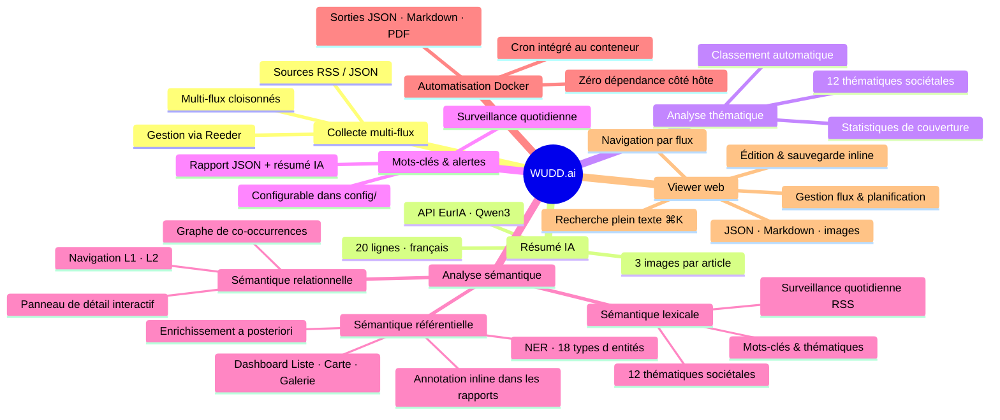

---

## 2. Architecture

> 📐 Documentation technique complète : [docs/ARCHITECTURE.md](docs/ARCHITECTURE.md) — diagrammes Mermaid, flux de données, modèle de données, ADRs, roadmap.
>
> 🎯 Scénarios d'utilisation : [docs/USE_CASES.md](docs/USE_CASES.md) — 6 use cases illustrés avec diagrammes Mermaid (veille, rapports, entités, carte, graphe sémantique, rapport Claude).

### Pipeline de traitement

```
Reeder (RSS/JSON) → Extraction HTML → Résumé EurIA/Qwen3 → JSON → Enrichissement NER → Markdown annoté / PDF
```

### Arborescence du projet

```
WUDD.ai/
├── scripts/           # Scripts Python exécutables
│   ├── Get_data_from_JSONFile_AskSummary_v2.py  # Collecte + résumés IA
│   ├── Get_htmlText_From_JSONFile.py             # Extraction texte HTML
│   ├── articles_json_to_markdown.py              # Conversion JSON → Markdown
│   ├── analyse_thematiques.py                    # Analyse sociétale
│   ├── scheduler_articles.py                     # Scheduler multi-flux
│   ├── get-keyword-from-rss.py                   # Extraction par mot-clé
│   ├── enrich_entities.py                        # Enrichissement NER (entités nommées)
│   └── check_cron_health.py                      # Monitoring cron
├── config/            # Sources, catégories, prompts, thématiques
├── data/              # Articles JSON générés (par flux)
│   ├── articles/<flux>/
│   ├── articles/cache/<flux>/
│   └── raw/
├── rapports/          # Rapports générés
│   ├── markdown/<flux>/
│   └── pdf/
├── viewer/            # Interface web de visualisation (Flask + React)
│   ├── app.py         # Backend Flask (API + serving)
│   └── src/           # Frontend React (Vite)
├── archives/          # Sauvegardes versionnées de scripts
├── samples/           # Exemples de rapports produits
├── tests/             # Tests unitaires
├── .github/           # Config GitHub Actions / Copilot
├── .env               # Variables d'environnement (non versionné)
└── README.md
```

### Fichiers de configuration clés

| Fichier | Rôle |
|---|---|
| `config/flux_json_sources.json` | Liste des flux RSS/JSON et paramètres cron |
| `config/sites_actualite.json` | Sources RSS disponibles |
| `config/categories_actualite.json` | Catégories d'articles |
| `config/keyword-to-search.json` | Mots-clés pour extraction quotidienne (avec filtres OR/AND optionnels) |
| `config/thematiques_societales.json` | 12 thématiques sociétales |
| `config/prompt-rapport.txt` | Template de prompt pour rapports |

---

## 3. Installation

### Prérequis

- Python 3.10+
- Compte Infomaniak avec accès à l'API EurIA
- Docker (pour l'orchestration automatisée)

### Dépendances

```bash
pip install -r requirements.txt
```

### Configuration

#### 1. Variables d'environnement

Créez un fichier `.env` à la racine à partir du template fourni :

```bash
cp .env.example .env
# Éditez .env et renseignez vos vraies valeurs
```

Le fichier `.env` n'est jamais commité (`.gitignore`). Référez-vous à `.env.example` pour la liste complète des variables requises.

#### 2. Fichier de flux `config/flux_json_sources.json`

> **⚠️ Ce fichier n'est pas dans le dépôt git** (il contient vos URLs privées Reeder).
> Seul le template `config/flux_json_sources.example.json` est versionné.

Créez votre fichier à partir de l'exemple :

```bash
cp config/flux_json_sources.example.json config/flux_json_sources.json
# Éditez config/flux_json_sources.json et renseignez vos URLs de flux
```

Voir la section [Configuration des flux](#6-configuration-des-flux) pour le format détaillé.

#### 3. Fichier de mots-clés `config/keyword-to-search.json`

> **⚠️ Ce fichier n'est pas dans le dépôt git** (contenu spécifique à chaque déploiement).
> Aucun template n'est fourni — il doit être créé manuellement.

Ce fichier est utilisé par `scripts/get-keyword-from-rss.py` (extraction quotidienne par mot-clé). Créez-le dans `config/` avec le format suivant :

```json
[
  { "keyword": "Intelligence artificielle" },
  { "keyword": "Trump" },
  { "keyword": "UBS", "and": ["banque", "bank"] },
  { "keyword": "David Bowie", "or": ["Ziggy Stardust", "Thin White Duke"] }
]
```

Sans ce fichier, le script `get-keyword-from-rss.py` s'arrête avec une erreur au démarrage. Voir la section [Filtrage avancé](#filtrage-avancé-or--and-dans-configkeyword-to-searchjson) pour la syntaxe complète des filtres `or` / `and`.

---

## 4. Utilisation

### Générer des résumés pour un flux

```bash
python3 scripts/Get_data_from_JSONFile_AskSummary_v2.py \
  --flux "Intelligence-artificielle" \
  --date_debut 2026-02-01 \
  --date_fin 2026-02-17
```

Sortie :
- `data/articles/Intelligence-artificielle/articles_generated_2026-02-01_2026-02-17.json`
- `rapports/markdown/Intelligence-artificielle/rapport_sommaire_*.md`

### Convertir un fichier JSON en rapport Markdown

```bash
python3 scripts/articles_json_to_markdown.py \
  data/articles/Intelligence-artificielle/articles_generated_2026-02-01_2026-02-17.json
```

### Lancer le scheduler multi-flux

```bash
python3 scripts/scheduler_articles.py
```

Traite automatiquement tous les flux définis dans `config/flux_json_sources.json`.

### Extraction par mot-clé (manuelle)

```bash
python3 scripts/get-keyword-from-rss.py
```

Génère un fichier JSON dans `data/articles-from-rss/` pour chaque mot-clé configuré, avec résumé IA, images principales et entités nommées.

#### Filtrage avancé OR / AND dans `config/keyword-to-search.json`

Chaque entrée du fichier accepte deux collections optionnelles pour affiner la sélection des articles :

- **`or`** : si le mot-clé principal n'est pas trouvé dans le titre, l'article est quand même sélectionné si **au moins un** des mots de la liste est présent.
- **`and`** : si l'article est présélectionné (via le mot-clé ou via `or`), il n'est retenu que si **au moins un** des mots de cette liste est également présent dans le titre.

```json
[
  { "keyword": "Trump" },
  { "keyword": "David Bowie", "or": ["Ziggy Stardust", "Thin White Duke"] },
  { "keyword": "UBS", "and": ["banque", "bank"] },
  { "keyword": "Intelligence artificielle", "or": ["AI", "IA"] }
]
```

> Les mots des collections `or` et `and` utilisent une correspondance par **frontière de mot** (`\b` regex) pour éviter les faux positifs (ex. `AI` ne matche pas `semaine`).

### Enrichissement NER (entités nommées)

```bash
# Enrichir tous les articles (flux + mots-clés)
python3 scripts/enrich_entities.py

# Un flux spécifique uniquement
python3 scripts/enrich_entities.py --flux Intelligence-artificielle

# Simulation sans appel API ni écriture
python3 scripts/enrich_entities.py --dry-run
```

Ajoute un champ `entities` à chaque article possédant un champ `Résumé`, en interrogeant l'API EurIA. Le champ contient un dictionnaire de 18 types d'entités nommées :

| Types | Exemples |
|---|---|
| `PERSON`, `ORG`, `GPE` | personnes, organisations, pays/villes |
| `PRODUCT`, `EVENT`, `LAW` | produits, événements, textes de loi |
| `DATE`, `MONEY`, `PERCENT` | dates, montants, pourcentages |
| `LOC`, `FAC`, `NORP`, `WORK_OF_ART` | lieux, bâtiments, groupes, œuvres |

```json
"entities": {
  "PERSON": ["Sam Altman"],
  "ORG": ["OpenAI", "Infomaniak"],
  "GPE": ["États-Unis"],
  "PRODUCT": ["Qwen3"]
}
```

Les articles déjà enrichis sont ignorés (sauf avec `--force`). La sauvegarde est atomique : écriture dans un `.tmp` puis remplacement. Voir [scripts/USAGE.md](scripts/USAGE.md) pour la liste complète des arguments.

### Réparer les résumés en erreur

Si des articles ont été traités avec un résumé d'erreur (ex. indisponibilité API temporaire), le script `repair_failed_summaries.py` les régénère automatiquement :

```bash
# Réparer tous les fichiers dans data/articles-from-rss/
python3 scripts/repair_failed_summaries.py

# Cibler un répertoire spécifique
python3 scripts/repair_failed_summaries.py --dir data/articles/Intelligence-artificielle

# Simulation sans appel API ni écriture
python3 scripts/repair_failed_summaries.py --dry-run
```

Le script détecte les articles dont le champ `Résumé` contient un message d'erreur, re-récupère le texte HTML de l'article, et relance la génération via l'API EurIA. La sauvegarde est atomique.

### Radar thématique

```bash
python3 scripts/radar_wudd.py
```

Analyse la distribution thématique de tous les articles collectés et génère un **radar visuel** sous deux formes :

- **HTML interactif** (`rapports/radar_wudd.html`) — graphique SVG à bulles, filtrable par quadrant
- **Markdown Mermaid** (`rapports/markdown/radar/radar_articles_generated_YYYY-MM-DD_YYYY-MM-DD.md`) — lisible directement dans le Viewer

Chaque thème est positionné dans un quadrant selon deux axes :

- **Horizontal (Rare → Fréquent)** : part des articles qui mentionnent ce thème
- **Vertical (Déclin → Hausse)** : vélocité = évolution de la fréquence entre la période précédente (T1) et la période courante (T0)

| Quadrant | Signification |
|---|---|
| **Dominants** | Thèmes fréquents et en hausse |
| **Émergents** | Thèmes rares mais en forte progression |
| **Habituels** | Thèmes fréquents mais stables ou en léger déclin |
| **Déclinants** | Thèmes rares et en recul |

Le script sélectionne les 10 thèmes les plus représentatifs et les répartit sur le graphique. Il est planifié automatiquement le dernier jour de chaque mois à 5h00 (voir [§8 Docker](#8-orchestration-docker)).

### Analyse manuelle avec Claude

Il est possible d'utiliser un fichier JSON généré par WUDD.ai directement dans Claude (ou tout autre LLM) pour produire un rapport, indépendamment de l'automatisation. Les instructions détaillées pour cette utilisation (format du rapport, modèle Markdown, regroupement thématique) sont disponibles dans :

→ [`docs/instructions-for-claude-report.md`](docs/instructions-for-claude-report.md)

→ [Exemple de rapport généré par Claude — Anthropic (20–28 fév 2026)](samples/claude-generated-rapport-anthropic-20-28-fev-2026.pdf)

### Exemples de présentations générées par Claude

Le prompt utilisé pour générer ces présentations est disponible dans : [docs/prompt-for-claude-presentation.md](docs/prompt-for-claude-presentation.md)

Exemples de présentations générées par Claude à partir des données collectées :
- [Présentation Markdown](samples/claude-generated-presentation.md)
- [Présentation PDF](samples/claude-generated-presentation.pdf)

### Utilisation avec NotebookLM

Les fichiers Markdown générés (rapports de synthèse, présentations) peuvent être importés directement dans **[NotebookLM](https://notebooklm.google.com/)** comme sources de connaissances. NotebookLM permet ensuite de générer des résumés, des FAQ, des podcasts audio ou des infographies à partir du contenu collecté. Exemples de sorties produites :
- [Présentation NotebookLM (PDF)](samples/NotebookLM%20-%20Presentation.pdf)
- [Infographie NotebookLM](samples/NotebookLM%20-%20infographie.png)

## 5. Viewer — Interface de visualisation

WUDD.ai inclut une interface web locale permettant de naviguer, lire et éditer les fichiers JSON et Markdown générés par le pipeline, sans quitter le navigateur.

L'interface est **entièrement responsive** et optimisée pour iPhone et tablette :

- Navigation hamburger (☰) sur mobile avec sidebar en drawer
- Barre de navigation fixée en bas de l'écran (thème, entités, réglages, recherche)
- Support de la zone de sécurité iOS (`safe-area-inset-bottom`)
- Panneau entités en plein écran sur mobile, flottant sur desktop
- `theme-color` dynamique (blanc / ardoise) selon le mode clair/sombre
- Taille de police respectant les préférences système iOS

### Démarrage

Un script raccourci est disponible à la racine du projet :

```bash
bash start-viewer.sh           # mode développement (Flask + Vite)
bash start-viewer.sh docker    # production via Docker Compose
bash start-viewer.sh stop      # arrêter le conteneur Docker
```

| Mode | URL |
|---|---|
| Développement (Vite) | http://localhost:5173 |
| Production (Flask / Docker) | http://localhost:5050 |

### Fonctionnalités

| Fonctionnalité | Description |
|---|---|
| Navigation latérale | Liste tous les fichiers JSON et Markdown par flux |
| Visionneuse JSON | Coloration syntaxique, mode édition/sauvegarde intégré |
| Visionneuse Markdown | Rendu HTML avec images et graphiques Mermaid |
| Recherche plein texte | Recherche dans tous les fichiers via **⌘K** / **Ctrl+K** |
| Panneau réglages | Gestion des flux, des planifications et des thématiques ; onglets Quota, RSS, Mots-clés, Alertes |
| Dashboard entités | Vue agrégée cross-fichiers des entités nommées (NER) : statistiques par type, top entités, barres de proportion |
| Détail d'une entité | Cliquer sur une entité ouvre la liste des articles la mentionnant, avec graphe de co-occurrences, synthèse IA en streaming, boutons **Générer un rapport** et **Exporter JSON** |
| Top articles | Panneau des N articles les mieux scorés (grille 3 colonnes, images, entités cliquables, rang podium 🥇🥈🥉) |
| Tendances & alertes | Détection des entités en forte hausse (ratio 24h/7j), seuils configurables par type d'entité dans `config/alert_rules.json` |
| Biais éditoriaux | Analyse et visualisation du sentiment et du ton éditorial par source RSS |
| Timeline des entités | Sparklines SVG d'évolution temporelle des entités nommées dans le Dashboard |
| Temps de lecture | Badge ⧗ estimé sur chaque article (basé sur `enrich_reading_time.py`, 230 mots/min) |
| Interface mobile | Toolbars transparentes fixées en bas (`backdrop-blur`, safe-area iPhone), boutons fermer à droite, bottom sheet pour panneau RSS |

### Captures d'écran

**Vue JSON des articles avec images**

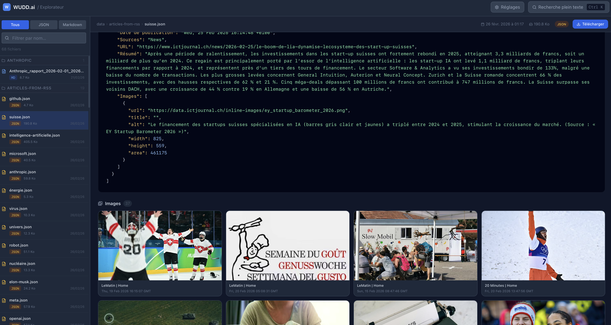

**Vue JSON avec coloration syntaxique**

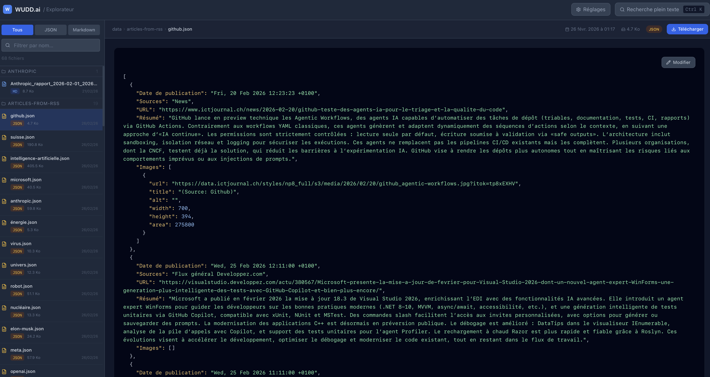

**Vue Markdown des rapports**


**Radar thématique — vue Markdown avec graphique Mermaid**
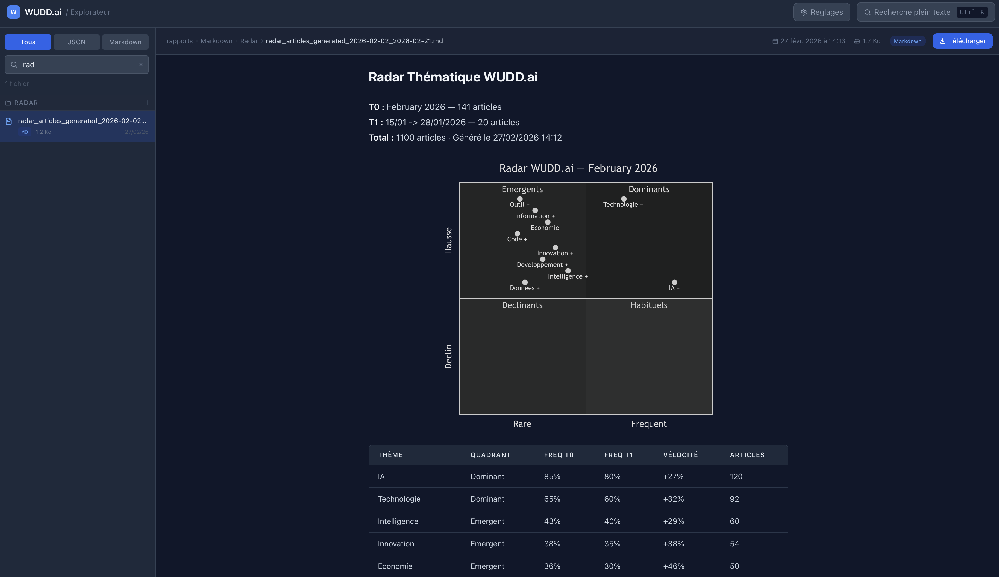

**Recherche plein texte (⌘K)**

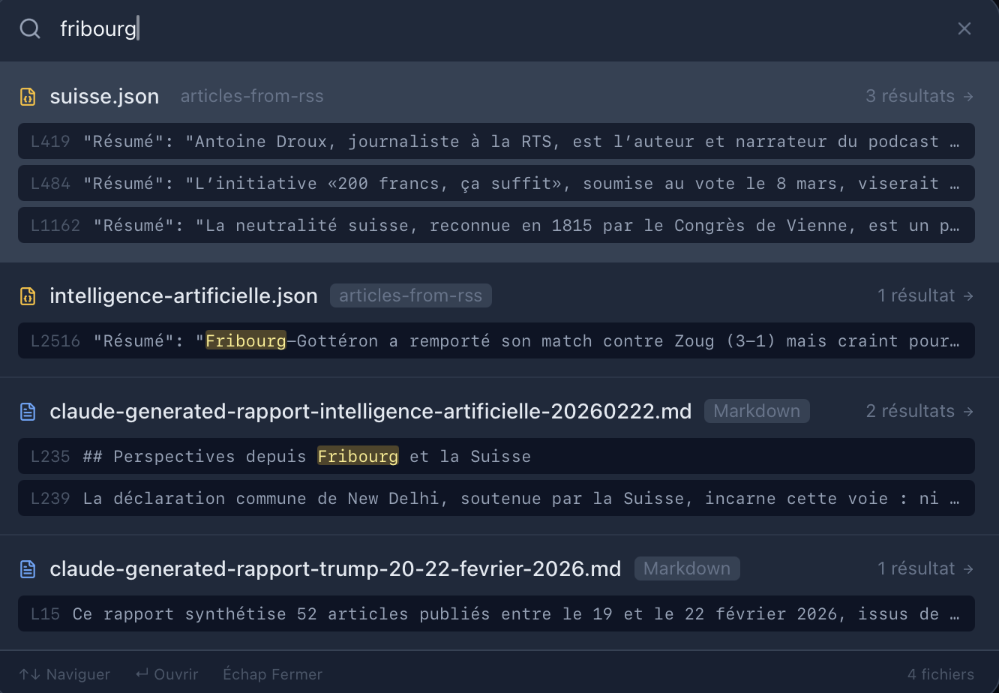

**Panneau de réglages — Planification**

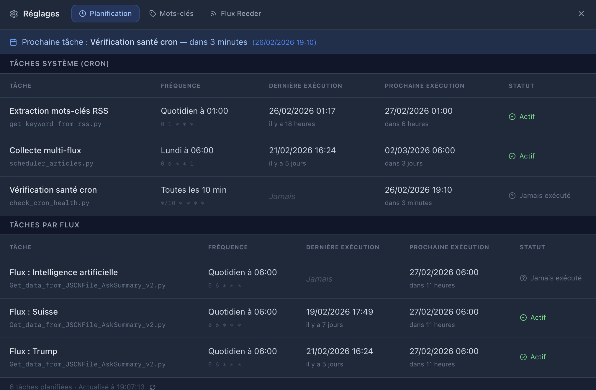

**Panneau de réglages — Gestion des flux**

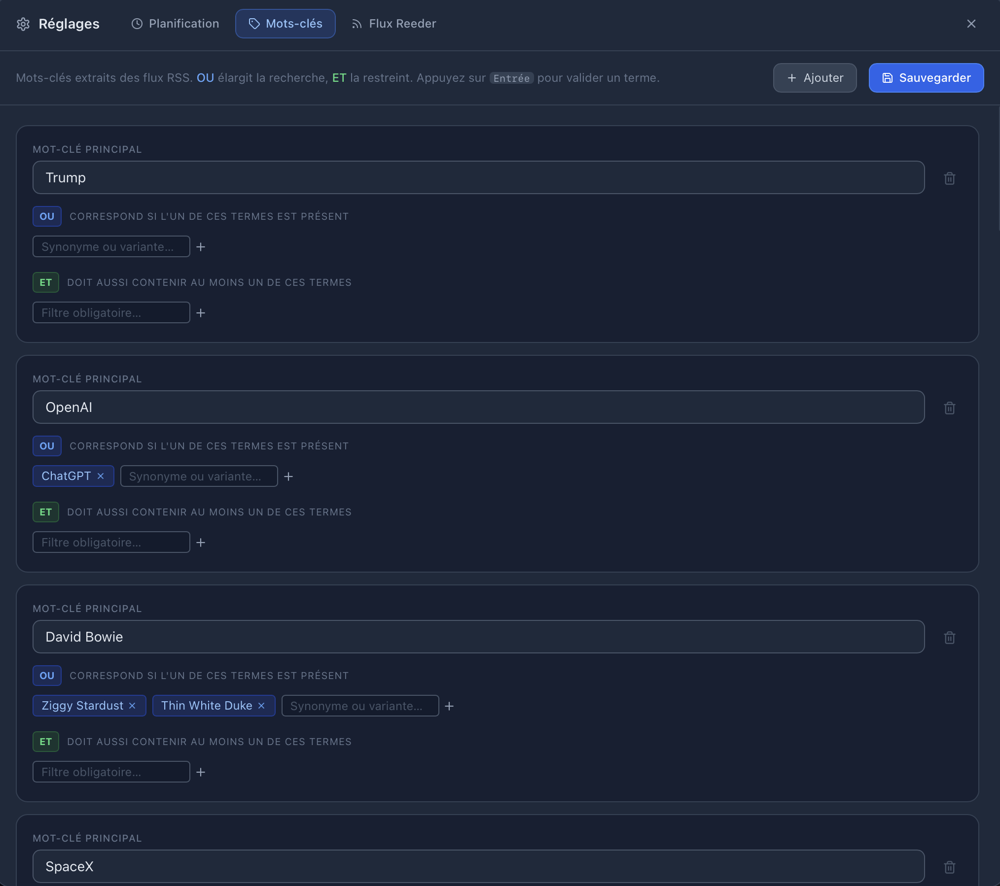

**Panneau de réglages — Thématiques**

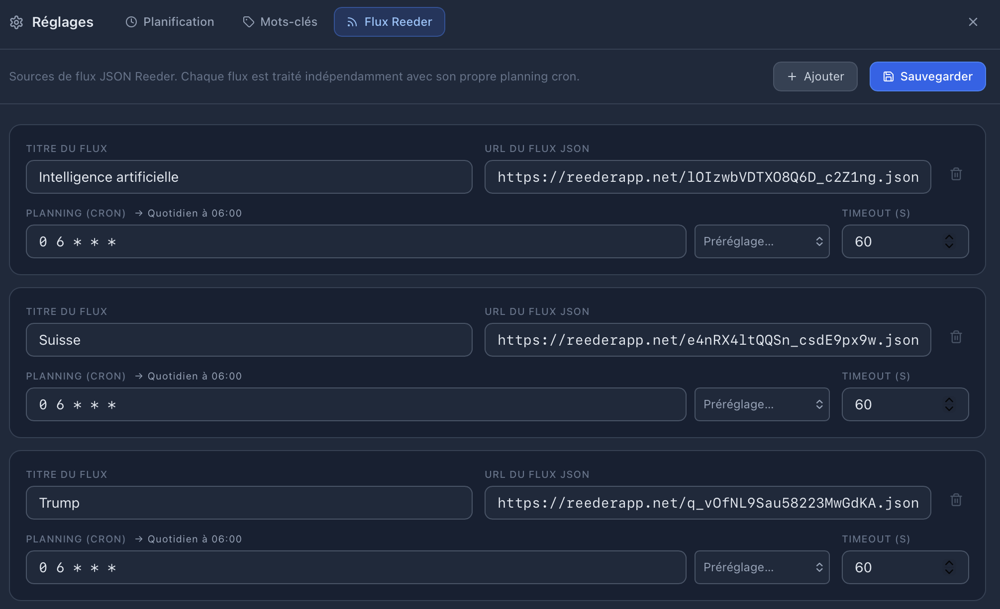

**Dashboard entités nommées (NER)**

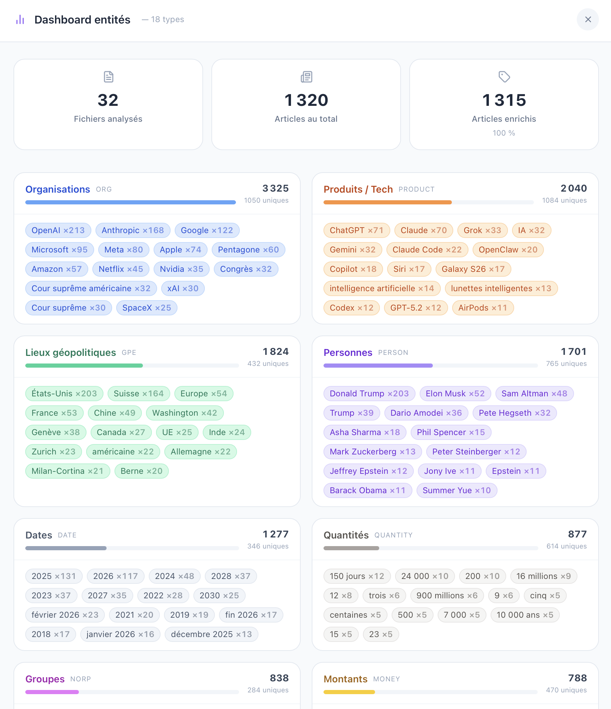

**Détail d'une entité — articles filtrés avec export**


**Calendrier des entités — vue semaine**


**Carte géographique des entités — monde**

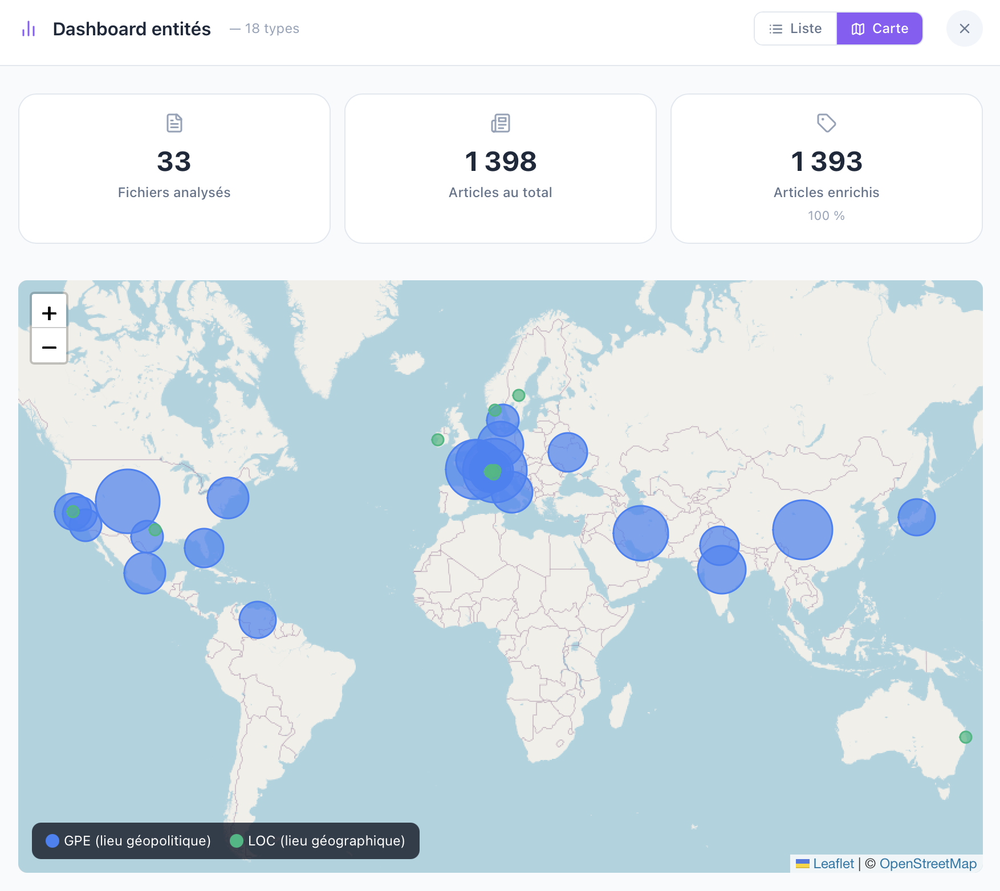

**Carte géographique des entités — zoom**

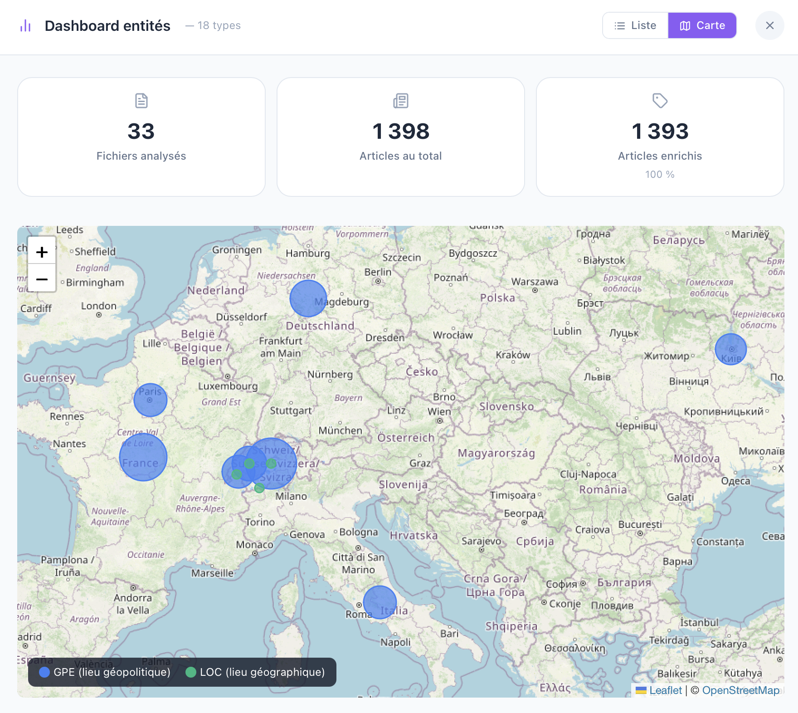

**Carte géographique — vue mobile**

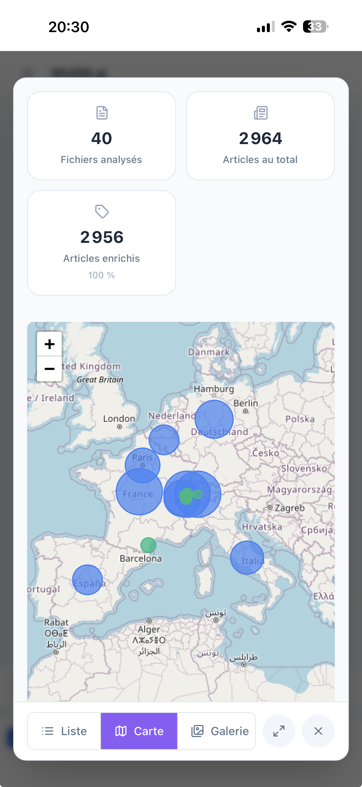

**Graphe de relations entre entités**

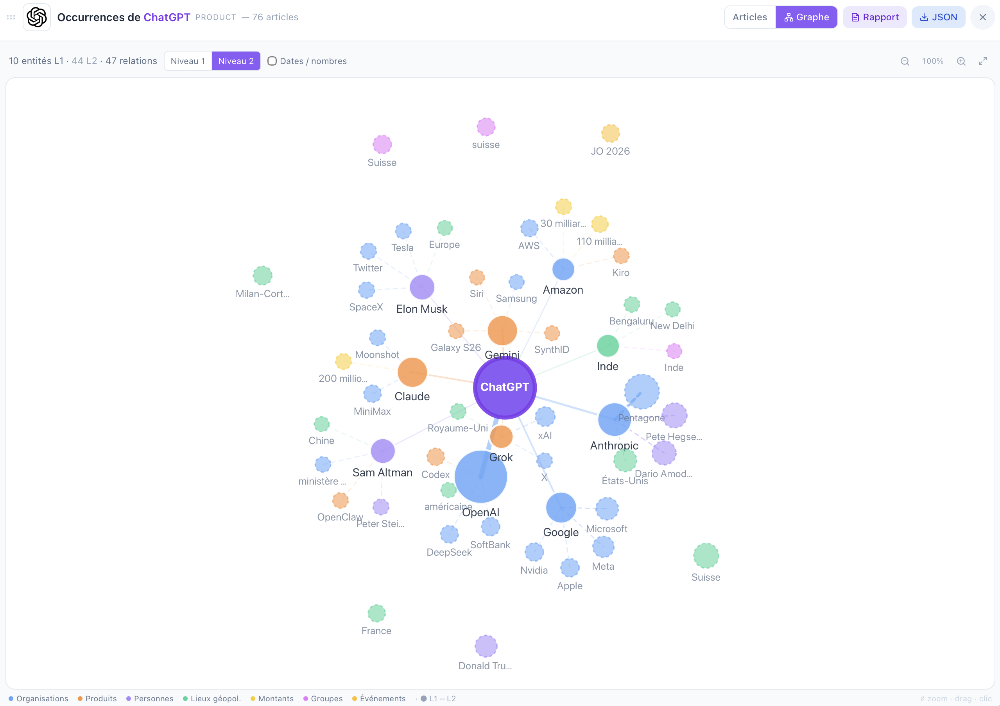

**Galerie d'images des entités — desktop**

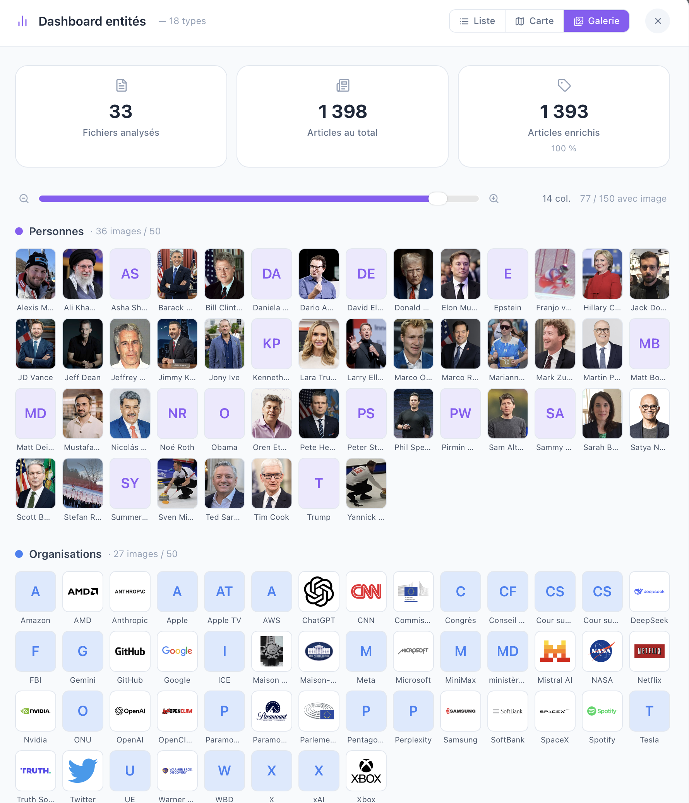

**Galerie d'images des entités — mobile**


**Liste des fichiers — vue mobile**


**Articles — vue mobile**


### Prérequis

- `python3` avec Flask (`pip install flask`)
- `node` + `npm` ([nodejs.org](https://nodejs.org))

---

## 6. Configuration des flux

### Format `config/flux_json_sources.json`

> **⚠️ Fichier non versionné** — à créer à partir de `config/flux_json_sources.example.json` (voir section [Configuration](#2-fichier-de-flux-configflux_json_sourcesjson)).

```json
[
  {
    "title": "Intelligence artificielle",
    "url": "https://reederapp.net/flux1.json",
    "scheduler": {
      "cron": "0 6 * * *",
      "timeout": 60
    }
  },
  {
    "title": "Suisse",
    "url": "https://reederapp.net/flux2.json",
    "scheduler": {
      "cron": "0 6 * * *",
      "timeout": 60
    }
  }
]
```

Chaque objet définit un flux indépendant. Le scheduler et tous les scripts multi-flux utilisent ce fichier comme source de vérité unique. Pour ajouter un flux, il suffit d'ajouter un objet au tableau.

### Quota d'import journalier (`config/quota.json`)

Le système de quota régule le volume d'articles importés chaque jour via l'API EurIA, en garantissant la diversité des sources.

```json
{
  "enabled": true,
  "global_daily_limit": 150,
  "per_keyword_daily_limit": 30,
  "per_source_daily_limit": 5,
  "adaptive_sorting": true
}
```

| Paramètre | Description | Défaut |
|---|---|---|
| `enabled` | Active / désactive le système | `true` |
| `global_daily_limit` | Plafond journalier global (tous mots-clés) | `150` |
| `per_keyword_daily_limit` | Max articles par mot-clé par jour | `30` |
| `per_source_daily_limit` | Max articles d'un même site pour un mot-clé | `5` |
| `adaptive_sorting` | Tri des mots-clés par ratio consommation/plafond croissant | `true` |

Avec `adaptive_sorting: true`, les mots-clés les moins traités passent en priorité à chaque itération, assurant une couverture équilibrée sur l'ensemble des sujets configurés. Les compteurs se réinitialisent automatiquement à minuit.

La configuration et la supervision en temps réel sont accessibles depuis l'onglet **Quota** du Viewer (Réglages).

---

## 7. Fonctionnement technique

### Appel API EurIA

```python
response = requests.post(
    URL,
    json={
        "messages": [{"content": prompt, "role": "user"}],
        "model": "qwen3",
        "enable_web_search": True
    },
    headers={"Authorization": f"Bearer {BEARER}"},
    timeout=60
)
content = response.json()["choices"][0]["message"]["content"]
```

L'API intègre un mécanisme de retry avec backoff exponentiel.

### Prompts

**Résumé d'article :**
```
Faire un résumé de ce texte sur maximum 20 lignes en français,
ne donne que le résumé, sans commentaire ni remarque : {texte}
```

**Rapport thématique :**
```
Analyse ce fichier JSON et fait une synthèse des actualités.
Affiche la date de publication et les sources lorsque tu cites un article.
Groupe les articles par catégories que tu auras identifiées.
En fin de synthèse fait un tableau avec les références.
Inclus des images pertinentes ().
```

### Formats de données

**Format d'entrée attendu (flux JSON) :**
```json
{
  "items": [
    {
      "url": "https://...",
      "date_published": "2025-01-23T10:00:00Z",
      "authors": [{"name": "Auteur"}]
    }
  ]
}
```

**Format de sortie (articles résumés) :**
```json
[
  {
    "Date de publication": "23/01/2025",
    "Sources": "Nom de la source",
    "URL": "https://...",
    "Résumé": "Résumé généré par l'IA...",
    "Images": [
      { "URL": "https://...", "Width": 1200, "Height": 800 }
    ],
    "entities": {
      "PERSON": ["Sam Altman"],
      "ORG": ["OpenAI", "Infomaniak"],
      "GPE": ["États-Unis"],
      "PRODUCT": ["Qwen3"]
    }
  }
]
```

> Le champ `Images` est présent dès la collecte (jusqu'à 3 images, largeur > 500 px). Le champ `entities` est ajouté a posteriori par `enrich_entities.py`.

### Chemins absolus (v2.0+)

Depuis la v2.0, tous les scripts utilisent des chemins absolus et fonctionnent depuis n'importe quel répertoire :

```python
SCRIPT_DIR = os.path.dirname(os.path.abspath(__file__))
PROJECT_ROOT = os.path.dirname(SCRIPT_DIR)
DATA_ARTICLES_DIR = os.path.join(PROJECT_ROOT, "data", "articles")
```

### Bonnes pratiques de développement

- Langue française obligatoire pour les clés JSON et messages
- Format de date ISO 8601 strict : `YYYY-MM-DDTHH:MM:SSZ`
- Utiliser `print_console()` pour les logs horodatés
- **Toujours sauvegarder avant de modifier un script :**
  ```bash
  cp "script.py" "archives/script_$(date +%Y%m%d_%H%M%S).py"
  ```

### Déduplication avancée (`utils/deduplication.py`)

Les articles provenant de flux RSS multiples peuvent contenir des doublons. Le module `utils/deduplication.py` détecte et filtre automatiquement les doublons selon **trois signaux combinés** :

| Signal | Mécanisme | Module |
|---|---|---|
| URL exacte | Empreinte MD5 de l'URL normalisée (sans fragment, sans slash final) | `compute_url_fingerprint()` |
| Contenu résumé | Empreinte MD5 des 200 premiers caractères normalisés | `compute_resume_fingerprint()` |
| Titre similaire | Similarité Jaccard sur bigrammes de mots (seuil ≥ 0.80) | `compute_title_similarity()` |

```python
from utils.deduplication import Deduplicator

dedup = Deduplicator(title_threshold=0.85)

# Déduplication d'un corpus complet
unique_articles, stats = dedup.deduplicate(articles)

# Déduplication incrémentale (nouveaux articles vs existants)
filtered = dedup.deduplicate_incremental(new_articles, existing_articles)

print(stats)  # {'total': 150, 'unique': 127, 'removed': 23}
```

La déduplication avancée remplace la déduplication par URL seule dans `scripts/get-keyword-from-rss.py`.

### Détection de tendances et alertes (`config/alert_rules.json`)

Le script `scripts/trend_detector.py` compare les mentions d'entités sur 24h vs 7j pour détecter les sujets en forte hausse. Les seuils et comportements sont entièrement configurables dans `config/alert_rules.json` :

```json
{
  "global": { "threshold_ratio": 2.0, "top": 20, "min_mentions_24h": 2 },
  "types_entites": {
    "PERSON": { "enabled": true, "threshold_ratio": 3.0 },
    "GPE":    { "enabled": true, "threshold_ratio": 2.5 },
    "EVENT":  { "enabled": true, "threshold_ratio": 1.5 }
  },
  "niveaux": {
    "modere":   { "ratio_min": 2.0 },
    "eleve":    { "ratio_min": 3.0 },
    "critique": { "ratio_min": 5.0 }
  },
  "notifications": {
    "niveaux_notifies": ["élevé", "critique"],
    "webhook_discord": false,
    "webhook_slack": false,
    "webhook_ntfy": false
  }
}
```

```bash
# Détection normale (écrit data/alertes.json + notifications configurées)
python3 scripts/trend_detector.py

# Options avancées
python3 scripts/trend_detector.py --top 15 --threshold 3.0
python3 scripts/trend_detector.py --dry-run    # pas d'écriture
python3 scripts/trend_detector.py --no-notify  # pas de webhook
```

Les alertes générées sont visualisées dans le panneau **Tendances & alertes** du Viewer.

---

## 8. Orchestration Docker

### Principe

**Toute l'automatisation est contenue dans le conteneur Docker.** Aucune tâche cron n'est programmée sur l'hôte, garantissant isolation et portabilité.

> _Vérifié le 21/02/2026 : conformité confirmée._

### Déploiement

```bash
docker-compose up --build -d
```

Seul le conteneur `analyse-actualites` (défini dans `docker-compose.yml`) doit être actif. Pour supprimer un ancien conteneur résiduel :

```bash
docker rm -f wudd-ai-final   # ou wuddai, etc.
```

### Tâches cron actives dans le conteneur

| Planification | Tâche |
|---|---|
| `*/5 * * * *` | Surveillance round-robin flux RSS — mise à jour incrémentale 48h (`flux_watcher.py`) |
| `0 6-22/2 * * *` | Extraction par mot-clé toutes les 2h de 6h00 à 22h00 (`get-keyword-from-rss.py`) |
| `*/10 * * * *` | Vérification santé du cron (`check_cron_health.py`) |
| `0 6 * * 1` | Scheduler multi-flux chaque lundi (`scheduler_articles.py`) |
| `0 7 * * *` | Détection de tendances et alertes (`trend_detector.py`) → `data/alertes.json` |
| `30 7 * * *` | Chronologie des entités (`entity_timeline.py`) → `data/entity_timeline.json` |
| `0 23 * * *` | Rapport quotidien Top 10 entités — fenêtre 48h (`generate_48h_report.py`) |
| `0 3 * * *` | Enrichissement sentiment round-robin, 1 fichier/jour (`enrich_sentiment.py`) |
| `30 4 * * 0` | Enrichissement temps de lecture chaque dimanche (`enrich_reading_time.py`) |
| `30 5 * * 1` | Analyse croisée des flux chaque lundi (`cross_flux_analysis.py`) |
| `0 5 28-31 * *` | Radar thématique le dernier jour du mois (`radar_wudd.py`) |
| `30 5 28-31 * *` | Conversion articles RSS → Markdown le dernier jour du mois (`articles_rss_to_markdown.py`) |

Tous les logs sont disponibles dans `rapports/`.

---

## 9. Développement et extension

### Ajouter une source RSS

Modifiez `config/sites_actualite.json` :
```json
{
  "Titre": "Nom de la source",
  "URL": "https://exemple.com/feed.rss"
}
```

### Ajouter une catégorie

Modifiez `config/categories_actualite.json` :
```json
{
  "Catégories": "Nouvelle catégorie"
}
```

### Lancer les tests

```bash
pytest tests/
```

---

## 10. Limitations

- Certains scripts écrivent dans des fichiers prédéfinis — à adapter selon les besoins
- Langue française requise pour les clés et messages (non configurable)
- `README.md` et fichiers critiques doivent rester à la racine du projet

---

## 11. FAQ / Dépannage

**Q : Le README n'est pas à jour sur GitHub ?**  
Vérifiez que vous êtes sur la branche `main` et que le push a été effectué. Actualisez ou videz le cache du navigateur.

**Q : Erreur de parsing de date ?**  
Les dates doivent être au format ISO 8601 strict : `YYYY-MM-DDTHH:MM:SSZ`.

**Q : Les scripts ne trouvent pas les fichiers de données ?**  
Depuis la v2.0, tous les chemins sont absolus. Les scripts fonctionnent depuis n'importe quel répertoire.

**Q : Comment ajouter un flux ou une catégorie ?**  
Modifiez les fichiers dans `config/` (voir [Section 6](#6-configuration-des-flux) et [Section 9](#9-développement-et-extension)).

**Q : Comment sauvegarder avant une modification ?**  
Copiez le script dans `archives/` avec timestamp (voir [Section 7](#7-fonctionnement-technique)).

---

## 12. Contribuer

Les contributions sont les bienvenues !

1. Forkez le dépôt
2. Créez une branche : `git checkout -b feature/ma-nouvelle-fonction`
3. Commitez : `git commit -am 'Ajout nouvelle fonction'`
4. Poussez : `git push origin feature/ma-nouvelle-fonction`
5. Ouvrez une Pull Request

Merci de respecter : la structure du projet, la langue française pour les clés/messages, et la politique de sauvegarde avant modification.

---

## 13. Contact et licence

- **Auteur** : Patrick Ostertag
- **Email** : patrick.ostertag@gmail.com
- **Site** : [patrickostertag.ch](http://patrickostertag.ch)
- **Moteur IA** : EurIA (Infomaniak) — Modèle : Qwen3 — [euria.infomaniak.com](https://euria.infomaniak.com)
- **Licence** : Projet personnel

---

_Documentation prompts : [docs/PROMPTS.md](docs/PROMPTS.md) · Entités NER : [docs/ENTITIES.md](docs/ENTITIES.md) · Services externes : [docs/EXTERNAL_SERVICES.md](docs/EXTERNAL_SERVICES.md) · Use Cases : [docs/USE_CASES.md](docs/USE_CASES.md) · Rapports automatiques : [docs/RAPPORTS_AUTOMATIQUES.md](docs/RAPPORTS_AUTOMATIQUES.md)_
