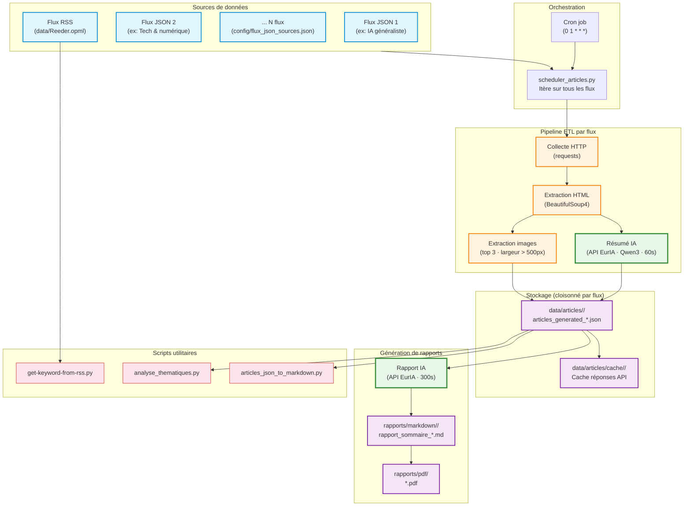
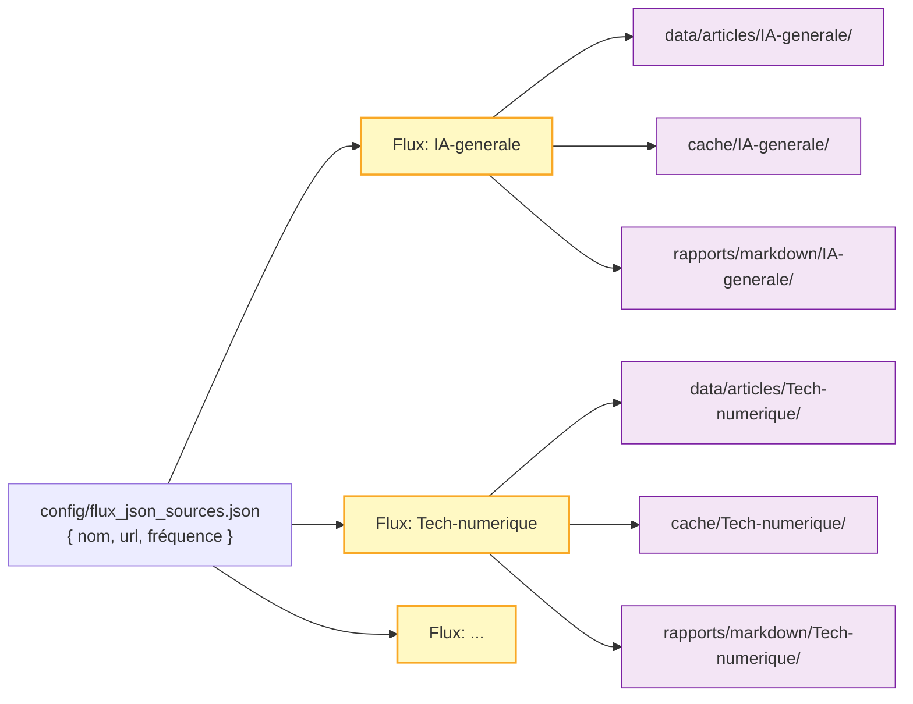
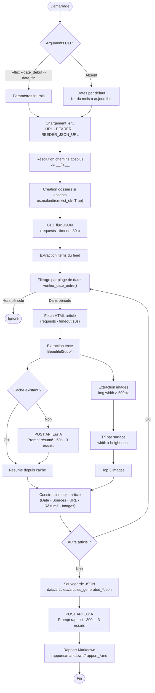
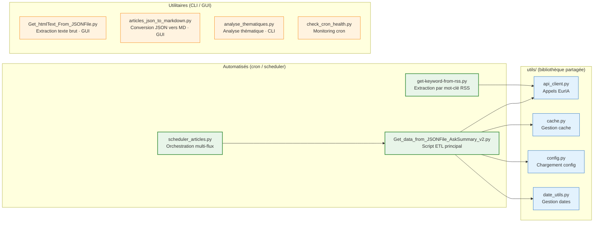
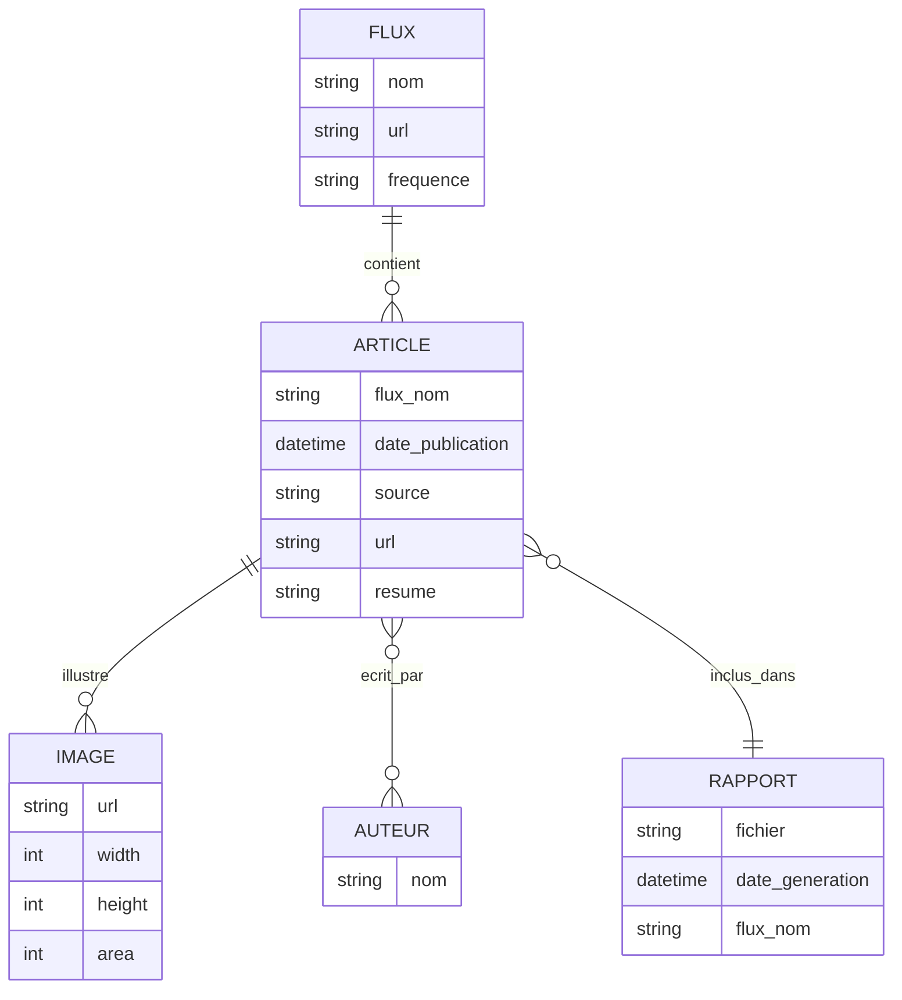
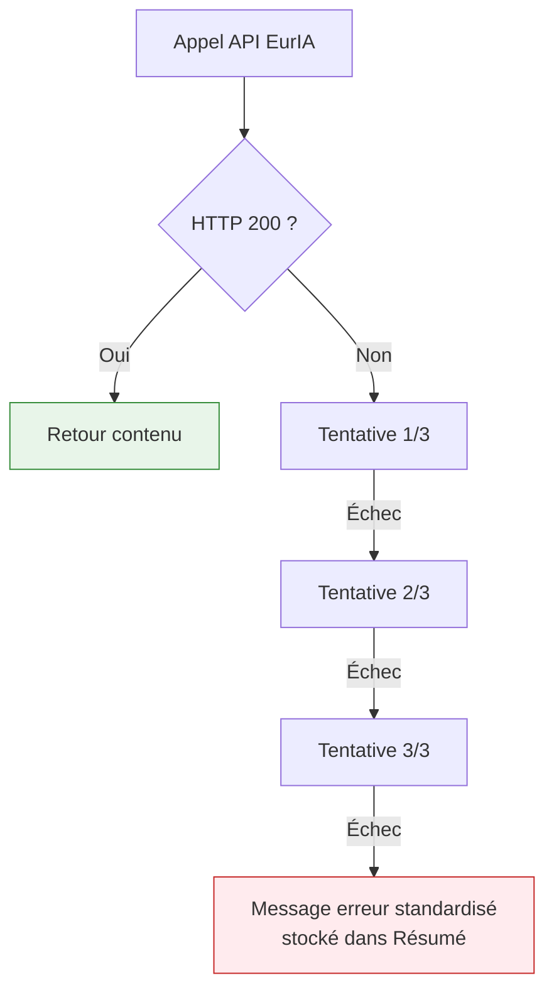
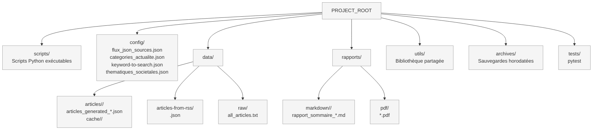
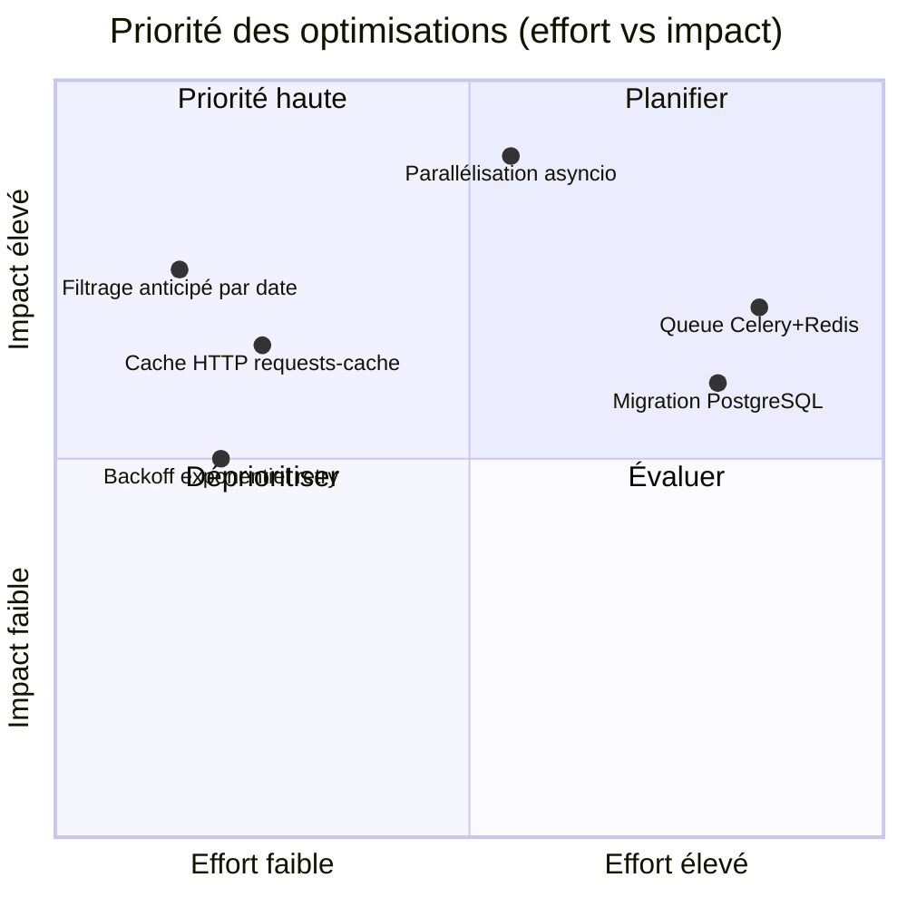
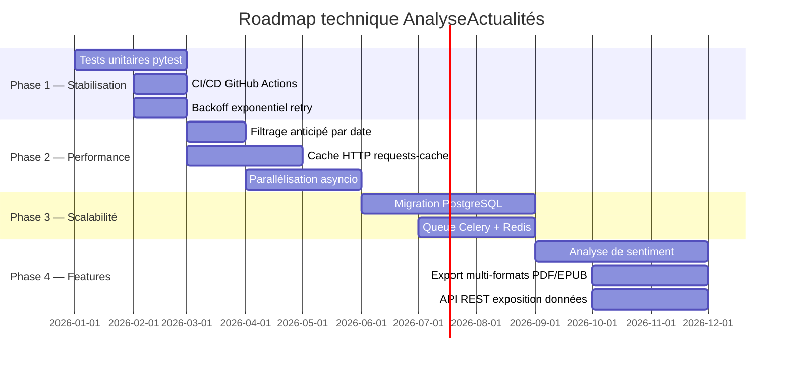

# Architecture — AnalyseActualités

> Document de référence technique · Version 3.0 · 22 février 2026

---

## Table des matières

1. [Vue d'ensemble](#1-vue-densemble)
2. [Architecture multi-flux](#2-architecture-multi-flux)
3. [Flux de données détaillé](#3-flux-de-données-détaillé)
4. [Composants principaux](#4-composants-principaux)
5. [Modèle de données](#5-modèle-de-données)
6. [Intégrations externes — API EurIA](#6-intégrations-externes--api-euria)
7. [Infrastructure & Chemins](#7-infrastructure--chemins)
8. [Sécurité](#8-sécurité)
9. [Performance et scalabilité](#9-performance-et-scalabilité)
10. [Décisions architecturales](#10-décisions-architecturales)
11. [Roadmap](#11-roadmap)

---

## 1. Vue d'ensemble

### Objectif

Pipeline ETL automatisé qui **collecte** des flux d'actualités (JSON/RSS), **extrait** le contenu HTML, **enrichit** chaque article par un résumé IA (API EurIA, modèle Qwen3) et **produit** des sorties structurées (JSON + rapports Markdown), cloisonnées par flux.

### Principes architecturaux

| # | Principe | Implication |
|---|----------|-------------|
| 1 | **Séparation des préoccupations** | Scripts, config, données et rapports dans des dossiers dédiés |
| 2 | **Cloisonnement par flux** | Chaque source a ses propres dossiers de sortie et de cache |
| 3 | **Chemins absolus dynamiques** | Résolution via `__file__` — indépendant du `cwd` |
| 4 | **Résilience** | Retry automatique (3 tentatives), gestion exhaustive des erreurs |
| 5 | **Headless first** | Tout est pilotable en CLI ; GUI uniquement pour scripts utilitaires |
| 6 | **Langue française** | Clés JSON, messages, prompts IA — ne pas modifier sans mise à jour globale |

### Architecture générale



---

## 2. Architecture multi-flux

### Principe de cloisonnement

Depuis février 2026, chaque flux est traité de manière totalement indépendante.
La configuration centralisée `config/flux_json_sources.json` définit la liste des flux et le scheduler les exécute séquentiellement (ou via cron).



### Structure des dossiers de sortie

```
data/
├── articles/
│   ├── <nom-flux>/
│   │   └── articles_generated_YYYY-MM-DD_YYYY-MM-DD.json
│   └── cache/
│       └── <nom-flux>/
├── articles-from-rss/
│   └── <mot-clé>.json
└── raw/
    └── all_articles.txt

rapports/
├── markdown/
│   └── <nom-flux>/
│       └── rapport_sommaire_*.md
└── pdf/
    └── *.pdf
```

---

## 3. Flux de données détaillé

### Pipeline de traitement complet



### Formats de données

**Entrée (flux JSON)**
```json
{
  "items": [
    {
      "url": "https://source.com/article",
      "date_published": "2026-01-23T10:00:00Z",
      "authors": [{ "name": "Auteur" }],
      "title": "Titre de l'article"
    }
  ]
}
```

**Sortie (JSON structuré)**
```json
[
  {
    "Date de publication": "2026-01-23T10:00:00Z",
    "Sources": "Nom de la source",
    "URL": "https://...",
    "Résumé": "Résumé généré par l'IA en français (max 20 lignes)...",
    "Images": [
      { "url": "https://image.jpg", "width": 1200, "height": 800, "area": 960000 }
    ]
  }
]
```

> ⚠️ **Format de date strict** : `YYYY-MM-DDTHH:MM:SSZ`
> Parser Python : `datetime.strptime(d, "%Y-%m-%dT%H:%M:%SZ")`

---

## 4. Composants principaux

### Vue d'ensemble des scripts



### Détail des scripts principaux

#### `Get_data_from_JSONFile_AskSummary_v2.py` — Script ETL central

```
Main Program
├── Configuration Loading    → load_dotenv() + utils/config.py
├── Path Detection & Setup   → SCRIPT_DIR, PROJECT_ROOT
├── Directory Creation       → os.makedirs(exist_ok=True)
├── Data Fetching            → requests.get(REEDER_JSON_URL)
├── Processing Loop
│   ├── Date Filtering       → verifier_date_entre()
│   ├── Text Extraction      → fetch_and_extract_text()   [requests + BS4]
│   ├── AI Summarization     → askForResume()             [API EurIA · 60s]
│   ├── Image Extraction     → extract_top_3_largest_images()
│   └── Cache Management     → utils/cache.py
├── Data Persistence         → json.dump vers data/articles/<flux>/
└── Report Generation        → create_report()            [API EurIA · 300s]
```

**Invocation :**
```bash
python scripts/Get_data_from_JSONFile_AskSummary_v2.py \
  --flux "Intelligence-artificielle" \
  --date_debut 2026-02-01 \
  --date_fin 2026-02-28
```

#### `scheduler_articles.py` — Orchestrateur multi-flux

- Lit `config/flux_json_sources.json`
- Lance le script ETL pour chaque flux et chaque période configurée
- Déclenchement via cron (`0 1 * * *`) ou manuellement

#### `get-keyword-from-rss.py` — Extraction par mot-clé

- Lit `data/Reeder.opml` (liste flux RSS)
- Filtre les articles des 7 derniers jours par mot-clé (`config/keyword-to-search.json`)
- Produit `data/articles-from-rss/<mot-clé>.json` sans doublon
- Résumé IA + image principale par article
- Cron : `0 1 * * *`

---

## 5. Modèle de données

### Schéma entité-relation



### Contraintes métier

| Champ | Type | Contrainte |
|-------|------|------------|
| `Date de publication` | ISO 8601 String | Format `YYYY-MM-DDTHH:MM:SSZ` obligatoire |
| `Sources` | String | `authors[0].name` du flux |
| `Résumé` | Text | Max 20 lignes · Langue française |
| `Images[].url` | URL | Doit commencer par `https://` |
| `Images[].width` | Integer | > 500 px |
| Période | Dates | `date_debut < date_fin` |

---

## 6. Intégrations externes — API EurIA

### Appel API standard

```python
response = requests.post(
    URL,  # depuis .env
    json={
        "messages": [{"content": prompt, "role": "user"}],
        "model": "qwen3",
        "enable_web_search": True
    },
    headers={"Authorization": f"Bearer {BEARER}"},
    timeout=60
)
content = response.json()["choices"][0]["message"]["content"]
```

### Prompts utilisés

| Usage | Timeout | Tentatives | Prompt |
|-------|---------|------------|--------|
| Résumé article | 60 s | 3 | `faire un résumé de ce texte sur maximum 20 lignes en français, ne donne que le résumé, sans commentaire ni remarque : {texte}` |
| Génération rapport | 300 s | 3 | Analyse JSON, groupe par catégories, tableau références, intègre images |

### Gestion des erreurs & retry



> Amélioration future : backoff exponentiel `time.sleep(2 ** attempt)` (2 s, 4 s, 8 s…)

---

## 7. Infrastructure & Chemins

### Résolution des chemins

Tous les scripts utilisent des chemins absolus construits depuis `__file__` :

```python
SCRIPT_DIR            = os.path.dirname(os.path.abspath(__file__))
PROJECT_ROOT          = os.path.dirname(SCRIPT_DIR)
DATA_ARTICLES_DIR     = os.path.join(PROJECT_ROOT, "data", "articles")
DATA_RAW_DIR          = os.path.join(PROJECT_ROOT, "data", "raw")
RAPPORTS_MARKDOWN_DIR = os.path.join(PROJECT_ROOT, "rapports", "markdown")
```

Avantage : fonctionne depuis n'importe quel répertoire, compatible cron, raccourcis macOS et Docker.

### Cartographie des dossiers



### Déploiement Docker

Le projet inclut `Dockerfile` + `docker-compose.yml`. L'`entrypoint.sh` démarre le scheduler au lancement du conteneur.

---

## 8. Sécurité

### Gestion des secrets

- Toutes les credentials dans `.env` (jamais versionné — `.gitignore`)
- Chargement exclusif via `python-dotenv`
- Variables sensibles : `bearer`, `REEDER_JSON_URL`

### Validation des entrées

| Vecteur | Validation |
|---------|-----------|
| URLs | `startswith(('http://', 'https://'))` + `raise_for_status()` |
| Dates | `datetime.strptime()` strict + `date_debut < date_fin` |
| JSON | `try/except` sur `json.load()` et `response.json()` |
| Images | Largeur > 500 px + URL absolue |

---

## 9. Performance et scalabilité

### Métriques (traitement séquentiel actuel)

| Opération | Temps moyen |
|-----------|-------------|
| Fetch HTML | 1–3 s |
| Extraction texte (BS4) | < 100 ms |
| Résumé IA | 5–10 s |
| Extraction + tri images | 1–2 s |
| **Total / article** | **7–15 s** |

> 100 articles ≈ 12–25 minutes

### Priorité des optimisations



---

## 10. Décisions architecturales

| ADR | Décision | Justification | Limite |
|-----|----------|---------------|--------|
| **ADR-001** | Chemins absolus via `__file__` | Compatible cron, macOS, Docker | Légèrement plus verbeux |
| **ADR-002** | JSON comme stockage primaire | Natif Python, lisible, sans setup DB | Pas de requêtes complexes |
| **ADR-003** | Résumés IA en français uniquement | Sources et utilisateurs francophones | Limite réutilisabilité |
| **ADR-004** | Retry sans backoff | Simple à implémenter | Risque surcharge API en erreur systémique |
| **ADR-005** | GUI tkinter (scripts utilitaires) | User-friendly en usage manuel | Incompatible headless / CI |
| **ADR-006** | Cloisonnement par flux (fév. 2026) | Isolation complète des données | Duplication de dossiers |

---

## 11. Roadmap



---

## Références

| Ressource | Lien |
|-----------|------|
| Structure détaillée | [docs/STRUCTURE.md](STRUCTURE.md) |
| Guide déploiement | [docs/DEPLOY.md](DEPLOY.md) |
| Guide scripts | [scripts/USAGE.md](../scripts/USAGE.md) |
| Historique | [CHANGELOG.md](../CHANGELOG.md) |
| BeautifulSoup4 | https://www.crummy.com/software/BeautifulSoup/bs4/doc/ |
| API EurIA Infomaniak | https://euria.infomaniak.com |
| ISO 8601 | https://www.iso.org/iso-8601-date-and-time-format.html |

---

**Maintenu par** : Patrick Ostertag · patrick.ostertag@gmail.com
**Dernière mise à jour** : 22 février 2026 · Version 3.0
