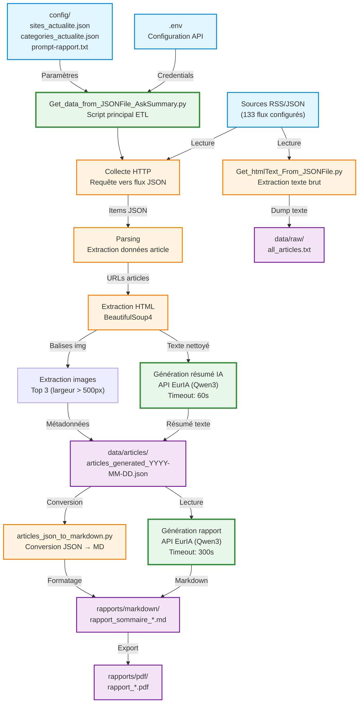
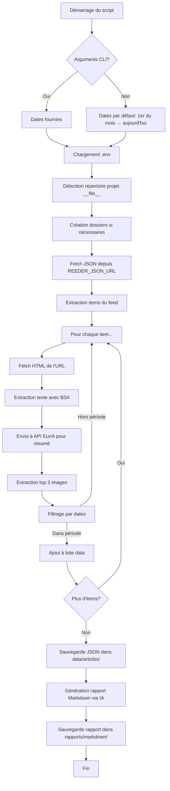

# Architecture du projet AnalyseActualités

> Documentation technique de l'architecture du système  
> Version 2.0 - 23 janvier 2026

## 📋 Table des matières

1. [Vue d'ensemble](#vue-densemble)
2. [Architecture logicielle](#architecture-logicielle)
3. [Flux de données](#flux-de-données)
4. [Composants principaux](#composants-principaux)
5. [Modèle de données](#modèle-de-données)
6. [Intégrations externes](#intégrations-externes)
7. [Gestion des chemins](#gestion-des-chemins)
8. [Sécurité](#sécurité)
9. [Performance et scalabilité](#performance-et-scalabilité)
10. [Décisions architecturales](#décisions-architecturales)

---

## 🎯 Vue d'ensemble

### Objectif du système
Pipeline automatisé de collecte, traitement et analyse d'articles d'actualité utilisant l'intelligence artificielle pour générer des résumés et rapports structurés.

### Architecture générale

#### Diagramme ASCII
```
┌─────────────────────────────────────────────────────────────────┐
│                         Sources RSS/JSON                         │
│              (133 flux d'actualités configurés)                  │
└────────────────────────────┬────────────────────────────────────┘
                             │
                             ▼
┌─────────────────────────────────────────────────────────────────┐
│                   Script de collecte principal                   │
│         (Get_data_from_JSONFile_AskSummary.py)                  │
│                                                                  │
│  ┌──────────────┐  ┌──────────────┐  ┌──────────────┐         │
│  │   Collecte   │→ │  Extraction  │→ │   Résumé IA  │         │
│  │   HTTP/JSON  │  │     HTML     │  │  (API EurIA) │         │
│  └──────────────┘  └──────────────┘  └──────────────┘         │
└────────────────────────────┬────────────────────────────────────┘
                             │
                             ▼
┌─────────────────────────────────────────────────────────────────┐
│                      Stockage de données                         │
│  ┌─────────────────────┐       ┌─────────────────────┐         │
│  │  data/articles/     │       │   data/raw/         │         │
│  │  (JSON structuré)   │       │  (HTML/texte brut)  │         │
│  └─────────────────────┘       └─────────────────────┘         │
└────────────────────────────┬────────────────────────────────────┘
                             │
                             ▼
┌─────────────────────────────────────────────────────────────────┐
│                    Génération de rapports                        │
│         ┌────────────────────────────────────┐                  │
│         │  Rapport Markdown synthétique      │                  │
│         │  (classification par catégories)   │                  │
│         └────────────────────────────────────┘                  │
│                          │                                       │
│                          ▼                                       │
│              rapports/markdown/*.md                              │
│              rapports/pdf/*.pdf                                  │
└─────────────────────────────────────────────────────────────────┘
```

#### Diagramme Mermaid interactif



### Principes architecturaux

1. **Séparation des préoccupations** : Scripts, configuration, données et rapports isolés
2. **Chemins absolus dynamiques** : Détection automatique de la racine du projet via `__file__`
3. **Résilience** : Retry automatique, gestion d'erreurs exhaustive
4. **Traçabilité** : Logs horodatés, métadonnées complètes
5. **Extensibilité** : Architecture modulaire facilitant l'ajout de nouvelles sources/fonctionnalités

---

## 🏗️ Architecture logicielle

### Pattern architectural
**Pipeline ETL (Extract, Transform, Load)** avec enrichissement IA

```
Extract          Transform              Load
   │                │                    │
   ├─ Fetch JSON   ├─ Parse HTML        ├─ Save JSON
   ├─ Parse feeds  ├─ Summarize (AI)    ├─ Generate MD
   └─ Get images   └─ Categorize        └─ Export reports
```

### Composants logiciels

#### 1. **Layer de collecte** (`fetch_and_extract_text`)
- Responsabilité : Récupération HTTP et parsing HTML
- Entrée : URL d'article
- Sortie : Texte brut extrait
- Dépendances : `requests`, `beautifulsoup4`

#### 2. **Layer d'enrichissement IA** (`askForResume`, `ask_for_ia`)
- Responsabilité : Interaction avec l'API EurIA (Qwen3)
- Entrée : Texte brut
- Sortie : Résumé structuré en français
- Features : Retry logic, timeout management, error handling

#### 3. **Layer de traitement d'images** (`extract_top_3_largest_images`)
- Responsabilité : Extraction et tri des images pertinentes
- Algorithme : Filtre (largeur > 500px) + tri par surface
- Sortie : Top 3 images avec métadonnées

#### 4. **Layer de persistance**
- Format primaire : JSON structuré
- Format secondaire : Markdown pour rapports
- Stratégie : Création automatique des dossiers si absents

#### 5. **Layer de rapportage** (`create_report`)
- Responsabilité : Génération de synthèses via IA
- Entrée : Fichier JSON d'articles
- Sortie : Rapport Markdown structuré par catégories

---

## 🔄 Flux de données

### Flux principal (collecte et analyse)



### Format des données

#### Flux d'entrée (RSS/JSON)
```json
{
  "items": [
    {
      "url": "https://source.com/article",
      "date_published": "2026-01-23T10:00:00Z",
      "authors": [{"name": "Auteur"}],
      "title": "Titre de l'article"
    }
  ]
}
```

#### Données intermédiaires (après extraction)
```python
texts = {
    "https://url1": "Texte extrait de l'article...",
    "https://url2": "Texte extrait de l'article..."
}
```

#### Format de sortie (JSON structuré)
```json
[
  {
    "Date de publication": "2026-01-23T10:00:00Z",
    "Sources": "Nom de la source",
    "URL": "https://...",
    "Résumé": "Résumé généré par l'IA en français...",
    "Images": [
      {
        "url": "https://image.jpg",
        "title": "Titre",
        "alt": "Description",
        "width": 1200,
        "height": 800,
        "area": 960000
      }
    ]
  }
]
```

---

## 🧩 Composants principaux

### 1. Get_data_from_JSONFile_AskSummary.py

**Rôle** : Script principal de collecte et analyse

**Architecture interne** :
```
Main Program
├── Configuration Loading (load_dotenv)
├── Path Detection & Setup (SCRIPT_DIR, PROJECT_ROOT)
├── Directory Creation (os.makedirs)
├── Data Fetching (requests.get)
├── Processing Loop
│   ├── Text Extraction (fetch_and_extract_text)
│   ├── AI Summarization (askForResume)
│   ├── Image Extraction (extract_top_3_largest_images)
│   └── Date Filtering (verifier_date_entre)
├── Data Persistence (json.dump)
└── Report Generation (create_report)
```

**Variables globales** :
- `SCRIPT_DIR` : Répertoire du script (détection via `__file__`)
- `PROJECT_ROOT` : Racine du projet (parent de SCRIPT_DIR)
- `DATA_ARTICLES_DIR` : `{PROJECT_ROOT}/data/articles`
- `DATA_RAW_DIR` : `{PROJECT_ROOT}/data/raw`
- `RAPPORTS_MARKDOWN_DIR` : `{PROJECT_ROOT}/rapports/markdown`
- `URL`, `BEARER` : Credentials API EurIA

**Points d'entrée** :
```python
# Sans arguments (dates par défaut)
python Get_data_from_JSONFile_AskSummary.py

# Avec période spécifique
python Get_data_from_JSONFile_AskSummary.py 2026-01-01 2026-01-31
```

### 2. Get_htmlText_From_JSONFile.py

**Rôle** : Extraction texte brut depuis flux JSON

**Flux** :
1. Sélection fichier JSON (GUI tkinter)
2. Parsing et extraction URLs
3. Fetch HTML pour chaque URL
4. Extraction texte avec BeautifulSoup
5. Consolidation dans `all_articles.txt`

**Sortie** : `data/raw/all_articles.txt` (format texte structuré)

### 3. articles_json_to_markdown.py

**Rôle** : Conversion JSON → Markdown

**Transformation** :
```
JSON Article → Markdown Block
{                # Date — Source
  "Date": "...", → [Lien](URL)
  "URL": "...",  → 
  "Résumé": "..." → Résumé
}                → ---
```

---

## 📊 Modèle de données

### Entité principale : Article

| Champ | Type | Source | Description |
|-------|------|--------|-------------|
| `Date de publication` | ISO 8601 String | Flux JSON (`date_published`) | Date originale de publication |
| `Sources` | String | Flux JSON (`authors[0].name`) | Nom de la source/auteur |
| `URL` | URL String | Flux JSON (`url`) | Lien vers l'article original |
| `Résumé` | Text | API EurIA (généré) | Résumé concis en français (max 20 lignes) |
| `Images` | Array[ImageObject] | Extraction HTML (généré) | Top 3 images par surface |

### Sous-entité : ImageObject

| Champ | Type | Description |
|-------|------|-------------|
| `url` | URL String | URL absolue de l'image |
| `title` | String | Attribut title de la balise `` |
| `alt` | String | Texte alternatif |
| `width` | Integer | Largeur en pixels |
| `height` | Integer | Hauteur en pixels |
| `area` | Integer | Surface calculée (width × height) |

### Contraintes métier

- **Date** : Format obligatoire `YYYY-MM-DDTHH:MM:SSZ`
- **Images** : Largeur minimale 500px, URLs absolues uniquement
- **Résumé** : Maximum 20 lignes, langue française
- **Période** : `date_debut < date_fin` (validation stricte)

---

## 🔌 Intégrations externes

### API EurIA (Infomaniak)

**Endpoint** : `https://api.infomaniak.com/euria/v1/chat/completions`

**Authentification** :
```http
Authorization: Bearer {BEARER_TOKEN}
Content-Type: application/json
```

**Payload** :
```json
{
  "messages": [
    {
      "content": "Prompt utilisateur...",
      "role": "user"
    }
  ],
  "model": "qwen3",
  "enable_web_search": true
}
```

**Réponse** :
```json
{
  "choices": [
    {
      "message": {
        "content": "Réponse de l'IA..."
      }
    }
  ]
}
```

**Prompts utilisés dans le projet** :

#### 1. Prompt de résumé d'article (fonction `askForResume`)
```
faire un résumé de ce texte sur maximum 20 lignes en français, 
ne donne que le résumé, sans commentaire ni remarque : {TextToResume}
```

**Paramètres** :
- `TextToResume` : Texte HTML extrait de l'article
- Timeout : 60s
- Max attempts : 3

**Objectif** : Générer un résumé concis en français de chaque article

#### 2. Prompt de génération de rapport (fonction `create_report`)
```
Analyse le fichier ce fichier JSON et fait une synthèse des actualités. 
Affiche la date de publication et les sources lorsque tu cites un article. 
Groupe les acticles par catégories que tu auras identifiées. 
En fin de synthèse fait un tableau avec les références (date de publication, sources et URL)
pour chaque article dans la rubrique "Images" il y a des liens d'images.
Lorsque cela est possible, publie le lien de l'image sous la forme  
sur une nouvelle ligne en fin de paragraphe de catégorie. N'utilise qu'une image par 
paragraphe et assure-toi qu'une même URL d'image n'apparaisse qu'une seule fois dans 
tout le rapport.

Filename: {file_output}
File contents:
----- BEGIN FILE CONTENTS -----
{json_str}
----- END FILE CONTENTS -----
```

**Paramètres** :
- `file_output` : Chemin du fichier JSON source
- `json_str` : Contenu JSON complet des articles
- Timeout : 300s (5 minutes)
- Max attempts : 3

**Objectif** : Créer un rapport Markdown structuré avec :
- Classement par catégories automatique
- Citations avec dates et sources
- Tableau récapitulatif des références
- Intégration d'images pertinentes

**Gestion des erreurs** :
- **Retry logic** : 3 tentatives par défaut
- **Timeout** : 60s (résumé), 300s (rapport)
- **Fallback** : Message d'erreur standardisé

**Rate limiting** : Non implémenté (à considérer pour usage intensif)

---

## 🗂️ Gestion des chemins

### Stratégie de résolution (post-refactoring v2.0)

**Problème résolu** : Scripts fonctionnent indépendamment du répertoire d'exécution

**Solution** :
```python
# Détection automatique de la racine du projet
SCRIPT_DIR = os.path.dirname(os.path.abspath(__file__))
PROJECT_ROOT = os.path.dirname(SCRIPT_DIR)

# Construction de chemins absolus
DATA_ARTICLES_DIR = os.path.join(PROJECT_ROOT, "data", "articles")
```

**Avantages** :
- ✅ Fonctionne depuis n'importe quel répertoire
- ✅ Compatible avec raccourcis macOS
- ✅ Compatible avec cron jobs / automatisation
- ✅ Pas de dépendance au `cwd` du terminal

### Mapping des chemins

| Constante | Chemin absolu | Usage |
|-----------|---------------|-------|
| `PROJECT_ROOT` | `/Users/.../AnalyseActualités` | Racine du projet |
| `SCRIPT_DIR` | `{PROJECT_ROOT}/scripts` | Localisation des scripts |
| `DATA_ARTICLES_DIR` | `{PROJECT_ROOT}/data/articles` | Stockage JSON |
| `DATA_RAW_DIR` | `{PROJECT_ROOT}/data/raw` | Données brutes |
| `RAPPORTS_MARKDOWN_DIR` | `{PROJECT_ROOT}/rapports/markdown` | Rapports générés |

---

## 🔒 Sécurité

### Gestion des secrets

**Fichier** : `.env` à la racine du projet

**Variables sensibles** :
```env
bearer=TOKEN_API_CONFIDENTIEL
REEDER_JSON_URL=URL_PRIVEE_DU_FLUX
```

**Protection** :
- ✅ `.env` dans `.gitignore` (jamais versionné)
- ✅ Chargement via `python-dotenv`
- ✅ Pas de hardcoding des credentials

### Validation des entrées

**URLs** :
- Validation implicite via `requests.get()` (exceptions levées)
- Vérification `startswith(('http://', 'https://'))` pour images

**Dates** :
- Parsing strict avec `datetime.strptime()`
- Validation `date_debut < date_fin`

**JSON** :
- Try/except sur `json.load()` et `response.json()`

### Gestion des erreurs réseau

```python
try:
    response = requests.get(url, timeout=10)
    response.raise_for_status()
except requests.exceptions.HTTPError:
    # HTTP 4xx / 5xx
except requests.exceptions.ConnectionError:
    # Pas de connexion
except requests.exceptions.Timeout:
    # Timeout dépassé
except requests.exceptions.RequestException:
    # Autres erreurs réseau
```

---

## ⚡ Performance et scalabilité

### Goulots d'étranglement actuels

1. **Séquentiel** : Traitement article par article (pas de parallélisation)
2. **Réseau** : Latence cumulée des requêtes HTTP (fetch + API IA)
3. **API IA** : Temps de génération ~5-10s par résumé

### Métriques estimées

| Opération | Temps moyen | Commentaire |
|-----------|-------------|-------------|
| Fetch HTML | 1-3s | Dépend de la source |
| Extraction texte | <100ms | Très rapide (local) |
| Résumé IA | 5-10s | API externe (variable) |
| Extraction images | 1-2s | Fetch + parsing |
| **Total par article** | **7-15s** | Sans parallélisation |

**Pour 100 articles** : ~12-25 minutes

### Optimisations possibles

#### Court terme
1. **Filtrage anticipé** : Filtrer par date AVANT extraction
   ```python
   # TODO déjà noté dans le code
   items_filtered = [i for i in items if date_in_range(i['date_published'])]
   ```

2. **Cache HTTP** : Utiliser `requests-cache` pour éviter re-fetch

3. **Batch AI requests** : Grouper plusieurs résumés en une requête

#### Moyen terme
1. **Parallélisation** : `concurrent.futures` ou `asyncio`
   ```python
   with ThreadPoolExecutor(max_workers=5) as executor:
       texts = executor.map(fetch_and_extract_text, urls)
   ```

2. **Queue system** : Redis + Celery pour traitement asynchrone

3. **Incremental processing** : Ne traiter que les nouveaux articles

#### Long terme
1. **Base de données** : Migration JSON → PostgreSQL/SQLite
2. **Cache distribué** : Redis pour textes extraits
3. **Microservices** : Séparer collecte / enrichissement IA / rapports

---

## 🎯 Décisions architecturales

### ADR-001 : Chemins absolus vs relatifs

**Contexte** : Scripts v1.0 utilisaient chemins relatifs (`../data/`), causaient erreurs avec raccourcis macOS

**Décision** : Détection automatique via `__file__` + construction chemins absolus

**Conséquences** :
- ✅ Fonctionne depuis n'importe quel répertoire
- ✅ Compatible automatisation
- ⚠️ Légèrement plus verbeux

### ADR-002 : JSON comme format de stockage primaire

**Alternatives considérées** : CSV, SQLite, PostgreSQL

**Décision** : JSON structuré

**Justification** :
- Simple à manipuler (natif Python)
- Lisible par humains
- Compatible avec la plupart des outils
- Pas de setup de DB requis

**Limites** :
- ❌ Pas de requêtes complexes
- ❌ Pas de relations entre entités
- ❌ Performance limitée pour gros volumes

### ADR-003 : Résumés IA en français uniquement

**Décision** : Forcer langue française dans les prompts

**Justification** :
- Sources principalement francophones
- Utilisateur francophone
- Cohérence des rapports

**Impact** : Limite réutilisabilité pour sources non-françaises

### ADR-004 : Retry automatique sans backoff exponentiel

**Implémentation actuelle** :
```python
for attempt in range(max_attempts):
    try:
        response = requests.post(...)
        # ...
    except:
        continue  # Retry immédiat
```

**Risque** : Peut surcharger API en cas d'erreur systémique

**Amélioration future** : Implémenter backoff exponentiel
```python
time.sleep(2 ** attempt)  # 2s, 4s, 8s...
```

### ADR-005 : Interface GUI (tkinter) pour sélection fichiers

**Contexte** : Scripts `Get_htmlText_From_JSONFile.py` et `articles_json_to_markdown.py` utilisent dialogs

**Avantages** :
- ✅ User-friendly
- ✅ Pas d'arguments CLI à mémoriser

**Inconvénients** :
- ❌ Incompatible environnements headless
- ❌ Bloque automatisation complète

**Alternative** : Ajouter support arguments CLI optionnels

---

## 📈 Métriques et monitoring

### Logs actuels

**Format** :
```
YYYY-MM-DD HH:MM:SS Message
```

**Implémentation** :
```python
def print_console(msg: str):
    print(f"{datetime.now().strftime('%Y-%m-%d %H:%M:%S')} {msg}")
```

**Améliorations suggérées** :
1. Niveau de log (DEBUG/INFO/WARNING/ERROR)
2. Output vers fichier en plus de stdout
3. Structured logging (JSON)

### Métriques à suivre

| Métrique | Comment la calculer | Utilité |
|----------|-------------------|---------|
| Articles traités/jour | Count dans JSON | Tendance volume |
| Temps moyen/article | Timestamps début/fin | Optimisation |
| Taux d'erreur extraction | Failed / Total | Qualité sources |
| Taux d'erreur API IA | Retry count | Fiabilité API |
| Taille rapports générés | File size | Monitoring stockage |

---

## 🔮 Évolutions futures

### Roadmap technique

#### Phase 1 : Stabilisation (Q1 2026)
- [ ] Tests unitaires (pytest)
- [ ] CI/CD avec GitHub Actions
- [ ] Documentation API (Sphinx)
- [ ] Backoff exponentiel pour retry

#### Phase 2 : Performance (Q2 2026)
- [ ] Parallélisation avec asyncio
- [ ] Cache HTTP (requests-cache)
- [ ] Filtrage anticipé par dates

#### Phase 3 : Scalabilité (Q3 2026)
- [ ] Migration vers PostgreSQL
- [ ] Queue system (Celery + Redis)
- [ ] API REST pour exposer les données

#### Phase 4 : Features (Q4 2026)
- [ ] Détection automatique de catégories
- [ ] Analyse de sentiment
- [ ] Génération graphiques/visualisations
- [ ] Export multi-formats (PDF, EPUB)

---

## 📚 Références

### Documentation externe
- [BeautifulSoup4 Docs](https://www.crummy.com/software/BeautifulSoup/bs4/doc/)
- [Requests Docs](https://requests.readthedocs.io/)
- [Python-dotenv](https://github.com/theskumar/python-dotenv)
- [API EurIA Infomaniak](https://euria.infomaniak.com)

### Standards suivis
- [PEP 8](https://peps.python.org/pep-0008/) – Style Guide for Python Code
- [ISO 8601](https://www.iso.org/iso-8601-date-and-time-format.html) – Date and time format
- [Semantic Versioning](https://semver.org/) – Versioning scheme

---

**Document maintenu par** : Patrick Ostertag  
**Dernière mise à jour** : 23 janvier 2026  
**Version** : 2.0
