# Architecture — AnalyseActualités

> Document de référence technique · Version 4.1 · 2 mars 2026

---

## Table des matières

1. [Vue d'ensemble](#1-vue-densemble)
2. [Architecture multi-flux](#2-architecture-multi-flux)
3. [Flux de données détaillé](#3-flux-de-données-détaillé)
4. [Composants principaux](#4-composants-principaux)
5. [Modèle de données](#5-modèle-de-données)
6. [Analyse sémantique — Entités nommées (NER)](#6-analyse-sémantique--entités-nommées-ner)
7. [Viewer — Interface web](#7-viewer--interface-web)
8. [Intégrations externes — API EurIA](#8-intégrations-externes--api-euria)
9. [Infrastructure & Chemins](#9-infrastructure--chemins)
10. [Sécurité](#10-sécurité)
11. [Performance et scalabilité](#11-performance-et-scalabilité)
12. [Décisions architecturales](#12-décisions-architecturales)
13. [Roadmap](#13-roadmap)

---

## 1. Vue d'ensemble

### Objectif

Pipeline ETL automatisé qui **collecte** des flux d'actualités (JSON/RSS), **extrait** le contenu HTML, **enrichit** chaque article par un résumé IA et une analyse d'entités nommées (NER), et **produit** des sorties structurées (JSON + rapports Markdown + visualisations thématiques), cloisonnées par flux et consultables via une interface web locale.

### Principes architecturaux

| # | Principe | Implication |
|---|----------|-------------|
| 1 | **Séparation des préoccupations** | Scripts, config, données et rapports dans des dossiers dédiés |
| 2 | **Cloisonnement par flux** | Chaque source a ses propres dossiers de sortie et de cache |
| 3 | **Chemins absolus dynamiques** | Résolution via `__file__` — indépendant du `cwd` |
| 4 | **Résilience** | Retry automatique (3 tentatives + backoff exponentiel), gestion exhaustive des erreurs |
| 5 | **Headless first** | Tout est pilotable en CLI ; GUI uniquement pour scripts utilitaires |
| 6 | **Langue française** | Clés JSON, messages, prompts IA — ne pas modifier sans mise à jour globale |
| 7 | **Enrichissement progressif** | Les articles acquièrent des métadonnées NER a posteriori sans retraitement |

### Architecture générale

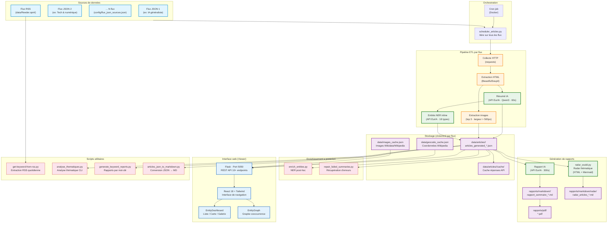
```mermaid
flowchart TB
    subgraph SOURCES["Sources de données"]
        F1["Flux JSON 1\n(ex: IA généraliste)"]
        F2["Flux JSON 2\n(ex: Tech & numérique)"]
        FN["... N flux\n(config/flux_json_sources.json)"]
        RSS["Flux RSS\n(data/Reeder.opml)"]
    end

    subgraph ORCHESTRATION["Orchestration"]
        CRON["Cron job\n(Docker)"]
        SCHED["scheduler_articles.py\nItère sur tous les flux"]
        CRON --> SCHED
    end

    subgraph PIPELINE["Pipeline ETL par flux"]
        COLLECT["Collecte HTTP\n(requests)"]
        EXTRACT["Extraction HTML\n(BeautifulSoup4)"]
        SUMMARIZE["Résumé IA\n(API EurIA · Qwen3 · 60s)"]
        IMAGES["Extraction images\n(top 3 · largeur > 500px)"]
        NER_INLINE["Entités NER inline\n(API EurIA · 18 types)"]
    end

    subgraph STORAGE["Stockage (cloisonné par flux)"]
        JOUT["data/articles/<flux>/\narticles_generated_*.json"]
        CACHE["data/articles/<flux>/cache/\nCache réponses API"]
        GEOCACHE["data/geocode_cache.json\nCoordonnées Wikipedia"]
        IMGCACHE["data/images_cache.json\nImages Wikidata/Wikipedia"]
    end

    subgraph ENRICHMENT["Enrichissement a posteriori"]
        ENRICH["enrich_entities.py\nNER post-hoc"]
        REPAIR["repair_failed_summaries.py\nRécupération d'erreurs"]
    end

    subgraph REPORTS["Génération de rapports"]
        REPORT["Rapport IA\n(API EurIA · 300s)"]
        RADAR["radar_wudd.py\nRadar thématique\n(HTML + Mermaid)"]
        MDOUT["rapports/markdown/<flux>/\nrapport_sommaire_*.md"]
        RADAR_OUT["rapports/markdown/radar/\nradar_articles_*.md"]
        PDF["rapports/pdf/\n*.pdf"]
    end

    subgraph VIEWER["Interface web (Viewer)"]
        FLASK["Flask · Port 5050\nREST API 10+ endpoints"]
        REACT["React 18 + Tailwind\nInterface de navigation"]
        ENTITY_DASH["EntityDashboard\nListe / Carte / Galerie"]
        ENTITY_GRAPH["EntityGraph\nGrapke cooccurrence"]
    end

    subgraph UTILS["Scripts utilitaires"]
        KEYWORD["get-keyword-from-rss.py\nExtraction RSS quotidienne"]
        THEMA["analyse_thematiques.py\nAnalyse thématique CLI"]
        KW_REPORT["generate_keyword_reports.py\nRapports par mot-clé"]
        MD2["articles_json_to_markdown.py\nConversion JSON → MD"]
    end

    SOURCES --> SCHED
    SCHED --> COLLECT
    COLLECT --> EXTRACT
    EXTRACT --> SUMMARIZE
    EXTRACT --> IMAGES
    SUMMARIZE --> NER_INLINE
    SUMMARIZE --> JOUT
    IMAGES --> JOUT
    NER_INLINE --> JOUT
    JOUT --> CACHE
    JOUT --> ENRICH
    JOUT --> REPAIR
    JOUT --> REPORT
    JOUT --> RADAR
    REPORT --> MDOUT
    MDOUT --> PDF
    RADAR --> RADAR_OUT
    RSS --> KEYWORD
    JOUT --> THEMA
    JOUT --> MD2
    JOUT --> KW_REPORT
    JOUT --> FLASK
    GEOCACHE --> FLASK
    IMGCACHE --> FLASK
    FLASK --> REACT
    REACT --> ENTITY_DASH
    REACT --> ENTITY_GRAPH

    classDef source fill:#e1f5ff,stroke:#0288d1,stroke-width:2px
    classDef process fill:#fff3e0,stroke:#f57c00,stroke-width:2px
    classDef storage fill:#f3e5f5,stroke:#7b1fa2,stroke-width:2px
    classDef ai fill:#e8f5e9,stroke:#388e3c,stroke-width:3px
    classDef util fill:#fce4ec,stroke:#c62828,stroke-width:1px
    classDef viewer fill:#e3f2fd,stroke:#1565c0,stroke-width:2px
    class F1,F2,FN,RSS source
    class COLLECT,EXTRACT,IMAGES process
    class JOUT,CACHE,MDOUT,PDF,GEOCACHE,IMGCACHE,RADAR_OUT storage
    class SUMMARIZE,REPORT,NER_INLINE,RADAR ai
    class KEYWORD,THEMA,MD2,KW_REPORT,ENRICH,REPAIR util
    class FLASK,REACT,ENTITY_DASH,ENTITY_GRAPH viewer
```

---

## 2. Architecture multi-flux

### Principe de cloisonnement

Chaque flux est traité de manière totalement indépendante.
La configuration centralisée `config/flux_json_sources.json` définit la liste des flux et le scheduler les exécute séquentiellement (ou via cron).

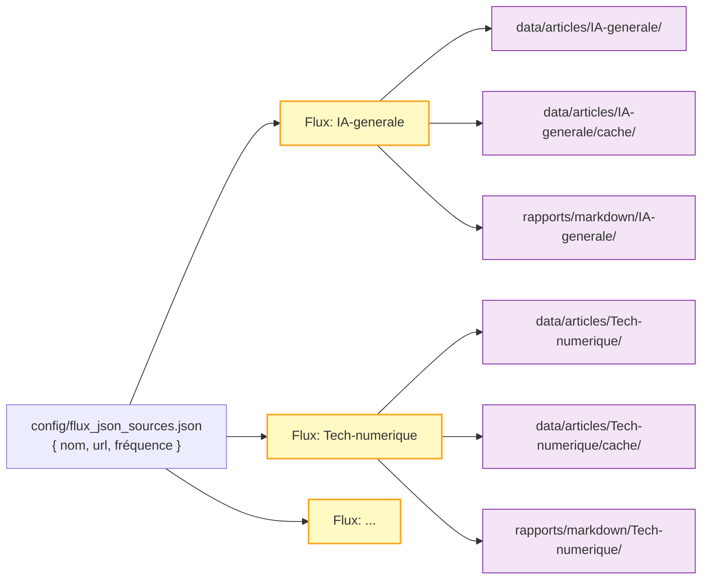
```mermaid
flowchart LR
    CFG["config/flux_json_sources.json\n{ nom, url, fréquence }"]
    CFG --> S1["Flux: IA-generale"]
    CFG --> S2["Flux: Tech-numerique"]
    CFG --> SN["Flux: ..."]
    S1 --> D1["data/articles/IA-generale/"]
    S1 --> C1["data/articles/IA-generale/cache/"]
    S1 --> R1["rapports/markdown/IA-generale/"]
    S2 --> D2["data/articles/Tech-numerique/"]
    S2 --> C2["data/articles/Tech-numerique/cache/"]
    S2 --> R2["rapports/markdown/Tech-numerique/"]
    classDef flux fill:#fff9c4,stroke:#f9a825,stroke-width:2px
    classDef data fill:#f3e5f5,stroke:#7b1fa2,stroke-width:1px
    class S1,S2,SN flux
    class D1,D2,C1,C2,R1,R2 data
```

### Structure des dossiers de sortie

```
data/
├── articles/
│   └── <nom-flux>/
│       ├── articles_generated_YYYY-MM-DD_YYYY-MM-DD.json
│       └── cache/                    # Cache API par flux
├── articles-from-rss/
│   └── <mot-clé>.json
├── geocode_cache.json                # Coordonnées géographiques (Wikipedia)
├── images_cache.json                 # Images entités (Wikidata/Wikipedia)
└── raw/
    └── all_articles.txt

rapports/
├── markdown/
│   ├── <nom-flux>/
│   │   └── rapport_sommaire_*.md
│   ├── keyword/
│   │   └── <mot-clé>/
│   │       └── <mot-clé>_rapport_DATES.md
│   └── radar/
│       └── radar_articles_generated_*.md
└── pdf/
    └── *.pdf
```

---

## 3. Flux de données détaillé

### Pipeline de traitement complet

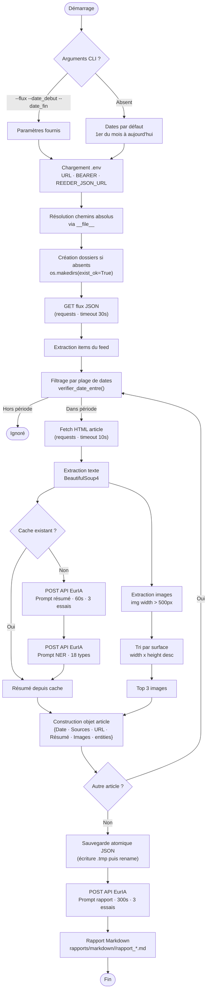
```mermaid
flowchart TD
    START([Démarrage]) --> ARGS{Arguments CLI ?}
    ARGS -->|"--flux --date_debut --date_fin"| PARAMS[Paramètres fournis]
    ARGS -->|Absent| DEFAULTS["Dates par défaut\n1er du mois à aujourd'hui"]
    PARAMS --> ENV
    DEFAULTS --> ENV
    ENV["Chargement .env\nURL · BEARER · REEDER_JSON_URL"]
    ENV --> PATHS["Résolution chemins absolus\nvia __file__"]
    PATHS --> MKDIR["Création dossiers si absents\nos.makedirs(exist_ok=True)"]
    MKDIR --> FETCH["GET flux JSON\n(requests · timeout 30s)"]
    FETCH --> ITEMS["Extraction items du feed"]
    ITEMS --> FILTER["Filtrage par plage de dates\nverifier_date_entre()"]
    FILTER -->|Hors période| SKIP([Ignoré])
    FILTER -->|Dans période| HTML["Fetch HTML article\n(requests · timeout 10s)"]
    HTML --> BS4["Extraction texte\nBeautifulSoup4"]
    BS4 --> CACHE_CHK{Cache existant ?}
    CACHE_CHK -->|Oui| RESUME_CACHED["Résumé depuis cache"]
    CACHE_CHK -->|Non| EURIA1["POST API EurIA\nPrompt résumé · 60s · 3 essais"]
    EURIA1 --> NER_CALL["POST API EurIA\nPrompt NER · 18 types"]
    NER_CALL --> RESUME_CACHED
    BS4 --> IMG["Extraction images\nimg width > 500px"]
    IMG --> SORT["Tri par surface\nwidth x height desc"]
    SORT --> TOP3["Top 3 images"]
    RESUME_CACHED --> BUILD["Construction objet article\n{Date · Sources · URL · Résumé · Images · entities}"]
    TOP3 --> BUILD
    BUILD --> LOOP{Autre article ?}
    LOOP -->|Oui| FILTER
    LOOP -->|Non| SAVE["Sauvegarde atomique JSON\n(écriture .tmp puis rename)"]
    SAVE --> EURIA2["POST API EurIA\nPrompt rapport · 300s · 3 essais"]
    EURIA2 --> MDOUT["Rapport Markdown\nrapports/markdown/<flux>/rapport_*.md"]
    MDOUT --> DONE([Fin])
```

### Formats de données

**Entrée (flux JSON)**
```json
{
  "items": [
    {
      "url": "https://source.com/article",
      "date_published": "2026-01-23T10:00:00Z",
      "authors": [{ "name": "Auteur" }],
      "title": "Titre de l'article"
    }
  ]
}
```

**Sortie (JSON structuré)**
```json
[
  {
    "Date de publication": "2026-01-23T10:00:00Z",
    "Sources": "Nom de la source",
    "URL": "https://...",
    "Résumé": "Résumé généré par l'IA en français (max 20 lignes)...",
    "Images": [
      { "url": "https://image.jpg", "width": 1200, "height": 800, "area": 960000 }
    ],
    "entities": {
      "PERSON": ["Sam Altman", "Emmanuel Macron"],
      "ORG": ["OpenAI", "Infomaniak"],
      "GPE": ["France", "San Francisco"],
      "PRODUCT": ["ChatGPT"],
      "DATE": ["2026"]
    }
  }
]
```

> Le champ `entities` est optionnel — absent des articles non encore enrichis. Le pipeline principal l'ajoute inline ; `enrich_entities.py` le complète a posteriori.

---

## 4. Composants principaux

### Vue d'ensemble des scripts

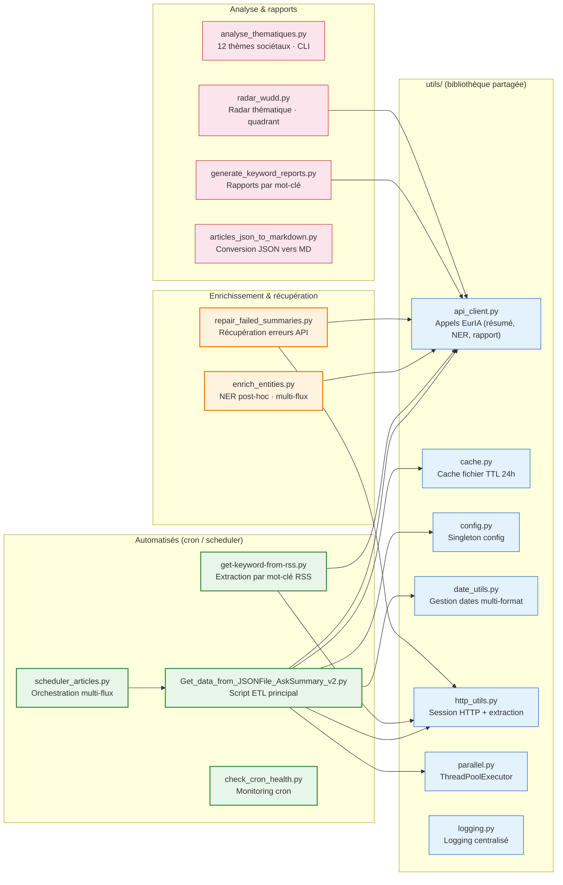
```mermaid
flowchart LR
    subgraph AUTO["Automatisés (cron / scheduler)"]
        SCHED["scheduler_articles.py\nOrchestration multi-flux"]
        MAIN["Get_data_from_JSONFile_AskSummary_v2.py\nScript ETL principal"]
        KW["get-keyword-from-rss.py\nExtraction par mot-clé RSS"]
        HEALTH["check_cron_health.py\nMonitoring cron"]
    end

    subgraph ENRICH_GRP["Enrichissement & récupération"]
        ENRICH["enrich_entities.py\nNER post-hoc · multi-flux"]
        REPAIR["repair_failed_summaries.py\nRécupération erreurs API"]
    end

    subgraph ANALYSIS["Analyse & rapports"]
        TH["analyse_thematiques.py\n12 thèmes sociétaux · CLI"]
        RADAR["radar_wudd.py\nRadar thématique · quadrant"]
        KW_REPORT["generate_keyword_reports.py\nRapports par mot-clé"]
        MD["articles_json_to_markdown.py\nConversion JSON vers MD"]
    end

    subgraph LIB["utils/ (bibliothèque partagée)"]
        API["api_client.py\nAppels EurIA (résumé, NER, rapport)"]
        CACHE_M["cache.py\nCache fichier TTL 24h"]
        CFG["config.py\nSingleton config"]
        DATE["date_utils.py\nGestion dates multi-format"]
        HTTP["http_utils.py\nSession HTTP + extraction"]
        PAR["parallel.py\nThreadPoolExecutor"]
        LOG["logging.py\nLogging centralisé"]
    end

    SCHED --> MAIN
    MAIN --> API
    MAIN --> CACHE_M
    MAIN --> CFG
    MAIN --> DATE
    MAIN --> HTTP
    MAIN --> PAR
    KW --> API
    KW --> HTTP
    ENRICH --> API
    REPAIR --> API
    REPAIR --> HTTP
    KW_REPORT --> API
    RADAR --> API

    classDef auto fill:#e8f5e9,stroke:#388e3c,stroke-width:2px
    classDef enrich fill:#fff3e0,stroke:#f57c00,stroke-width:2px
    classDef analysis fill:#fce4ec,stroke:#c62828,stroke-width:1px
    classDef lib fill:#e3f2fd,stroke:#1565c0,stroke-width:1px
    class SCHED,MAIN,KW,HEALTH auto
    class ENRICH,REPAIR enrich
    class TH,RADAR,KW_REPORT,MD analysis
    class API,CACHE_M,CFG,DATE,HTTP,PAR,LOG lib
```

### Détail des scripts

#### `Get_data_from_JSONFile_AskSummary_v2.py` — Script ETL central

```
Main Program
├── Configuration Loading    → utils/config.py (singleton)
├── Path Detection & Setup   → SCRIPT_DIR, PROJECT_ROOT via __file__
├── Directory Creation       → os.makedirs(exist_ok=True)
├── Data Fetching            → requests.get(REEDER_JSON_URL)
├── Processing Loop (parallèle — ThreadPoolExecutor 5 workers)
│   ├── Date Filtering       → verifier_date_entre()
│   ├── Text Extraction      → utils/http_utils.fetch_and_extract_text()
│   ├── AI Summarization     → utils/api_client.generate_summary()   [60s]
│   ├── NER Extraction       → utils/api_client.generate_entities()  [30s]
│   ├── Image Extraction     → utils/http_utils.extract_top_n_images()
│   └── Cache Management     → utils/cache.py (TTL 24h, MD5 keys)
├── Data Persistence         → sauvegarde atomique .tmp → rename
└── Report Generation        → utils/api_client.generate_report()    [300s]
```

#### `scheduler_articles.py` — Orchestrateur multi-flux

- Lit `config/flux_json_sources.json`
- Exécution mensuelle obligatoire (1er → dernier jour du mois)
- Détection hebdomadaire de nouveaux articles (déclenche une édition intermédiaire si > 10)
- Recommandation de fréquence adaptative via EurIA AI
- Suivi de l'historique de fréquence

#### `enrich_entities.py` — Enrichissement NER post-hoc

- Traite les articles des flux (`data/articles/<flux>/`) et des mots-clés (`data/articles-from-rss/`)
- Filtres CLI : `--flux`, `--keyword`, `--dry-run`, `--force`, `--delay`
- Statistiques par fichier : total, enrichis, déjà_présents, erreurs, ignorés
- Sauvegarde atomique (tmp → rename)

```bash
python scripts/enrich_entities.py --flux Intelligence-artificielle
python scripts/enrich_entities.py --dry-run   # scan sans appel API
```

#### `repair_failed_summaries.py` — Récupération d'erreurs

- Détecte le préfixe d'erreur : `"Désolé, je n'ai pas pu obtenir de réponse"`
- `--dry-run` : scan sans appel API
- `--dir` : répertoire cible (défaut : `data/articles-from-rss`)
- Ré-extrait le texte depuis l'URL, régénère résumé + entités
- Stats : réparés / échoués / ignorés

#### `radar_wudd.py` — Radar thématique analytique

Analyse temporelle des thèmes dans les articles, avec comparaison entre deux périodes.

- **Segmentation** : T0 (mois courant) vs T1 (2 semaines antérieures)
- **Scoring IA** : envoi d'un corpus de 50 articles à EurIA pour évaluation des fréquences par thème
- **18 thèmes** : IA, Tech, Innovation, Politique, Géopolitique, Économie, Santé, Éducation, Environnement, Emploi, Protection, Médias, Justice, Énergie, Militaire, Liberté, Désinformation, Espace
- **Métrique de vélocité** : `vel` = ratio de fréquence normalisé [0.1, 0.9] par rang (évite la compression quand tous les ratios sont proches de 1.0)
- **Quadrants** :
  - Dominant : fréquence haute + stable/croissant (vel ≥ 0.5)
  - Émergent : fréquence rare + croissant (vel > 0.5)
  - Habituel : fréquence haute + déclinant (vel < 0.5)
  - Déclinant : fréquence rare + déclinant
- **Sorties** :
  - Dashboard HTML interactif avec graphique SVG quadrant (tooltips, couleurs)
  - Rapport Markdown avec diagramme Mermaid `quadrantChart`
  - Sauvegarde dans `rapports/markdown/radar/radar_articles_generated_YYYY-MM-DD_YYYY-MM-DD.md`

#### `get-keyword-from-rss.py` — Extraction RSS quotidienne

- Lit `data/Reeder.opml` (liste flux RSS de l'app Reeder)
- Fenêtre de 7 jours, recherche par contrainte `or` / `and` avec word-boundary
- Résumé IA + extraction d'entités NER inline + image principale (min 500px)
- Sortie : `data/articles-from-rss/<mot-clé>.json` (déduplication par URL)
- Cron : `0 6-22/2 * * *` (toutes les 2h de 6h à 22h — 9 exécutions/jour)

#### `generate_keyword_reports.py` — Rapports par mot-clé

- Scanne `data/articles-from-rss/` pour chaque fichier JSON de mot-clé
- Filtre sur le mois courant
- Génère un rapport Markdown via `generate_report()`
- Sortie : `rapports/markdown/keyword/<mot-clé>/<mot-clé>_rapport_DATES.md`

#### `analyse_thematiques.py` — Analyse thématique

- 12 thèmes sociétaux définis dans `config/thematiques_societales.json`
- Correspondance par mots-clés dans les résumés
- Filtrage des résumés contenant des messages d'erreur
- Top 3 exemples par thème avec extraits

#### `check_cron_health.py` — Monitoring cron

- Surveille les fichiers de log (configurables via env : `CRON_LOG`, `SCHEDULER_LOG`)
- Alerte email si inactivité ou motif d'erreur (`Traceback`, `Error`, `Exception`)
- Configuration SMTP exclusivement via variables d'environnement

---

## 5. Modèle de données

### Schéma entité-relation

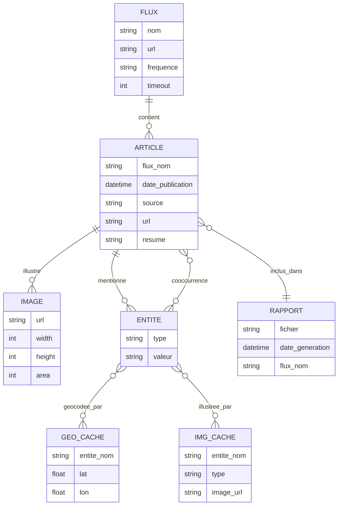
```mermaid
erDiagram
    FLUX ||--o{ ARTICLE : contient
    FLUX {
        string nom
        string url
        string frequence
        int timeout
    }
    ARTICLE {
        string flux_nom
        datetime date_publication
        string source
        string url
        string resume
    }
    ARTICLE ||--o{ IMAGE : illustre
    IMAGE {
        string url
        int width
        int height
        int area
    }
    ARTICLE ||--o{ ENTITE : mentionne
    ENTITE {
        string type
        string valeur
    }
    ENTITE }o--o{ ARTICLE : cooccurrence
    ARTICLE }o--|| RAPPORT : inclus_dans
    RAPPORT {
        string fichier
        datetime date_generation
        string flux_nom
    }
    ENTITE }o--o{ GEO_CACHE : geocodee_par
    GEO_CACHE {
        string entite_nom
        float lat
        float lon
    }
    ENTITE }o--o{ IMG_CACHE : illustree_par
    IMG_CACHE {
        string entite_nom
        string type
        string image_url
    }
```

### Contraintes métier

| Champ | Type | Contrainte |
|-------|------|------------|
| `Date de publication` | ISO 8601 String | Format `YYYY-MM-DDTHH:MM:SSZ` obligatoire |
| `Sources` | String | `authors[0].name` du flux |
| `Résumé` | Text | Max 20 lignes · Max 15 000 caractères · Langue française |
| `Images[].url` | URL | Doit commencer par `https://` |
| `Images[].width` | Integer | > 500 px |
| `entities` | Object | Optionnel · Clés = types OntoNotes 5.0 · Valeurs = listes de chaînes |
| Période | Dates | `date_debut < date_fin` |

### Types d'entités NER (18 types — OntoNotes 5.0)

| Catégorie    | Types                                          | Exemples                            |
| ------------ | ---------------------------------------------- | ----------------------------------- |
| Acteurs      | PERSON, ORG, NORP                              | Sam Altman, OpenAI, Démocrates      |
| Géographie   | GPE, LOC, FAC                                  | France, Alpes, Tour Eiffel          |
| Objets       | PRODUCT, WORK_OF_ART, LAW                      | ChatGPT, Nature, RGPD               |
| Événements   | EVENT                                          | Forum de Davos                      |
| Temporel     | DATE, TIME                                     | 2026, 14h00                         |
| Quantitatif  | MONEY, QUANTITY, PERCENT, CARDINAL, ORDINAL    | 150 M€, 3 milliards, 12%, cinquième |
| Linguistique | LANGUAGE                                       | Français, Anglais                   |

---

## 6. Analyse sémantique — Entités nommées (NER)

> Voir aussi `docs/ENTITIES.md` pour la documentation complète.

### Pipeline d'enrichissement

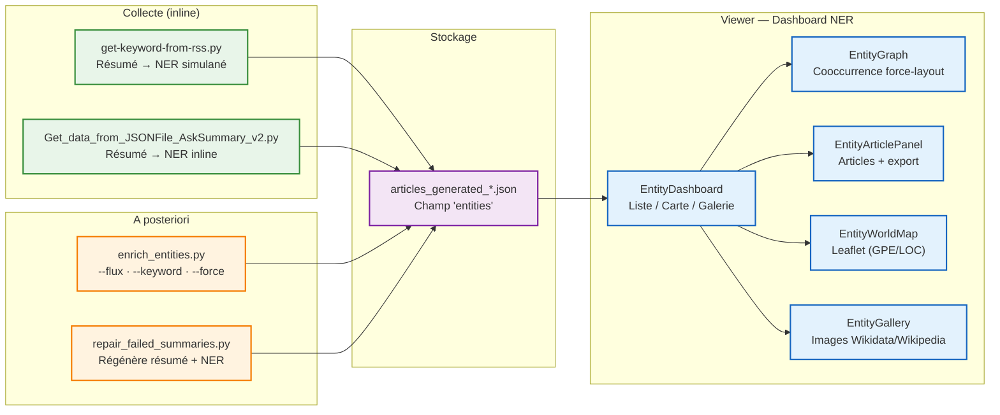
```mermaid
flowchart LR
    subgraph COLLECT["Collecte (inline)"]
        GET["get-keyword-from-rss.py\nRésumé → NER simulané"]
        MAIN2["Get_data_from_JSONFile_AskSummary_v2.py\nRésumé → NER inline"]
    end

    subgraph POSTHOC["A posteriori"]
        ENRICH2["enrich_entities.py\n--flux · --keyword · --force"]
        REPAIR2["repair_failed_summaries.py\nRégénère résumé + NER"]
    end

    subgraph STORE["Stockage"]
        JSON_ENT["articles_generated_*.json\nChamp 'entities'"]
    end

    subgraph VIEWER_NER["Viewer — Dashboard NER"]
        DASH["EntityDashboard\nListe / Carte / Galerie"]
        GRAPH["EntityGraph\nCooccurrence force-layout"]
        PANEL["EntityArticlePanel\nArticles + export"]
        MAP["EntityWorldMap\nLeaflet (GPE/LOC)"]
        GALLERY["EntityGallery\nImages Wikidata/Wikipedia"]
    end

    GET --> JSON_ENT
    MAIN2 --> JSON_ENT
    ENRICH2 --> JSON_ENT
    REPAIR2 --> JSON_ENT
    JSON_ENT --> DASH
    DASH --> GRAPH
    DASH --> PANEL
    DASH --> MAP
    DASH --> GALLERY

    classDef collect fill:#e8f5e9,stroke:#388e3c,stroke-width:2px
    classDef posthoc fill:#fff3e0,stroke:#f57c00,stroke-width:2px
    classDef store fill:#f3e5f5,stroke:#7b1fa2,stroke-width:2px
    classDef viewer fill:#e3f2fd,stroke:#1565c0,stroke-width:2px
    class GET,MAIN2 collect
    class ENRICH2,REPAIR2 posthoc
    class JSON_ENT store
    class DASH,GRAPH,PANEL,MAP,GALLERY viewer
```

### Génération des entités via API EurIA

```python
# utils/api_client.py
def generate_entities(resume: str, timeout: int = 30) -> dict:
    """
    Extrait les entités nommées d'un résumé.
    Retourne un dict {TYPE: [valeur, ...]} selon OntoNotes 5.0.
    Nettoie les blocs <think>...</think> de Qwen3.
    """
```

Le prompt NER est envoyé sur le résumé (pas le texte brut) pour limiter les jetons. La réponse est un bloc JSON qui est parsé et normalisé.

### Graphe de cooccurrence (EntityGraph)

L'algorithme de layout implémente Fruchterman-Reingold en pur SVG (sans D3) :

- **240 itérations** de relaxation
- Nœud central ancré (entité requêtée) avec forte gravité
- Nœuds L1 (cooccurrents directs) sur un cercle intermédiaire
- Nœuds L2 (2ᵉ degré) sur un cercle extérieur, répulsion réduite (0.7×)
- `k = sqrt(W×H/n) × 0.90` — constante de ressort
- `température = 7 × (1 - iter/ITERS)` — recuit simulé
- Taille des nœuds proportionnelle au nombre d'articles mentionnant l'entité

### Caches externes

| Cache     | Fichier                      | Source                               | Contenu                        |
| --------- | ---------------------------- | ------------------------------------ | ------------------------------ |
| Géocodage | `data/geocode_cache.json`    | Wikipedia API (coordonnées)          | GPE/LOC → lat/lon              |
| Images    | `data/images_cache.json`     | Wikidata P154 + Wikipedia pageimages | PERSON/ORG/PRODUCT → URL image |

---

## 7. Viewer — Interface web

### Architecture

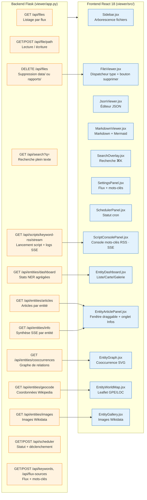
```mermaid
flowchart LR
    subgraph BACKEND["Backend Flask (viewer/app.py)"]
        API_FILES["GET /api/files\nListage par flux"]
        API_FILE["GET/POST /api/file/path\nLecture / écriture"]
        API_DEL["DELETE /api/files\nSuppression data/ ou rapports/"]
        API_SEARCH["GET /api/search?q=\nRecherche plein texte"]
        API_ENT["GET /api/entities/dashboard\nStats NER agrégées"]
        API_ENT_ART["GET /api/entities/articles\nArticles par entité"]
        API_GEO["GET /api/entities/geocode\nCoordonnées Wikipedia"]
        API_IMG["GET /api/entities/images\nImages Wikidata"]
        API_COOC["GET /api/entities/cooccurrences\nGraphe de relations"]
        API_INFO["GET /api/entities/info\nSynthèse SSE par entité"]
        API_SCRIPT["GET /api/scripts/keyword-rss/stream\nLancement script + logs SSE"]
        API_SCHED["GET/POST /api/scheduler\nStatut + déclenchement"]
        API_CFG["GET/POST /api/keywords, /api/flux-sources\nFlux + mots-clés"]
    end

    subgraph FRONTEND["Frontend React 18 (viewer/src/)"]
        SIDEBAR["Sidebar.jsx\nArborescence fichiers"]
        FILEVIEW["FileViewer.jsx\nDispatcheur type + bouton supprimer"]
        JSONVIEW["JsonViewer.jsx\nÉditeur JSON"]
        MDVIEW["MarkdownViewer.jsx\nMarkdown + Mermaid"]
        SEARCH_OV["SearchOverlay.jsx\nRecherche ⌘K"]
        SETTINGS["SettingsPanel.jsx\nFlux + mots-clés"]
        SCHEDPAN["SchedulerPanel.jsx\nStatut cron"]
        SCRIPT_CON["ScriptConsolePanel.jsx\nConsole mots-clés RSS · SSE"]
        E_DASH["EntityDashboard.jsx\nListe/Carte/Galerie"]
        E_PANEL["EntityArticlePanel.jsx\nFenêtre draggable + onglet Infos"]
        E_GRAPH["EntityGraph.jsx\nCooccurrence SVG"]
        E_MAP["EntityWorldMap.jsx\nLeaflet GPE/LOC"]
        E_GALL["EntityGallery.jsx\nImages Wikidata"]
    end

    BACKEND --> FRONTEND
    API_ENT --> E_DASH
    API_ENT_ART --> E_PANEL
    API_INFO --> E_PANEL
    API_COOC --> E_GRAPH
    API_GEO --> E_MAP
    API_IMG --> E_GALL
    API_DEL --> FILEVIEW
    API_SCRIPT --> SCRIPT_CON

    classDef be fill:#fff3e0,stroke:#f57c00,stroke-width:1px
    classDef fe fill:#e3f2fd,stroke:#1565c0,stroke-width:1px
    class API_FILES,API_FILE,API_DEL,API_SEARCH,API_ENT,API_ENT_ART,API_GEO,API_IMG,API_COOC,API_INFO,API_SCRIPT,API_SCHED,API_CFG be
    class SIDEBAR,FILEVIEW,JSONVIEW,MDVIEW,SEARCH_OV,SETTINGS,SCHEDPAN,SCRIPT_CON,E_DASH,E_PANEL,E_GRAPH,E_MAP,E_GALL fe
```

### Démarrage

| Mode               | Commande                                  | Port         |
| ------------------ | ----------------------------------------- | ------------ |
| Développement      | `bash viewer/start.sh` (depuis la racine) | 5173 (Vite)  |
| Production Docker  | `docker compose up -d`                    | 5050 (Flask) |

> Le `viewer/dist/` est baked dans l'image Docker (`docker compose build` obligatoire après `npm run build`).

### Interface responsive mobile/tablette (mars 2026)

L'interface est entièrement adaptée aux appareils mobiles et tablettes :

| Breakpoint | Comportement |
| --- | --- |
| Mobile (< 768 px) | Sidebar en drawer (hamburger + slide-in + overlay backdrop) |
| Mobile (< 768 px) | Barre de navigation fixe en bas : thème, RSS, Entités, Réglages, Recherche |
| Mobile (< 640 px) | `EntityArticlePanel` en fullscreen automatique |
| Mobile (< 768 px) | Toolbar `ArticleListViewer` en 2 lignes (flex-col) |
| Desktop (≥ 768 px) | Comportement identique à la version précédente |

**Support iPhone spécifique :**

- `viewport-fit=cover` + `env(safe-area-inset-top/bottom)` pour la zone notch / Dynamic Island
- `<meta name="theme-color">` mis à jour dynamiquement selon le thème (blanc mode jour, `#1e293b` mode nuit)
- `-webkit-text-size-adjust: auto` pour respecter la taille de police système iOS

### Routes API — détail

| Route | Méthode | Description | Restrictions |
|-------|---------|-------------|--------------|
| `/api/files` | GET | Liste tous les fichiers JSON/MD de `data/`, `rapports/`, `samples/` | — |
| `/api/files` | DELETE | Supprime un fichier par son chemin relatif | `data/` et `rapports/` uniquement |
| `/api/content` | GET | Lit le contenu brut d'un fichier | — |
| `/api/content` | POST | Sauvegarde le contenu (JSON validé) | `data/` et `config/` uniquement |
| `/api/download` | GET | Télécharge un fichier en pièce jointe | — |
| `/api/search` | GET | Recherche plein texte (param `q`) | — |
| `/api/scheduler` | GET | Liste les tâches cron avec dernier/prochain passage | — |
| `/api/keywords` | GET/POST | Lit/sauvegarde `keyword-to-search.json` | — |
| `/api/flux-sources` | GET/POST | Lit/sauvegarde `flux_json_sources.json` | — |
| `/api/search/entity` | GET | Recherche cross-fichiers d'une entité NER | — |
| `/api/entities/dashboard` | GET | Statistiques NER agrégées (top 50 par type) | — |
| `/api/entities/articles` | GET | Articles contenant une entité (type + value) | — |
| `/api/entities/cooccurrences` | GET | Graphe de relations (depth 1 ou 2) | — |
| `/api/entities/geocode` | POST | Géocode des entités via Wikipedia (cache JSON) | — |
| `/api/entities/images` | POST | Images via Wikidata P154 + Wikipedia pageimages | — |
| `/api/entities/info` | GET | Synthèse encyclopédique en streaming SSE (EurIA) | Token EurIA requis |
| `/api/scripts/keyword-rss/stream` | GET | Lance `get-keyword-from-rss.py` et stream les logs SSE | Un seul process à la fois |

### Composants React — détail

| Composant | Rôle |
|-----------|------|
| `Sidebar.jsx` | Arborescence par flux ; drawer mobile (hamburger, slide-in, overlay backdrop) |
| `FileViewer.jsx` | Détecte le type de fichier, route vers le bon composant, bouton Supprimer ; boutons flottants (haut / images / entités) repositionnés au-dessus de la barre de navigation mobile |
| `JsonViewer.jsx` | Édition JSON inline avec syntaxe colorée + sauvegarde |
| `MarkdownViewer.jsx` | Rendu Markdown + diagrammes Mermaid (v11) |
| `SearchOverlay.jsx` | Recherche plein texte globale (raccourci ⌘K) ; espacement adaptatif mobile |
| `SettingsPanel.jsx` | Gestion des flux et mots-clés |
| `SchedulerPanel.jsx` | Statut cron + déclenchement manuel |
| `ScriptConsolePanel.jsx` | Console modale SSE pour lancer `get-keyword-from-rss.py` ; logs en temps réel, rechargement auto de la liste de fichiers à la fin |
| `EntityDashboard.jsx` | Dashboard NER : 3 onglets (Liste / Carte / Galerie), plein écran ; paddings et libellés adaptatifs mobile |
| `EntityArticlePanel.jsx` | Fenêtre draggable/redimensionnable sur desktop ; fullscreen automatique sur mobile (< 640 px) ; `minWidth` réduit à 320 px |
| `EntityGraph.jsx` | Réseau de cooccurrence (SVG pur, algorithme FR, zoom/pan) |
| `EntityWorldMap.jsx` | Carte Leaflet pour entités GPE/LOC (géocodage Wikipedia, redimensionnement dynamique) |
| `EntityGallery.jsx` | Galerie d'images pour PERSON/ORG/PRODUCT (Wikidata + Wikipedia) |

---

## 8. Intégrations externes — API EurIA

### Appel API standard

```python
response = requests.post(
    URL,  # depuis .env
    json={
        "messages": [{"content": prompt, "role": "user"}],
        "model": "qwen3",
        "enable_web_search": True
    },
    headers={"Authorization": f"Bearer {BEARER}"},
    timeout=60
)
content = response.json()["choices"][0]["message"]["content"]
```

### Méthodes du client (`utils/api_client.py`)

| Méthode                    | Usage               | Timeout      | Tentatives   |
| -------------------------- | ------------------- | ------------ | ------------ |
| `generate_summary(text)`   | Résumé d'article    | 60 s         | 3            |
| `generate_entities(resume)`| NER sur le résumé   | 30 s         | 3            |
| `generate_report(json_str)`| Rapport de synthèse | 300 s        | 3            |
| `ask(prompt)`              | Appel générique     | configurable | configurable |

> `generate_entities()` nettoie automatiquement les blocs `<think>...</think>` produits par Qwen3 et normalise le JSON résultant.

### Gestion des erreurs & retry

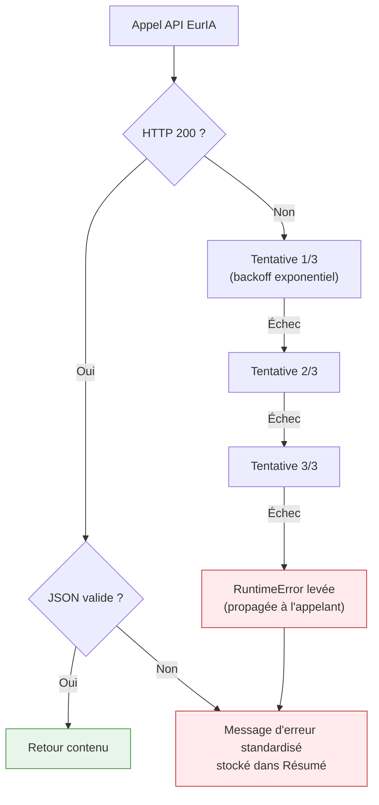
```mermaid
flowchart TD
    CALL["Appel API EurIA"] --> OK{HTTP 200 ?}
    OK -->|Oui| PARSE{JSON valide ?}
    PARSE -->|Oui| RETURN["Retour contenu"]
    PARSE -->|Non| FALLBACK
    OK -->|Non| A1["Tentative 1/3\n(backoff exponentiel)"]
    A1 -->|Échec| A2["Tentative 2/3"]
    A2 -->|Échec| A3["Tentative 3/3"]
    A3 -->|Échec| RAISE["RuntimeError levée\n(propagée à l'appelant)"]
    RAISE --> FALLBACK["Message d'erreur standardisé\nstocké dans Résumé"]
    classDef ok fill:#e8f5e9,stroke:#388e3c
    classDef err fill:#ffebee,stroke:#c62828
    class RETURN ok
    class FALLBACK,RAISE err
```

> **Correction critique (fév. 2026)** : `if e.response is not None` (au lieu de `if e.response`) — `bool(requests.Response)` retournait `False` pour les codes HTTP 4xx/5xx, masquant les erreurs.

### Intégrations tierces (entités)

| Service              | Usage                                        | Cache                     |
| -------------------- | -------------------------------------------- | ------------------------- |
| Wikipedia API        | Géocodage des entités GPE/LOC (coordonnées)  | `data/geocode_cache.json` |
| Wikidata (P154)      | Logos d'organisations et produits            | `data/images_cache.json`  |
| Wikipedia pageimages | Portraits de personnes                       | `data/images_cache.json`  |
| OpenStreetMap        | Fond de carte Leaflet                        | Navigateur (tiles)        |

---

## 9. Infrastructure & Chemins

### Résolution des chemins

Tous les scripts utilisent des chemins absolus construits depuis `__file__` :

```python
from pathlib import Path
SCRIPT_DIR   = Path(__file__).parent
PROJECT_ROOT = SCRIPT_DIR.parent
# Puis via utils/config.py (singleton) :
config = get_config()
config.data_articles_dir   # Path("data/articles/")
config.rapports_dir        # Path("rapports/")
```

Avantage : fonctionne depuis n'importe quel répertoire, compatible cron, raccourcis macOS et Docker.

### Cartographie des dossiers

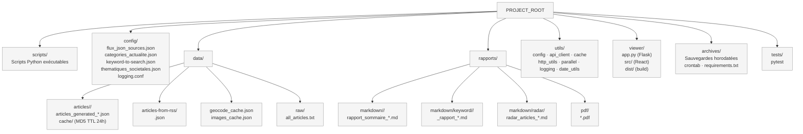
```mermaid
flowchart TD
    ROOT["PROJECT_ROOT"]
    ROOT --> SCRIPTS["scripts/\nScripts Python exécutables"]
    ROOT --> CONFIG2["config/\nflux_json_sources.json\ncategories_actualite.json\nkeyword-to-search.json\nthematiques_societales.json\nlogging.conf"]
    ROOT --> DATA2["data/"]
    ROOT --> RAPPORTS2["rapports/"]
    ROOT --> UTILS2["utils/\nconfig · api_client · cache\nhttp_utils · parallel · logging · date_utils"]
    ROOT --> VIEWER2["viewer/\napp.py (Flask)\nsrc/ (React)\ndist/ (build)"]
    ROOT --> ARCHIVES2["archives/\nSauvegardes horodatées\ncrontab · requirements.txt"]
    ROOT --> TESTS2["tests/\npytest"]
    DATA2 --> ART["articles/<flux>/\narticles_generated_*.json\ncache/ (MD5 TTL 24h)"]
    DATA2 --> ARSS["articles-from-rss/\n<mot-clé>.json"]
    DATA2 --> GEO["geocode_cache.json\nimages_cache.json"]
    DATA2 --> RAW2["raw/\nall_articles.txt"]
    RAPPORTS2 --> MD3["markdown/<flux>/\nrapport_sommaire_*.md"]
    RAPPORTS2 --> KW2["markdown/keyword/<mot-clé>/\n<mot-clé>_rapport_*.md"]
    RAPPORTS2 --> RAD["markdown/radar/\nradar_articles_*.md"]
    RAPPORTS2 --> PDF2["pdf/\n*.pdf"]
    classDef dir fill:#f5f5f5,stroke:#9e9e9e
    class ROOT,SCRIPTS,CONFIG2,DATA2,RAPPORTS2,UTILS2,VIEWER2,ARCHIVES2,TESTS2,ART,ARSS,GEO,RAW2,MD3,KW2,RAD,PDF2 dir
```

### Déploiement Docker

Le projet inclut `Dockerfile` + `docker-compose.yml`. L'`entrypoint.sh` démarre à la fois :

- Le scheduler cron (via `archives/crontab`)
- Le viewer Flask sur le port 5050

Le `viewer/dist/` est compilé et baked dans l'image Docker (pas de volume monté).

---

## 10. Sécurité

### Gestion des secrets

- Toutes les credentials dans `.env` (jamais versionné — `.gitignore`)
- Chargement exclusif via `python-dotenv`
- Variables sensibles : `bearer`, `REEDER_JSON_URL`
- Le viewer Flask expose une API locale (pas d'authentification — usage interne uniquement)

### Validation des entrées

| Vecteur | Validation |
|---------|-----------|
| URLs | `startswith(('http://', 'https://'))` + `raise_for_status()` |
| Dates | `datetime.strptime()` strict + `date_debut < date_fin` |
| JSON | `try/except` sur `json.load()` et `response.json()` |
| Images | Largeur > 500 px + URL absolue |
| Résumés | Troncature à 15 000 caractères avant envoi API |
| Réponse NER | Nettoyage `<think>...</think>` + validation JSON structure |

---

## 11. Performance et scalabilité

### Métriques (traitement parallèle actuel)

| Opération | Temps moyen |
|-----------|-------------|
| Fetch HTML | 1–3 s |
| Extraction texte (BS4) | < 100 ms |
| Résumé IA | 5–10 s |
| Extraction entités NER | 3–8 s |
| Extraction + tri images | 1–2 s |
| **Total / article (parallèle 5 workers)** | **7–15 s** |

> 100 articles ≈ 12–25 minutes (traitement parallèle par batch de 5)

### Cache multi-niveaux

| Niveau          | Mécanisme                  | TTL       | Périmètre |
| --------------- | -------------------------- | --------- | --------- |
| Texte HTML      | `utils/cache.py` (MD5)     | 24 h      | Par flux  |
| Résumé IA       | `utils/cache.py` (MD5)     | 24 h      | Par flux  |
| Géocodage       | `data/geocode_cache.json`  | Permanent | Global    |
| Images entités  | `data/images_cache.json`   | Permanent | Global    |

### Priorité des optimisations

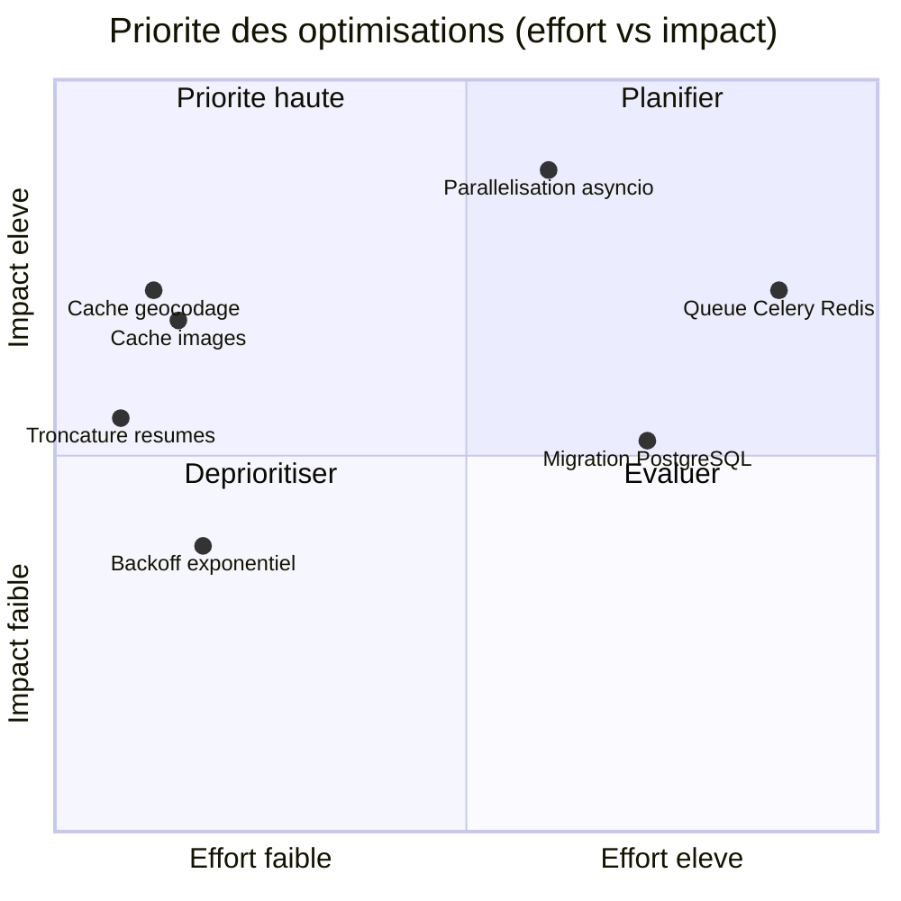
```mermaid
quadrantChart
    title Priorite des optimisations (effort vs impact)
    x-axis Effort faible --> Effort eleve
    y-axis Impact faible --> Impact eleve
    quadrant-1 Planifier
    quadrant-2 Priorite haute
    quadrant-3 Deprioritiser
    quadrant-4 Evaluer
    Cache geocodage: [0.12, 0.72]
    Cache images: [0.15, 0.68]
    Troncature resumes: [0.08, 0.55]
    Backoff exponentiel: [0.18, 0.38]
    Parallelisation asyncio: [0.60, 0.88]
    Migration PostgreSQL: [0.72, 0.52]
    Queue Celery Redis: [0.88, 0.72]
```

---

## 12. Décisions architecturales

| ADR | Décision | Justification | Limite |
|-----|----------|---------------|--------|
| **ADR-001** | Chemins absolus via `__file__` | Compatible cron, macOS, Docker | Légèrement plus verbeux |
| **ADR-002** | JSON comme stockage primaire | Natif Python, lisible, sans setup DB | Pas de requêtes complexes |
| **ADR-003** | Résumés IA en français uniquement | Sources et utilisateurs francophones | Limite réutilisabilité |
| **ADR-004** | Retry avec backoff exponentiel (urllib3) | Résilience sans surcharge API | Latence plus haute en cas d'erreur transitoire |
| **ADR-005** | GUI tkinter uniquement dans scripts legacy | Scripts utilitaires user-friendly | Incompatible headless / CI |
| **ADR-006** | Cloisonnement par flux (fév. 2026) | Isolation complète des données | Duplication de dossiers |
| **ADR-007** | Viewer Flask + React (fév. 2026) | Interface locale sans dépendance cloud | Nécessite Node.js pour le build |
| **ADR-008** | NER sur résumé et non texte brut | Moins de jetons, qualité suffisante | Perd les entités hors résumé |
| **ADR-009** | Enrichissement NER a posteriori | Permet d'ajouter NER sans retraitement ETL | Désynchronisation possible |
| **ADR-010** | Sauvegarde atomique (tmp → rename) | Intégrité fichiers si interruption | Dépend du même filesystem |
| **ADR-011** | Layout graphe sans D3 (FR pur SVG) | Pas de dépendance JavaScript lourde | Moins de fonctionnalités interactives |
| **ADR-012** | Cache Wikidata/Wikipedia permanent | Wikipedia évolue peu pour les entités stables | Nécessite invalidation manuelle |

---

## 13. Roadmap

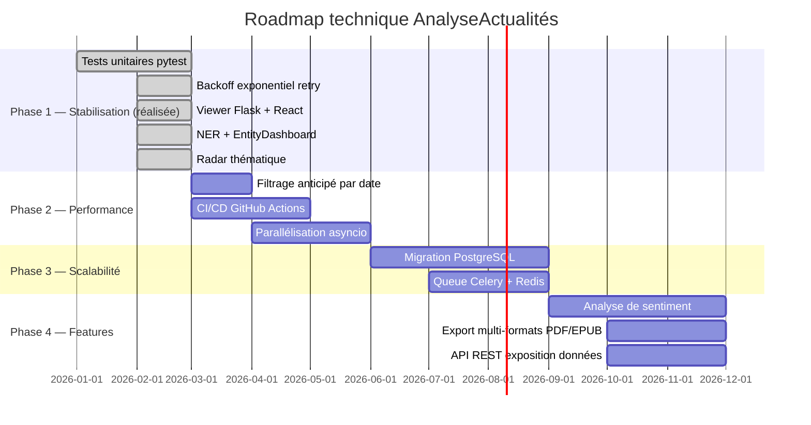
```mermaid
gantt
    title Roadmap technique AnalyseActualités
    dateFormat  YYYY-MM
    section Phase 1 — Stabilisation (réalisée)
    Tests unitaires pytest           :done, 2026-01, 2026-03
    Backoff exponentiel retry        :done, 2026-02, 2026-03
    Viewer Flask + React             :done, 2026-02, 2026-03
    NER + EntityDashboard            :done, 2026-02, 2026-03
    Radar thématique                 :done, 2026-02, 2026-03
    section Phase 2 — Performance
    Filtrage anticipé par date       :2026-03, 2026-04
    CI/CD GitHub Actions             :2026-03, 2026-05
    Parallélisation asyncio          :2026-04, 2026-06
    section Phase 3 — Scalabilité
    Migration PostgreSQL              :2026-06, 2026-09
    Queue Celery + Redis              :2026-07, 2026-09
    section Phase 4 — Features
    Analyse de sentiment              :2026-09, 2026-12
    Export multi-formats PDF/EPUB     :2026-10, 2026-12
    API REST exposition données       :2026-10, 2026-12
```

---

## Références

| Ressource | Lien |
|-----------|------|
| Analyse entités nommées | [docs/ENTITIES.md](ENTITIES.md) |
| Guide déploiement | [docs/DEPLOY.md](DEPLOY.md) |
| Services externes | [docs/EXTERNAL_SERVICES.md](EXTERNAL_SERVICES.md) |
| Sécurité | [docs/security/SECURITY.md](security/SECURITY.md) |
| Prompts EurIA | [docs/PROMPTS.md](PROMPTS.md) |
| Guide scripts | [scripts/USAGE.md](../scripts/USAGE.md) |
| Viewer (UI) | [README.md — Section 5](../README.md#5-viewer--interface-de-visualisation) |
| Historique | [CHANGELOG.md](../CHANGELOG.md) |
| BeautifulSoup4 | [crummy.com/software/BeautifulSoup](https://www.crummy.com/software/BeautifulSoup/bs4/doc/) |
| API EurIA Infomaniak | [euria.infomaniak.com](https://euria.infomaniak.com) |
| OntoNotes 5.0 NER types | [catalog.ldc.upenn.edu](https://catalog.ldc.upenn.edu/LDC2013T19) |
| Leaflet.js | [leafletjs.com](https://leafletjs.com) |
| Wikidata API | [wikidata.org/wiki/Wikidata:Data\_access](https://www.wikidata.org/wiki/Wikidata:Data_access) |

---

**Maintenu par** : Patrick Ostertag · patrick.ostertag@gmail.com
**Dernière mise à jour** : 3 mars 2026 · Version 4.2
