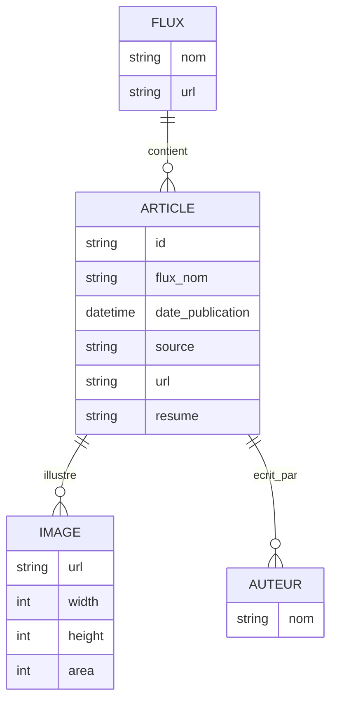

# Architecture de l’application AnalyseActualités (Multi-Flux)

## 1. Vue d’ensemble
L’application est un pipeline ETL modulaire qui collecte, analyse et synthétise des actualités issues de plusieurs flux JSON, avec stockage cloisonné par flux. Elle s’appuie sur des scripts Python, une configuration centralisée, un scheduler, un système de cache, et l’API EurIA d’Infomaniak pour la génération de résumés et de rapports.

---

## 2. APIs et modules principaux

### a. API EurIA (Infomaniak)
- **URL** : fournie dans `.env` (ex : https://api.infomaniak.com/euria/v1/chat/completions)
- **Usage** : génération de résumés d’articles et de rapports synthétiques via modèle Qwen3
- **Appel** : POST avec prompt, modèle, et web search activé
- **Réponse** : résumé ou rapport structuré (texte)

### b. Scheduler
- **Script** : `scripts/scheduler_articles.py`
- **Rôle** : itère sur tous les flux définis dans `config/flux_json_sources.json` et lance le traitement pour chaque flux (et chaque période souhaitée)
- **Automatisation** : peut être appelé par cron ou manuellement

### c. Scripts principaux
- **Get_data_from_JSONFile_AskSummary_v2.py** :
  - Paramètres : `--flux`, `--date_debut`, `--date_fin`
  - Rôle : collecte, extraction HTML, résumé IA, stockage JSON, gestion du cache, génération rapport Markdown
- **articles_json_to_markdown.py** :
  - Conversion JSON → Markdown, par flux
- **analyse_thematiques.py** :
  - Analyse thématique des articles collectés

### d. Modules utilitaires
- **utils/api_client.py** : gestion des appels API
- **utils/cache.py** : gestion du cache par flux
- **utils/config.py** : chargement et validation de la configuration
- **utils/date_utils.py** : gestion des dates et périodes

---

## 3. Stockage des données

### a. Organisation des dossiers
- **data/articles/<flux>/** : articles JSON générés par flux et période
- **data/articles/cache/<flux>/** : cache des réponses API par flux
- **rapports/markdown/<flux>/** : rapports Markdown par flux
- **config/** : fichiers de configuration (flux, catégories, thématiques, prompts)

### b. Cycle de vie des données
1. **Collecte** : téléchargement du flux JSON (URL dans config)
2. **Extraction** : parsing des articles, extraction HTML, images
3. **Résumé IA** : appel à l’API EurIA pour chaque article
4. **Stockage** : sauvegarde des articles enrichis dans `data/articles/<flux>/`
5. **Rapport** : génération d’un rapport Markdown dans `rapports/markdown/<flux>/`
6. **Cache** : stockage des réponses API pour éviter les doublons

---

## 4. Schéma relationnel des éléments stockés

- **FLUX** : défini dans `config/flux_json_sources.json`
- **ARTICLE** : stocké dans `data/articles/<flux>/articles_generated_YYYY-MM-DD_YYYY-MM-DD.json`
- **IMAGE** : images extraites et associées à chaque article (top 3 par surface)
- **AUTEUR** : liste d’auteurs par article

---

## 5. Déroulement d’un traitement (exemple)
1. Le scheduler lit la liste des flux dans la config.
2. Pour chaque flux et période :
   - Le script principal télécharge le flux JSON.
   - Il extrait les articles, le texte, les images.
   - Il appelle l’API EurIA pour générer un résumé.
   - Il stocke le résultat dans le dossier du flux.
   - Il génère un rapport Markdown.
   - Le cache évite les appels redondants à l’API.

---

## 6. Références
- **Configuration des flux** : `config/flux_json_sources.json`
- **Exemple d’article stocké** : voir `data/articles/<flux>/articles_generated_YYYY-MM-DD_YYYY-MM-DD.json`
- **Documentation détaillée** : `docs/STRUCTURE.md`, `docs/ARCHITECTURE.md`, `docs/SYNTHESE_MULTI_FLUX.md`

---
*Document généré automatiquement le 17/02/2026.*
