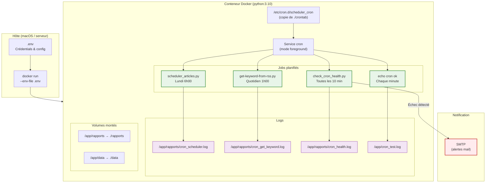
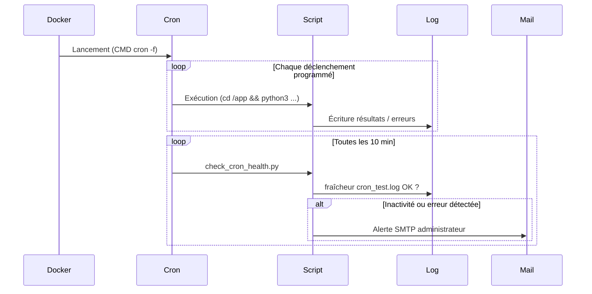
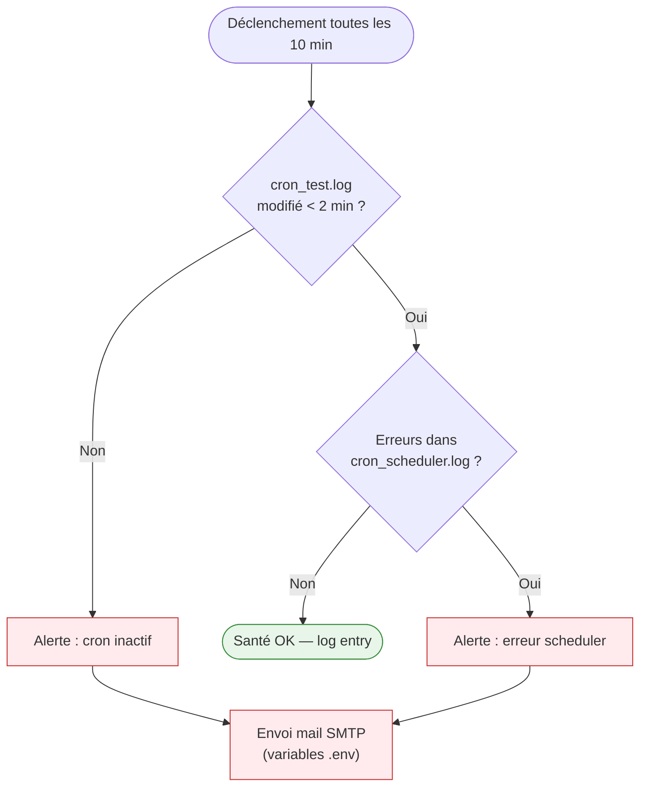

# Cron & Docker — AnalyseActualités

> Document de référence · Version 2.0 · 22 février 2026

---

## Table des matières

1. [Vue d'ensemble](#1-vue-densemble)
2. [Architecture d'exécution](#2-architecture-dexécution)
3. [Configuration crontab](#3-configuration-crontab)
4. [Build & déploiement Docker](#4-build--déploiement-docker)
5. [Surveillance et alertes](#5-surveillance-et-alertes)
6. [Logs](#6-logs)
7. [Bonnes pratiques](#7-bonnes-pratiques)

---

## 1. Vue d'ensemble

### Principe

Toutes les tâches planifiées sont **exclusivement gérées dans le conteneur Docker** via une crontab personnalisée. Aucune tâche cron n'est programmée sur l'hôte.

### Tâches actives (vérification 21/02/2026)

| Tâche | Script | Fréquence | Log |
|-------|--------|-----------|-----|
| Scheduler d'articles | `scheduler_articles.py` | Lundi 6h | `/app/rapports/cron_scheduler.log` |
| Extraction par mot-clé | `get-keyword-from-rss.py` | Quotidien 1h | `/app/rapports/cron_get_keyword.log` |
| Surveillance cron | `check_cron_health.py` | Toutes les 10 min | `/app/rapports/cron_health.log` |
| Test de vie cron | *(echo)* | Chaque minute | `/app/cron_test.log` |

---

## 2. Architecture d'exécution



---

## 3. Configuration crontab

### Fichier `crontab` (racine du projet)

```cron
SHELL=/bin/bash
PATH=/usr/local/sbin:/usr/local/bin:/sbin:/bin:/usr/sbin:/usr/bin

# Scheduler d'articles — chaque lundi à 6h
0 6 * * 1 root cd /app && python3 scripts/scheduler_articles.py >> /app/rapports/cron_scheduler.log 2>&1

# Extraction par mot-clé — quotidien à 1h
0 1 * * * root cd /app && python3 scripts/get-keyword-from-rss.py 2>&1 | tee -a /app/rapports/cron_get_keyword.log

# Surveillance santé cron — toutes les 10 minutes
*/10 * * * * root cd /app && python3 scripts/check_cron_health.py >> /app/rapports/cron_health.log 2>&1

# Test de vie du cron — chaque minute
* * * * * root echo "cron ok $(date)" >> /app/cron_test.log
```

> Le fichier est copié dans `/etc/cron.d/scheduler_cron` lors du build Docker (format avec utilisateur `root` sur chaque ligne, obligatoire pour `/etc/cron.d/`).

### Cycle de vie de la planification



---

## 4. Build & déploiement Docker

### Build de l'image

```bash
docker build -t wudd-ai .
```

### Lancement du conteneur

```bash
docker run --env-file .env -d \
  --name wudd-ai-final \
  -v $(pwd)/rapports:/app/rapports \
  -v $(pwd)/data:/app/data \
  wudd-ai
```

### Vérification immédiate

```bash
# Le fichier de test doit être mis à jour chaque minute
docker exec wudd-ai-final cat /app/cron_test.log

# Recharger la crontab après modification
docker exec wudd-ai-final service cron reload
```

---

## 5. Surveillance et alertes

### Fonctionnement de `check_cron_health.py`



### Variables d'environnement de notification (`.env`)

```env
CRON_ALERT_MAIL=admin@example.com
CRON_ALERT_FROM=cron-bot@example.com
CRON_ALERT_SMTP=smtp.example.com
CRON_ALERT_PORT=587
CRON_ALERT_USER=monuser
CRON_ALERT_PASS=motdepasse
```

---

## 6. Logs

| Fichier | Contenu | Commande de consultation |
|---------|---------|--------------------------|
| `/app/cron_test.log` | Pulsation minute (test de vie) | `docker exec wudd-ai-final cat /app/cron_test.log` |
| `/app/rapports/cron_scheduler.log` | Sorties du scheduler d'articles | `docker exec wudd-ai-final tail -n 50 /app/rapports/cron_scheduler.log` |
| `/app/rapports/cron_get_keyword.log` | Sorties extraction mot-clé | `docker exec wudd-ai-final tail -n 50 /app/rapports/cron_get_keyword.log` |
| `/app/rapports/cron_health.log` | Résultats surveillance santé | `docker exec wudd-ai-final tail -n 50 /app/rapports/cron_health.log` |

---

## 7. Bonnes pratiques

- **Format `/etc/cron.d/`** : inclure l'utilisateur (`root`) sur chaque ligne de tâche
- **Recharger après modification** : `docker exec wudd-ai-final service cron reload`
- **Tester le SMTP** avec un serveur de test avant passage en production
- **Adapter la fréquence** de `check_cron_health.py` selon la criticité
- **Consulter régulièrement** `cron_health.log` et `cron_scheduler.log`
- **Volumes montés** : les dossiers `rapports/` et `data/` persistent hors du conteneur

---

**Dernière mise à jour** : 22 février 2026 · Version 2.0
