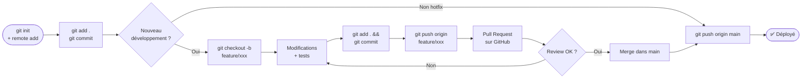

# 🚀 Guide de Déploiement GitHub

## 📋 Checklist Avant le Premier Push

### ✅ Étape 1 : Vérifier la sécurité

```bash
# Vérifier que .env est bien ignoré
cat .gitignore | grep "^\.env$"

# Vérifier que .env n'est PAS tracké
git status | grep ".env" && echo "⚠️ PROBLÈME !" || echo "✅ OK"

# Vérifier qu'aucune donnée sensible n'est présente
git status
```

**Attendu** : `.env` ne doit PAS apparaître dans les fichiers à commiter.

---

### ✅ Étape 2 : Initialiser Git (si pas déjà fait)

```bash
cd /chemin/vers/WUDD.ai

# Initialiser le dépôt
git init

# Ajouter le remote GitHub (remplacer par votre URL)
git remote add origin https://github.com/VOTRE_USERNAME/AnalyseActualites.git

# Vérifier le remote
git remote -v
```

---

### ✅ Étape 3 : Configurer le hook pre-commit (recommandé)

```bash
# Rendre le script exécutable
chmod +x pre-commit-hook.sh

# Installer le hook
mkdir -p .git/hooks
cp pre-commit-hook.sh .git/hooks/pre-commit
chmod +x .git/hooks/pre-commit

# Tester le hook
.git/hooks/pre-commit
```

---

### ✅ Étape 4 : Premier commit

```bash
# Ajouter tous les fichiers (sauf ceux dans .gitignore)
git add .

# Vérifier les fichiers à commiter
git status

# ATTENTION : Vérifier que ces éléments NE SONT PAS présents :
#   - .env
#   - data/articles/*.json (sauf .gitkeep)
#   - data/raw/ (sauf .gitkeep)
#   - rapports/*.md (sauf .gitkeep)
#   - archives/*.py (sauf .gitkeep)

# Créer le commit initial
git commit -m "🎉 Initial commit - Pipeline ETL d'analyse d'actualités

- Scripts Python pour collecte et analyse RSS/JSON
- Intégration API EurIA (Infomaniak)
- Configuration sécurisée avec .env
- Documentation complète
"
```

---

### ✅ Étape 5 : Créer le dépôt sur GitHub

1. Aller sur https://github.com/new
2. Nom du dépôt : `AnalyseActualites`
3. Description : `Pipeline ETL automatisé pour collecter, analyser et résumer des actualités via IA`
4. Visibilité : **Privé** (recommandé) ou Public
5. ⚠️ **NE PAS** initialiser avec README, .gitignore ou LICENSE
6. Cliquer "Create repository"

---

### ✅ Étape 6 : Premier push

```bash
# Pousser vers GitHub
git branch -M main
git push -u origin main

# Vérifier sur GitHub
open https://github.com/VOTRE_USERNAME/AnalyseActualites
```

---

## 🔐 Activer les Protections GitHub (Recommandé)

### 1. Secret Scanning

Aller dans : `Settings` → `Code security and analysis`

- ✅ Activer **Secret scanning**
- ✅ Activer **Push protection** (bloque les pushs avec secrets)

### 2. Dependabot

- ✅ Activer **Dependabot alerts**
- ✅ Activer **Dependabot security updates**

### 3. Branch Protection (si équipe)

Aller dans : `Settings` → `Branches` → `Add rule`

Protection de la branche `main` :
- ✅ Require pull request reviews before merging
- ✅ Require status checks to pass before merging
- ✅ Require conversation resolution before merging

---

## 🔄 Workflow de Développement



### Cloner sur une nouvelle machine

```bash
# Cloner le dépôt
git clone https://github.com/VOTRE_USERNAME/AnalyseActualites.git
cd AnalyseActualites

# Copier et configurer .env
cp .env.example .env
nano .env  # Éditer avec vos credentials

# Installer les dépendances
python3 -m venv venv
source venv/bin/activate
pip install -r requirements.txt

# Tester
python3 scripts/Get_data_from_JSONFile_AskSummary.py --help
```

### Mise à jour du code

```bash
# Créer une branche pour vos modifications
git checkout -b feature/nouvelle-fonctionnalite

# Faire vos modifications
# ...

# Commiter
git add .
git commit -m "✨ Ajout de la nouvelle fonctionnalité"

# Pousser
git push origin feature/nouvelle-fonctionnalite

# Créer une Pull Request sur GitHub
```

---

## 📊 Structure du Dépôt sur GitHub

```
WUDD.ai/
├── .github/
│   └── copilot-instructions.md    # Instructions pour GitHub Copilot
├── .gitignore                      # Fichiers à ignorer
├── .env.example                    # Template de configuration
├── entrypoint.sh                   # Entrypoint Docker
├── docker-compose.yml              # Configuration Docker Compose
├── Dockerfile                      # Image Docker
├── README.md                       # Documentation principale
├── requirements.txt                # Dépendances Python
├── CHANGELOG.md                    # Historique des versions
├── docs/                           # Documentation technique
│   ├── ARCHITECTURE.md             # Architecture du projet (v3.0)
│   ├── STRUCTURE.md                # Structure détaillée (v3.0)
│   ├── PROMPTS.md                  # Documentation des prompts IA
│   ├── CRON_DOCKER_README.md       # Cron & Docker (v2.0, fusion)
│   ├── SCHEDULER_CRON.md           # Planification cron locale
│   ├── DEPLOY.md                   # Ce fichier
│   ├── SYNTHESE_MULTI_FLUX.md      # Synthèse multi-flux
│   └── DOCS_INDEX.md               # Index de la documentation
├── scripts/                        # Scripts Python
├── config/                         # Configuration
├── data/                           # Données (ignoré sur GitHub)
├── rapports/                       # Rapports (ignorés sur GitHub)
├── archives/                       # Anciennes versions
└── tests/                          # Tests unitaires
```

---

## ⚠️ Problèmes Courants

### Problème : `.env` a été commité par erreur

```bash
# Si PAS ENCORE pushé
git reset HEAD .env
git commit --amend

# Si DÉJÀ pushé
# 1. Révoquer IMMÉDIATEMENT les credentials dans .env
# 2. Supprimer de l'historique
git filter-branch --force --index-filter \
  "git rm --cached --ignore-unmatch .env" \
  --prune-empty --tag-name-filter cat -- --all
git push origin --force --all

# 3. Régénérer de nouveaux tokens API
```

### Problème : Données sensibles dans les fichiers JSON

```bash
# Supprimer le fichier de l'historique
git filter-branch --force --index-filter \
  "git rm --cached --ignore-unmatch data/articles/FICHIER.json" \
  --prune-empty --tag-name-filter cat -- --all

# Forcer le push
git push origin --force --all
```

### Problème : Taille du dépôt trop volumineuse

```bash
# Identifier les gros fichiers
git rev-list --objects --all | git cat-file --batch-check='%(objecttype) %(objectname) %(objectsize) %(rest)' | awk '/^blob/ {print substr($0,6)}' | sort --numeric-sort --key=2 | tail -20

# Supprimer de l'historique
git filter-branch --force --index-filter \
  "git rm --cached --ignore-unmatch PATH/TO/BIG/FILE" \
  --prune-empty --tag-name-filter cat -- --all
```

---

## 📞 Support

- **Email** : patrick.ostertag@gmail.com
- **Issues GitHub** : https://github.com/VOTRE_USERNAME/AnalyseActualites/issues
- **Documentation** : Voir [README.md](../README.md)

---

**Dernière mise à jour** : 22 février 2026  
**Version** : 3.0
