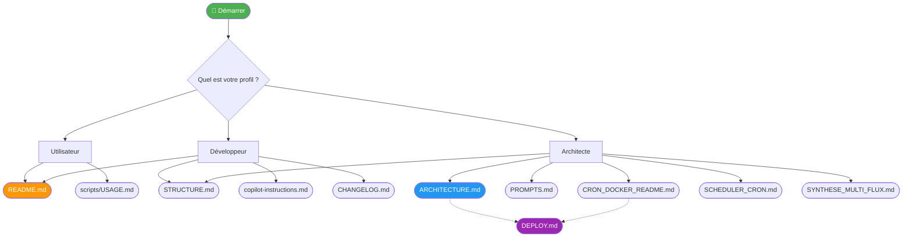

# 📚 Index de la documentation - AnalyseActualités

> Guide de navigation pour toute la documentation du projet  
> Version 2.0 - 23 janvier 2026

---

## 🎯 Pour commencer

### Nouveau contributeur ?
1. 📖 **[README.md](README.md)** - Vue d'ensemble et guide de démarrage rapide
2. 📂 **[STRUCTURE.md](STRUCTURE.md)** - Comprendre l'organisation des fichiers
3. 🚀 **[scripts/USAGE.md](scripts/USAGE.md)** - Guide d'utilisation des scripts

### Développeur expérimenté ?
1. 🏗️ **[ARCHITECTURE.md](ARCHITECTURE.md)** - Architecture technique complète
2. 📝 **[CHANGELOG.md](CHANGELOG.md)** - Historique des changements
3. 🤖 **[.github/copilot-instructions.md](.github/copilot-instructions.md)** - Instructions pour IA/Copilot

---

## 📖 Documentation par type

### Documentation utilisateur

| Fichier | Description | Quand l'utiliser |
|---------|-------------|------------------|
| **[README.md](README.md)** | Documentation principale du projet | Premier contact avec le projet |
| **[scripts/USAGE.md](scripts/USAGE.md)** | Guide d'utilisation détaillé des scripts | Pour exécuter les scripts |

### Documentation technique

| Fichier | Description | Quand l'utiliser |
|---------|-------------|------------------|
| **[ARCHITECTURE.md](ARCHITECTURE.md)** | Architecture logicielle complète (20 KB) — 7 diagrammes Mermaid | Comprendre le système en profondeur |
| **[STRUCTURE.md](STRUCTURE.md)** | Organisation des fichiers et conventions (v3.0) | Naviguer dans le projet |
| **[PROMPTS.md](PROMPTS.md)** | Documentation complète des prompts EurIA | Comprendre/modifier les prompts IA |
| **[CRON_DOCKER_README.md](CRON_DOCKER_README.md)** | Cron, Docker et monitoring (v2.0, fusion) | Déployer ou configurer le scheduler |
| **[SCHEDULER_CRON.md](SCHEDULER_CRON.md)** | Planification cron locale (hôte) | Configurer les tâches cron sur le serveur |
| **[SYNTHESE_MULTI_FLUX.md](SYNTHESE_MULTI_FLUX.md)** | Synthèse du fonctionnement multi-flux | Ajouter ou comprendre les flux JSON |

### Documentation de référence

| Fichier | Description | Quand l'utiliser |
|---------|-------------|------------------|
| **[CHANGELOG.md](CHANGELOG.md)** | Historique des modifications | Voir ce qui a changé |
| **[.github/copilot-instructions.md](.github/copilot-instructions.md)** | Guidelines pour AI agents | Contribuer avec Copilot |

---

## 🔍 Documentation par besoin

### "Je veux installer et lancer le projet"
→ **[README.md](README.md)** (sections Installation et Utilisation)

### "Je veux comprendre où sont les fichiers"
→ **[STRUCTURE.md](STRUCTURE.md)** (section Arborescence)

### "Je veux modifier un script"
1. **[STRUCTURE.md](STRUCTURE.md)** - Localiser le fichier
2. **[ARCHITECTURE.md](ARCHITECTURE.md)** - Comprendre son rôle
3. **[.github/copilot-instructions.md](.github/copilot-instructions.md)** - Règles à suivre

### "Je veux ajouter une fonctionnalité"
1. **[ARCHITECTURE.md](ARCHITECTURE.md)** - Décisions architecturales (ADRs)
2. **[.github/copilot-instructions.md](.github/copilot-instructions.md)** - Patterns du projet
3. **[CHANGELOG.md](CHANGELOG.md)** - Documenter les changements
### "Je veux modifier un prompt IA"
1. **[PROMPTS.md](PROMPTS.md)** - Comprendre les prompts actuels
2. **[ARCHITECTURE.md](ARCHITECTURE.md)** - Impact sur l'architecture
3. **[.github/copilot-instructions.md](.github/copilot-instructions.md)** - Règles à respecter

### "Je veux comprendre le flux de données"
→ **[ARCHITECTURE.md](ARCHITECTURE.md)** (section Flux de données + diagrammes)

### "Je veux débugger une erreur"
1. **[scripts/USAGE.md](scripts/USAGE.md)** - Section Dépannage
2. **[.github/copilot-instructions.md](.github/copilot-instructions.md)** - Points de défaillance courants
3. **[ARCHITECTURE.md](ARCHITECTURE.md)** - Gestion des erreurs

### "Je veux contribuer au projet"
1. **[.github/copilot-instructions.md](.github/copilot-instructions.md)** - Règles strictes
2. **[ARCHITECTURE.md](ARCHITECTURE.md)** - Principes architecturaux
3. **[CHANGELOG.md](CHANGELOG.md)** - Format de documentation

---

## 📊 Carte des contenus

### README.md (6.6 KB)
```
├── Description du projet
├── Fonctionnalités
├── Structure des dossiers
├── Installation (prérequis + dépendances)
├── Configuration (.env)
├── Utilisation (exemples de commandes)
├── Points clés techniques
│   ├── Chemins absolus v2.0
│   ├── Format de dates
│   └── API EurIA
└── Contact
```

### ARCHITECTURE.md (20 KB)
```
├── Vue d'ensemble
│   ├── Objectif du système
│   ├── Architecture générale (diagramme)
│   └── Principes architecturaux
├── Architecture logicielle
│   ├── Pattern ETL
│   └── Composants (5 layers)
├── Flux de données
│   ├── Diagramme Mermaid
│   └── Formats (entrée/sortie)
├── Composants principaux
│   └── Description détaillée des 3 scripts
├── Modèle de données
│   ├── Entité Article
│   └── Contraintes métier
├── Intégrations externes
│   └── API EurIA (specs complètes)
├── Gestion des chemins
│   └── Stratégie v2.0 (chemins absolus)
├── Sécurité
│   ├── Gestion des secrets
│   └── Validation des entrées
├── Performance et scalabilité
│   ├── Métriques
│   └── Optimisations proposées
└── Décisions architecturales (ADRs)
    ├── ADR-001: Chemins absolus
    ├── ADR-002: Format JSON
    ├── ADR-003: Langue française
    ├── ADR-004: Retry sans backoff
    └── ADR-005: Interface GUI
```

### STRUCTURE.md (8.7 KB)
```
├── Arborescence complète (ASCII tree)
├── Description des dossiers
│   ├── /scripts/
│   ├── /config/
│   ├── /data/
│   ├── /rapports/
│   ├── /archives/
│   └── /tests/
├── Flux de données
├── Conventions de développement
│   ├── Chemins absolus v2.0
│   └── Nommage des fichiers
├── Formats de données
├── Sécurité (.gitignore)
├── Statistiques du projet
└── Améliorations futures
```

### CHANGELOG.md (7.5 KB)
```
├── Version 2.0 - Chemins absolus
│   ├── Problème résolu
│   ├── Solution implémentée
│   ├── Fichiers modifiés
│   └── Bénéfices
├── Version 1.0 - Restructuration initiale
│   ├── Structure de dossiers
│   ├── Migration des fichiers
│   ├── Mise à jour des scripts
│   ├── Nouveaux fichiers créés
│   └── Comparaison avant/après
└── Informations complémentaires
    ├── Breaking changes
    ├── Migration utilisateurs
    ├── Bénéfices mesurables
    ├── Prochaines étapes
    └── Problèmes connus
```

### scripts/USAGE.md
```
├── Lancement rapide
├── Scripts disponibles (×3)
│   ├── Get_data_from_JSONFile_AskSummary.py
│   ├── Get_htmlText_From_JSONFile.py
│   └── articles_json_to_markdown.py
├── Configuration requise
│   ├── Fichier .env
│   └── Dépendances Python
├── Structure des chemins
├── Dépannage (FAQ)
└── Workflow typique
```

### .github/copilot-instructions.md (v2.0)
```
├── Big Picture
├── Structure du projet
├── Composants clés
│   └── 3 scripts principaux
├── Configuration
├── Environnement technique
│   ├── Dépendances
│   ├── Variables d'environnement
│   └── Chemins absolus v2.0
├── Comment exécuter
├── Conventions de données
│   ├── Format d'entrée
│   ├── Format de sortie
│   └── Parsing de dates
├── Patterns et contraintes
│   ├── Langue française
│   ├── API EurIA
│   ├── Workflow GUI vs CLI
│   └── Images
├── Debugging et développement
│   ├── Logs
│   └── Points de défaillance
├── Politique de sauvegarde
├── Règles strictes pour AI agents
│   ├── À NE JAMAIS FAIRE
│   └── À TOUJOURS FAIRE
├── Documentation de référence
└── Évolutions en cours
```

---

## 🗺️ Carte de navigation



---

## 🎯 Parcours d'apprentissage recommandés

### Parcours 1 : Utilisateur débutant (30 min)
1. **[README.md](README.md)** - Installation et premier lancement (10 min)
2. **[scripts/USAGE.md](scripts/USAGE.md)** - Comprendre chaque script (15 min)
3. **[STRUCTURE.md](STRUCTURE.md)** - Savoir où sont les fichiers générés (5 min)

### Parcours 2 : Développeur contributeur (2h)
1. **[README.md](README.md)** - Vue d'ensemble (10 min)
2. **[STRUCTURE.md](STRUCTURE.md)** - Organisation du code (20 min)
3. **[ARCHITECTURE.md](ARCHITECTURE.md)** - Architecture technique (60 min)
4. **[.github/copilot-instructions.md](.github/copilot-instructions.md)** - Règles de contribution (20 min)
5. **[CHANGELOG.md](CHANGELOG.md)** - Historique des décisions (10 min)

### Parcours 3 : Architecte / Lead dev (4h)
1. **[ARCHITECTURE.md](ARCHITECTURE.md)** - Architecture complète (2h)
2. **[.github/copilot-instructions.md](.github/copilot-instructions.md)** - Patterns et contraintes (30 min)
3. **[STRUCTURE.md](STRUCTURE.md)** - Conventions détaillées (30 min)
4. **[CHANGELOG.md](CHANGELOG.md)** - Évolution du projet (30 min)
5. Code source des scripts - Analyse approfondie (30 min)

---

## 🔗 Liens externes utiles

### Documentation des dépendances
- [Requests Documentation](https://requests.readthedocs.io/)
- [BeautifulSoup4 Documentation](https://www.crummy.com/software/BeautifulSoup/bs4/doc/)
- [Python-dotenv](https://github.com/theskumar/python-dotenv)

### Standards et références
- [PEP 8 – Style Guide for Python](https://peps.python.org/pep-0008/)
- [ISO 8601 – Date and time format](https://www.iso.org/iso-8601-date-and-time-format.html)
- [Semantic Versioning](https://semver.org/)

### API externe
- [API EurIA Infomaniak](https://euria.infomaniak.com)

---

## 📧 Support et contact

**Auteur** : Patrick Ostertag  
**Email** : patrick.ostertag@gmail.com  
**Site** : http://patrickostertag.ch

Pour toute question sur la documentation ou le projet, n'hésitez pas à me contacter.

---

**Dernière mise à jour** : 22 février 2026 - Version 3.0  
**Fichiers documentés** : 9 documents principaux (~80 KB de documentation)
