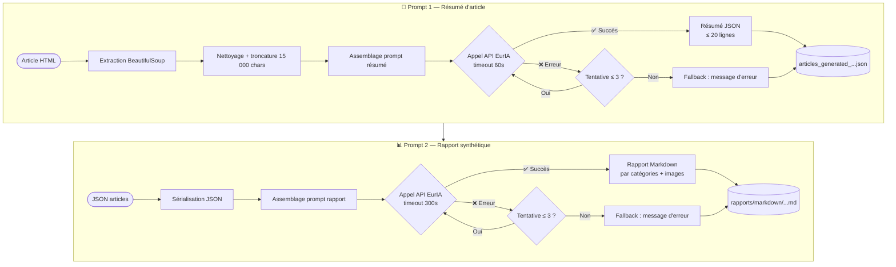

# Prompts EurIA - AnalyseActualités

> Documentation complète des prompts utilisés avec l'API EurIA (Qwen3)  
> Dernière mise à jour : 23 janvier 2026

---

## 📋 Vue d'ensemble

Le projet utilise l'API EurIA d'Infomaniak (modèle Qwen3) pour deux opérations principales :
1. Génération de résumés d'articles individuels
2. Création de rapports synthétiques de plusieurs articles

---

## � Cycle de vie des prompts



---

## �🔧 Configuration API

### Endpoint
```
https://api.infomaniak.com/euria/v1/chat/completions
```

### Authentification
```http
Authorization: Bearer {BEARER_TOKEN}
Content-Type: application/json
```

### Paramètres de base
```json
{
  "messages": [
    {
      "content": "Prompt...",
      "role": "user"
    }
  ],
  "model": "qwen3",
  "enable_web_search": true
}
```

---

## 📝 Prompt 1 : Résumé d'article

### Contexte d'utilisation
- **Fonction** : `askForResume(TextToResume: str)`
- **Fichier** : `scripts/Get_data_from_JSONFile_AskSummary.py`
- **Objectif** : Résumer le contenu HTML extrait d'un article

### Template du prompt

```python
prompt_for_ai = (
    "faire un résumé de ce texte sur maximum 20 lignes en français, "
    "ne donne que le résumé, sans commentaire ni remarque : " + TextToResume
)
```

### Paramètres techniques

| Paramètre | Valeur | Justification |
|-----------|--------|---------------|
| **Timeout** | 60s | Suffisant pour résumé d'un article |
| **Max attempts** | 3 | Retry en cas d'erreur réseau/API |
| **enable_web_search** | True | Enrichissement possible |
| **Langue** | Français | Sources majoritairement francophones |

### Variables d'entrée

- **`TextToResume`** : Texte HTML extrait via BeautifulSoup
  - Type : `str`
  - Longueur moyenne : 5000-10000 caractères
  - Format : Texte brut (HTML stripped)

### Sortie attendue

```
Résumé concis de l'article en français, maximum 20 lignes, sans commentaire
meta ni remarque de l'IA.
```

### Exemple d'utilisation

**Entrée** :
```
"Apple annonce aujourd'hui le lancement de son nouveau iPhone 16 avec 
des fonctionnalités révolutionnaires... [5000 caractères]"
```

**Sortie** :
```
Apple a dévoilé l'iPhone 16 avec un nouvel écran OLED amélioré, une puce 
A18 plus puissante, et une autonomie prolongée de 30%. Le smartphone 
intègre également un système de caméra à intelligence artificielle...
```

### Stratégies d'optimisation

1. **Pré-nettoyage du texte** :
   ```python
   # Supprimer les éléments inutiles avant envoi
   text = re.sub(r'\s+', ' ', text)  # Normaliser espaces
   text = text[:15000]  # Limiter longueur (éviter tokens excessifs)
   ```

2. **Post-traitement** :
   ```python
   summary = summary.strip()
   # Vérifier longueur (si > 20 lignes, tronquer ou re-prompt)
   ```

---

## 📊 Prompt 2 : Génération de rapport

### Contexte d'utilisation
- **Fonction** : `create_report(file_output: str)`
- **Fichier** : `scripts/Get_data_from_JSONFile_AskSummary.py`
- **Objectif** : Créer un rapport Markdown structuré à partir d'un fichier JSON d'articles

### Template du prompt

```python
prompt_for_report = f"""
Analyse le fichier ce fichier JSON et fait une synthèse des actualités. 
Affiche la date de publication et les sources lorsque tu cites un article. 
Groupe les acticles par catégories que tu auras identifiées. 
En fin de synthèse fait un tableau avec les références (date de publication, sources et URL)
pour chaque article dans la rubrique "Images" il y a des liens d'images.
Lorsque cela est possible, publie le lien de l'image sous la forme  sur une nouvelle ligne en fin de paragraphe de catégorie. N'utilise qu'une image par paragraphe et assure-toi qu'une même URL d'image n'apparaisse qu'une seule fois dans tout le rapport.

Filename: {file_output}
File contents:
----- BEGIN FILE CONTENTS -----
{json_str}
----- END FILE CONTENTS -----
"""
```

### Paramètres techniques

| Paramètre | Valeur | Justification |
|-----------|--------|---------------|
| **Timeout** | 300s (5 min) | Traitement de nombreux articles |
| **Max attempts** | 3 | Retry en cas d'erreur |
| **enable_web_search** | True | Enrichissement contextuel |
| **Langue** | Français | Rapport destiné à utilisateurs francophones |

### Variables d'entrée

- **`file_output`** : Chemin du fichier JSON source
  - Exemple : `data/articles/articles_generated_2026-01-01_2026-01-31.json`

- **`json_str`** : Contenu JSON complet
  ```json
  [
    {
      "Date de publication": "2026-01-23T10:00:00Z",
      "Sources": "TechCrunch",
      "URL": "https://...",
      "Résumé": "...",
      "Images": [{"url": "...", "width": 1200, ...}]
    }
  ]
  ```

### Instructions détaillées du prompt

1. **Analyse du contenu** : Lire et comprendre tous les articles JSON
2. **Catégorisation** : Identifier automatiquement des thématiques (IA, technologie, politique, etc.)
3. **Structuration** : Créer des sections par catégorie
4. **Citation** : Mentionner date et source pour chaque article cité
5. **Images** : Intégrer 1 image par catégorie (via balise ``)
6. **Tableau récapitulatif** : Créer table avec date, source, URL de tous les articles

### Sortie attendue

```markdown
# Synthèse des actualités du 1er au 31 janvier 2026

## Intelligence Artificielle

Le 15 janvier 2026, **TechCrunch** rapporte le lancement de GPT-5 par OpenAI...
Le 20 janvier 2026, **Les Échos** annonce...


## Technologie

...

## Tableau des références

| Date | Source | URL |
|------|--------|-----|
| 2026-01-15 | TechCrunch | https://... |
| 2026-01-20 | Les Échos | https://... |
```

### Optimisations possibles

1. **Réduire la taille du JSON** :
   ```python
   # Ne garder que les champs essentiels
   minimal_data = [{
       "Date": art["Date de publication"],
       "Source": art["Sources"],
       "URL": art["URL"],
       "Résumé": art["Résumé"][:500]  # Tronquer résumés longs
   } for art in data]
   ```

2. **Prompt en deux étapes** :
   - Étape 1 : Identifier catégories
   - Étape 2 : Générer rapport par catégorie

3. **Ajouter des exemples** :
   ```
   Exemple de structure attendue:
   ## [Catégorie]
   Le [date], [source] rapporte...
   ```

---

## 🔄 Gestion des erreurs

### Retry Logic

```python
for attempt in range(max_attempts):
    try:
        response = requests.post(URL, json=data, headers=headers, timeout=timeout)
        response.raise_for_status()
        return response.json()['choices'][0]['message']['content']
    except requests.exceptions.Timeout:
        continue  # Réessayer
    except requests.exceptions.RequestException:
        continue  # Réessayer
    except (ValueError, KeyError, TypeError):
        continue  # Réessayer
```

### Fallback

Si toutes les tentatives échouent :
```python
return "Désolé, je n'ai pas pu obtenir de réponse. Veuillez réessayer plus tard."
```

---

## 📈 Métriques et performance

### Temps de réponse observés

| Opération | Temps moyen | Temps max |
|-----------|-------------|-----------|
| Résumé d'article | 5-10s | 30s |
| Génération de rapport | 30-60s | 180s |

### Tokens estimés

| Opération | Tokens entrée | Tokens sortie |
|-----------|---------------|---------------|
| Résumé (article 5000 chars) | ~1500 | ~300 |
| Rapport (50 articles) | ~15000 | ~2000 |

---

## 🎯 Bonnes pratiques

### ✅ À faire

1. **Pré-nettoyer le texte** avant envoi (supprimer HTML, normaliser espaces)
2. **Limiter la longueur** des textes d'entrée (15000 caractères max)
3. **Vérifier la sortie** : longueur, format, langue
4. **Logger les prompts** pour debug et amélioration
5. **Monitorer les timeouts** pour ajuster les valeurs

### ❌ À éviter

1. ❌ Envoyer du HTML brut (extraire texte d'abord)
2. ❌ Prompts ambigus ou trop longs
3. ❌ Ne pas gérer les timeouts
4. ❌ Ignorer les erreurs API
5. ❌ Hardcoder les prompts sans variables

---

## 🔮 Améliorations futures

### Court terme
- [ ] Ajouter validation de sortie (vérifier structure Markdown)
- [ ] Logger les temps de réponse pour monitoring
- [ ] Implémenter backoff exponentiel

### Moyen terme
- [ ] Système de cache pour résumés déjà générés
- [ ] Prompts A/B testing
- [ ] Few-shot learning (exemples dans le prompt)

### Long terme
- [ ] Fine-tuning du modèle sur corpus d'articles
- [ ] Génération multilingue
- [ ] Intégration de contraintes de style

---

## 📚 Références

- [API EurIA Infomaniak](https://euria.infomaniak.com)
- [Qwen3 Model Documentation](https://huggingface.co/Qwen)
- [Prompt Engineering Guide](https://www.promptingguide.ai/)

---

**Auteur** : Patrick Ostertag  
**Email** : patrick.ostertag@gmail.com  
**Dernière mise à jour** : 23 janvier 2026
