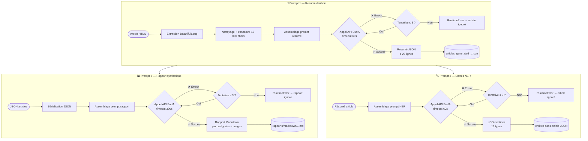
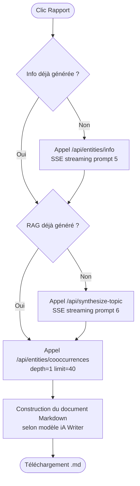

# Prompts EurIA — WUDD.ai

> Documentation complète des prompts utilisés avec l'API EurIA (Qwen3)
> Dernière mise à jour : 7 mars 2026

---

## Vue d'ensemble

Le projet utilise l'API EurIA d'Infomaniak (modèle Qwen3) pour sept opérations :

1. **Résumé d'article** — synthèse d'un texte HTML extrait, max 20 lignes
2. **Rapport synthétique** — rapport Markdown structuré à partir d'un JSON d'articles
3. **Extraction d'entités NER** — identification des entités nommées dans un résumé (18 types)
4. **Sentiment & ton éditorial** — analyse du sentiment et de la posture journalistique d'un article
5. **Synthèse encyclopédique** — fiche Markdown sur une entité (personne, org, lieu…) avec web search
6. **Synthèse RAG multi-sources** — analyse comparative de N articles sur un sujet, en streaming
7. **Rapport d'occurrence d'entité** — document de synthèse complet (articles + graphe L1 + info + RAG) généré via le bouton « Rapport » du panneau entité

Les opérations 1–4 passent par `utils/api_client.py` via la méthode centrale `ask()`.
Les opérations 5–6 sont implémentées directement dans `viewer/app.py` (routes SSE streaming).
L'opération 7 est entièrement côté client dans `EntityArticlePanel.jsx` — elle orchestre les appels 5 et 6 puis construit le Markdown localement.

---

## Cycle de vie des prompts


```mermaid
flowchart TD
    subgraph P1["📝 Prompt 1 — Résumé d'article"]
        A1([Article HTML]) --> B1[Extraction BeautifulSoup]
        B1 --> C1[Nettoyage + troncature 15 000 chars]
        C1 --> D1[Assemblage prompt résumé]
        D1 --> E1{Appel API EurIA\ntimeout 60s}
        E1 -->|✅ Succès| F1[Résumé JSON\n≤ 20 lignes]
        E1 -->|❌ Erreur| G1{Tentative ≤ 3 ?}
        G1 -->|Oui| E1
        G1 -->|Non| H1[RuntimeError → article ignoré]
        F1 --> I1[(articles_generated_...json)]
    end

    subgraph P2["📊 Prompt 2 — Rapport synthétique"]
        A2([JSON articles]) --> B2[Sérialisation JSON]
        B2 --> C2[Assemblage prompt rapport]
        C2 --> D2{Appel API EurIA\ntimeout 300s}
        D2 -->|✅ Succès| E2[Rapport Markdown\npar catégories + images]
        D2 -->|❌ Erreur| F2{Tentative ≤ 3 ?}
        F2 -->|Oui| D2
        F2 -->|Non| G2[RuntimeError → rapport ignoré]
        E2 --> H2[(rapports/markdown/...md)]
    end

    subgraph P3["🏷️ Prompt 3 — Entités NER"]
        A3([Résumé article]) --> B3[Assemblage prompt NER]
        B3 --> C3{Appel API EurIA\ntimeout 60s}
        C3 -->|✅ Succès| D3[JSON entities\n18 types]
        C3 -->|❌ Erreur| E3{Tentative ≤ 3 ?}
        E3 -->|Oui| C3
        E3 -->|Non| F3[RuntimeError → article ignoré]
        D3 --> G3[(entities dans article JSON)]
    end

    P1 --> P2
    P1 --> P3
```

---

## Configuration API

### Endpoint

```
https://api.infomaniak.com/euria/v1/chat/completions
```

### Authentification

```http
Authorization: Bearer {bearer}
Content-Type: application/json
```

> La variable d'environnement est `bearer` (minuscules) — voir `.env.example`.

### Paramètres de base

```json
{
  "messages": [
    {
      "content": "Prompt...",
      "role": "user"
    }
  ],
  "model": "qwen3",
  "enable_web_search": true
}
```

---

## Prompt 1 : Résumé d'article

### Contexte d'utilisation

- **Méthode** : `APIClient.generate_summary(text, max_lines, language, timeout)`
- **Fichier** : `utils/api_client.py`
- **Appelé par** : `scripts/Get_data_from_JSONFile_AskSummary_v2.py`, `scripts/get-keyword-from-rss.py`, `scripts/repair_failed_summaries.py`
- **Objectif** : Résumer le contenu HTML extrait d'un article (max 20 lignes, en français)

### Template du prompt

```python
text_truncated = text[:15000]
prompt = (
    f"Faire un résumé de ce texte sur maximum {max_lines} lignes en {language}, "
    f"ne donne que le résumé, sans commentaire ni remarque : {text_truncated}"
)
```

### Paramètres techniques

| Paramètre | Valeur | Justification |
| --- | --- | --- |
| **Timeout** | 60s | Suffisant pour résumé d'un article |
| **Max attempts** | 3 | Retry avec backoff exponentiel (2s, 4s) |
| **enable_web_search** | True | Enrichissement contextuel possible |
| **Langue** | Français (`fr`) | Sources majoritairement francophones |
| **Troncature** | 15 000 chars | Limite de tokens de l'API |

### Variables d'entrée

- **`text`** : Texte brut extrait via BeautifulSoup (HTML stripped)
  - Longueur : variable, tronquée à 15 000 chars avant envoi
- **`max_lines`** : Nombre maximum de lignes (défaut : 20)
- **`language`** : Langue du résumé (défaut : `"français"`)

### Sortie attendue

```
Résumé concis de l'article en français, maximum 20 lignes,
sans commentaire ni remarque de l'IA.
```

### Comportement en cas d'erreur

`ask()` lève `RuntimeError` après épuisement des tentatives. Les callers catchent cette exception et ignorent l'article (pas de résumé vide sauvegardé en JSON).

```python
try:
    resume = api_client.generate_summary(text, max_lines=20)
except RuntimeError as e:
    logger.warning(f"Résumé impossible pour '{url}' : {e}")
    continue  # Article ignoré
```

---

## Prompt 2 : Rapport synthétique

### Contexte d'utilisation

- **Méthode** : `APIClient.generate_report(json_content, filename, timeout)`
- **Fichier** : `utils/api_client.py`
- **Appelé par** : `scripts/Get_data_from_JSONFile_AskSummary_v2.py`, `scripts/generate_keyword_reports.py`
- **Objectif** : Créer un rapport Markdown structuré à partir d'un fichier JSON d'articles

### Template du prompt

```python
prompt = f"""
Analyse le fichier ce fichier JSON et fait une synthèse des actualités.
Affiche la date de publication et les sources lorsque tu cites un article.
Groupe les articles par catégories que tu auras identifiées.
En fin de synthèse fait un tableau avec les références (date de publication, sources et URL).
Pour chaque article dans la rubrique "Images" il y a des liens d'images.
Lorsque cela est possible, publie le lien de l'image sous la forme 
sur une nouvelle ligne en fin de paragraphe de catégorie.
N'utilise qu'une image par paragraphe et assure-toi qu'une même URL d'image
n'apparaisse qu'une seule fois dans tout le rapport.

Filename: {filename}
File contents:
----- BEGIN FILE CONTENTS -----
{json_content}
----- END FILE CONTENTS -----
"""
```

### Paramètres techniques

| Paramètre | Valeur | Justification |
| --- | --- | --- |
| **Timeout** | 300s (5 min) | Traitement de nombreux articles |
| **Max attempts** | 3 | Retry avec backoff exponentiel |
| **enable_web_search** | True | Enrichissement contextuel |
| **Langue** | Français | Rapport destiné à utilisateurs francophones |

### Variables d'entrée

- **`json_content`** : Contenu JSON sérialisé (tableau d'articles)
- **`filename`** : Nom du fichier source (pour contextualiser le rapport)

Structure attendue du JSON d'entrée :

```json
[
  {
    "Date de publication": "23/01/2026",
    "Sources": "TechCrunch",
    "URL": "https://...",
    "Résumé": "...",
    "Images": [{ "URL": "https://...", "Width": 1200, "Height": 800 }],
    "entities": {
      "PERSON": ["Sam Altman"],
      "ORG": ["OpenAI"]
    }
  }
]
```

### Sortie attendue

```markdown
# Synthèse des actualités du 1er au 31 janvier 2026

## Intelligence Artificielle

Le 15 janvier 2026, **TechCrunch** rapporte...


## Tableau des références

| Date | Source | URL |
| --- | --- | --- |
| 2026-01-15 | TechCrunch | https://... |
```

---

## Prompt 3 : Extraction d'entités NER

- **Méthode** : `APIClient.generate_entities(resume, timeout)`
- **Fichier** : `utils/api_client.py`
- **Appelé par** : `scripts/enrich_entities.py`, `scripts/get-keyword-from-rss.py`
- **Objectif** : Extraire les entités nommées (personnes, organisations, lieux, produits…) d'un résumé

### Prompt NER

```python
prompt = (
    "Extrait les entités nommées du texte suivant et retourne un objet JSON "
    "avec les clés : PERSON, ORG, GPE, LOC, PRODUCT, EVENT, LAW, DATE, TIME, "
    "MONEY, PERCENT, QUANTITY, CARDINAL, ORDINAL, NORP, FAC, WORK_OF_ART, LANGUAGE. "
    "Chaque clé doit contenir une liste de chaînes (peut être vide []). "
    "Retourne UNIQUEMENT le JSON, sans explication ni balise markdown.\n\n"
    f"Texte : {resume}"
)
```

### Configuration NER

| Paramètre | Valeur | Justification |
| --- | --- | --- |
| **Timeout** | 60s | Résumé court, réponse rapide |
| **Max attempts** | 3 | Retry avec backoff exponentiel |
| **enable_web_search** | True | Paramètre global de la session |
| **Format sortie** | JSON strict | Parsé avec `json.loads()` |

### Les 18 types d'entités

Les types suivent la norme **OntoNotes 5.0** (UPenn / BBN / USC ISI), popularisée par spaCy — voir [ENTITIES.md §3](ENTITIES.md#3-les-18-types-dentités-reconnus) et [EXTERNAL_SERVICES.md §2](EXTERNAL_SERVICES.md#2-infomaniak-euria-llm) pour le détail de la norme et son statut légal.

| Type | Description | Exemples |
| --- | --- | --- |
| `PERSON` | Personnes physiques | Sam Altman, Emmanuel Macron |
| `ORG` | Organisations, entreprises | OpenAI, Infomaniak, ONU |
| `GPE` | Entités géopolitiques (pays, villes) | France, Paris, États-Unis |
| `LOC` | Lieux géographiques non-GPE | Alpes, Atlantique |
| `PRODUCT` | Produits, technologies | ChatGPT, iPhone 16, Qwen3 |
| `EVENT` | Événements | CES 2026, Davos |
| `LAW` | Lois, réglements | RGPD, AI Act |
| `DATE` | Expressions de date | 15 janvier 2026, Q1 2026 |
| `TIME` | Expressions d'heure | 14h00, ce matin |
| `MONEY` | Montants financiers | 110 milliards $, 50 M€ |
| `PERCENT` | Pourcentages | 13 %, hausse de 40% |
| `QUANTITY` | Quantités avec unité | 500 MW, 3 To |
| `CARDINAL` | Nombres cardinaux | cinq, 1000 |
| `ORDINAL` | Nombres ordinaux | premier, 3e |
| `NORP` | Nationalités, groupes politiques/religieux | Européens, Républicains |
| `FAC` | Sites, bâtiments, infrastructures | Tour Eiffel, Pentagone |
| `WORK_OF_ART` | Œuvres artistiques | Mona Lisa, Starship |
| `LANGUAGE` | Langues | français, mandarin |

### Format de sortie NER

```json
{
  "PERSON": ["Sam Altman", "Dario Amodei"],
  "ORG": ["OpenAI", "Anthropic"],
  "GPE": ["États-Unis"],
  "LOC": [],
  "PRODUCT": ["ChatGPT", "Claude"],
  "EVENT": [],
  "LAW": [],
  "DATE": ["février 2026"],
  "TIME": [],
  "MONEY": ["110 milliards $"],
  "PERCENT": [],
  "QUANTITY": [],
  "CARDINAL": [],
  "ORDINAL": [],
  "NORP": [],
  "FAC": [],
  "WORK_OF_ART": [],
  "LANGUAGE": []
}
```

### Intégration dans le JSON article

```json
{
  "Date de publication": "28/02/2026",
  "Sources": "Le Monde",
  "URL": "https://...",
  "Résumé": "...",
  "entities": {
    "PERSON": ["Sam Altman"],
    "ORG": ["OpenAI"],
    "GPE": ["États-Unis"],
    "PRODUCT": ["ChatGPT"]
  }
}
```

---

## Gestion des erreurs

### Implémentation actuelle (`utils/api_client.py`)

```python
def ask(self, prompt: str, timeout: int = 60) -> str:
    last_error = ""
    for attempt in range(self.max_attempts):
        try:
            response = requests.post(self.url, json=data, headers=headers, timeout=timeout)
            response.raise_for_status()
            return response.json()['choices'][0]['message']['content'].strip()
        except requests.exceptions.Timeout:
            last_error = f"Timeout après {timeout}s"
            if attempt < self.max_attempts - 1:
                time.sleep(2 ** attempt)  # Backoff exponentiel
        except requests.exceptions.HTTPError as e:
            status = e.response.status_code if e.response is not None else 'inconnu'
            last_error = f"Erreur HTTP {status}"
            return  # Pas de retry sur erreur HTTP
        except requests.exceptions.RequestException as e:
            last_error = str(e)
            if attempt < self.max_attempts - 1:
                time.sleep(2 ** attempt)
    raise RuntimeError(f"Échec API après {self.max_attempts} tentatives. {last_error}")
```

> **Important** : `if e.response is not None` (et non `if e.response`) — `bool(requests.Response)` retourne `False` pour tout code HTTP ≥ 400, ce qui masquerait le code d'erreur réel.

### Comportement des callers

Les scripts catchent `RuntimeError` et ignorent l'article concerné :

```python
try:
    resume = api_client.generate_summary(text)
except RuntimeError as e:
    logger.warning(f"Résumé impossible : {e}")
    continue  # Article ignoré, pas de résumé vide en JSON
```

---

## Métriques et performance

### Temps de réponse observés

| Opération | Temps moyen | Temps max (timeout) |
| --- | --- | --- |
| Résumé d'article | 8–12s | 60s |
| Génération de rapport | 30–90s | 300s |
| Extraction NER | 5–10s | 60s |
| Sentiment & ton éditorial | 2–5s | 30s |
| Synthèse encyclopédique | 10–30s | 90s |
| Synthèse RAG multi-sources | 15–60s | 120s |

### Tokens estimés

| Opération | Tokens entrée | Tokens sortie |
| --- | --- | --- |
| Résumé (article 5 000 chars) | ~1 500 | ~300 |
| Résumé (article 15 000 chars) | ~4 500 | ~300 |
| Rapport (50 articles) | ~15 000 | ~2 000 |
| NER (résumé 500 chars) | ~200 | ~150 |
| Sentiment (résumé 3 000 chars) | ~900 | ~50 |
| Synthèse encyclopédique | ~100 | ~800 |
| RAG (15 articles × 600 chars) | ~3 000 | ~1 000 |

---

## Bonnes pratiques

### À faire

1. Pré-nettoyer le texte avant envoi (supprimer HTML, normaliser espaces)
2. Respecter la troncature à 15 000 chars avant `generate_summary()`
3. Vérifier la sortie NER avec `json.loads()` — la réponse doit être du JSON pur
4. Logger les erreurs API avec le code HTTP pour diagnostic
5. Utiliser `get_config()` pour les timeouts — ne pas hardcoder

### À éviter

1. Envoyer du HTML brut (extraire le texte d'abord avec BeautifulSoup)
2. Sauvegarder en JSON un résumé contenant un message d'erreur
3. Utiliser `if e.response` (falsy pour HTTP ≥ 400) — toujours `if e.response is not None`
4. Ignorer les `RuntimeError` sans logger le contexte

---

---

## Prompt 4 : Sentiment & ton éditorial

### Contexte d'utilisation

- **Méthode** : `EurIAClient.generate_sentiment(resume, timeout)`
- **Fichier** : `utils/api_client.py`
- **Appelé par** : `scripts/enrich_sentiment.py` (mode Round-Robin, 1 fichier/jour)
- **Objectif** : Classifier le sentiment et le ton éditorial d'un article pour alimenter le panel *Biais des sources*

### Template du prompt

```python
prompt = (
    "Analyse le ton et le sentiment de ce texte journalistique. "
    "Réponds UNIQUEMENT avec un objet JSON valide, sans commentaire ni texte autour.\n\n"
    "Champs attendus :\n"
    '- "sentiment" : une des valeurs exactes : "positif", "neutre", "négatif"\n'
    '- "score_sentiment" : entier entre 1 (très négatif) et 5 (très positif), 3=neutre\n'
    '- "ton_editorial" : une des valeurs exactes : "factuel", "alarmiste", "promotionnel", "critique", "analytique"\n'
    '- "score_ton" : entier entre 1 (très biaisé/sensationnaliste) et 5 (très factuel/neutre)\n\n'
    f"Texte :\n{resume.strip()[:3000]}"
)
```

### Paramètres techniques

| Paramètre | Valeur | Justification |
| --- | --- | --- |
| **Timeout** | 30s | Réponse JSON courte |
| **Max attempts** | 2 | Quota API préservé |
| **max_tokens** | 150 | JSON compact attendu |
| **enable_web_search** | True | Paramètre global |
| **Troncature** | 3 000 chars | Résumé suffisant pour l'analyse |

### Format de sortie attendu

```json
{
  "sentiment": "négatif",
  "score_sentiment": 2,
  "ton_editorial": "alarmiste",
  "score_ton": 2
}
```

### Intégration dans le JSON article

Les champs sont ajoutés directement dans chaque article enrichi :

```json
{
  "Résumé": "...",
  "sentiment": "négatif",
  "score_sentiment": 2,
  "ton_editorial": "alarmiste",
  "score_ton": 2
}
```

---

## Prompt 5 : Synthèse encyclopédique d'entité

### Contexte d'utilisation

- **Route Flask** : `GET /api/entities/info?type=ORG&value=OpenAI`
- **Fichier** : `viewer/app.py` — fonction `api_entities_info()`
- **Déclenché par** : onglet **Info** du composant `EntityArticlePanel.jsx`
- **Objectif** : Générer une fiche encyclopédique Markdown sur une entité nommée, en streaming SSE

### Template du prompt

```python
prompt = (
    f"Fournis une synthèse encyclopédique en français sur « {entity_value} » ({label}).\n\n"
    "Structure ta réponse en Markdown avec des sections pertinentes "
    "(présentation, rôle, contexte, actualité récente, chiffres clés, liens avec d'autres acteurs…).\n"
    "Sois factuel et concis. Génère uniquement le contenu Markdown, sans balises <think>."
)
```

Où `label` est le libellé français du type NER (`PERSON` → `"personne physique"`, `ORG` → `"organisation ou entreprise"`, etc.).

### Paramètres techniques

| Paramètre | Valeur | Justification |
| --- | --- | --- |
| **Timeout** | 90s | Synthèse riche avec web search |
| **enable_web_search** | **True** | Indispensable pour données récentes |
| **stream** | True | Affichage progressif côté React |
| **Format sortie** | Markdown libre | Rendu via ReactMarkdown |

### Correspondance type → libellé

| Type NER | Libellé injecté |
| --- | --- |
| `PERSON` | personne physique |
| `ORG` | organisation ou entreprise |
| `GPE` | lieu géopolitique |
| `LOC` | lieu géographique |
| `PRODUCT` | produit ou technologie |
| `EVENT` | événement |
| `WORK_OF_ART` | œuvre |
| `LAW` | loi ou règlement |
| `NORP` | groupe national, religieux ou politique |
| `FAC` | site ou bâtiment |

### Remarques

- Le prompt demande explicitement `sans balises <think>` pour éviter que Qwen3 n'expose son raisonnement interne.
- Le parseur React filtre quand même les blocs `<think>…</think>` résiduels via un flag `inThink`.

---

## Prompt 6 : Synthèse RAG multi-sources

### Contexte d'utilisation

- **Route Flask** : `GET /api/synthesize-topic?entity_type=ORG&entity_value=OpenAI&n=15`
- **Méthode** : `EurIAClient.synthesize_topic(topic, articles, timeout)` (non-streaming) ou appel direct en streaming dans `viewer/app.py`
- **Fichier** : `viewer/app.py` — fonction `api_synthesize_topic()` + `utils/api_client.py`
- **Déclenché par** : onglet **RAG** du composant `EntityArticlePanel.jsx`
- **Objectif** : Analyse comparative de N articles issus de sources différentes sur un sujet

### Template du prompt

```python
prompt = (
    f"Tu es un analyste de presse. Voici {len(articles_to_use)} articles de sources différentes "
    f"traitant du sujet : **{label}**.\n\n"
    "Génère une synthèse comparative structurée en Markdown comprenant :\n"
    "1. **Résumé de la situation** (2-3 phrases)\n"
    "2. **Points de convergence** entre les sources\n"
    "3. **Points de divergence ou contradictions**\n"
    "4. **Positionnement éditorial** : sources favorables, neutres ou critiques\n"
    "5. **Éléments clés manquants**\n\n"
    "Cite les sources (nom + date) à chaque point. Sois concis et factuel.\n"
    "Génère uniquement le contenu Markdown, sans balises <think>.\n\n"
    f"Articles :\n{sources_block}"
)
```

Où `sources_block` est construit ainsi pour chaque article (max 600 chars de résumé) :

```
--- Article N (Sources, Date de publication) ---
[Résumé tronqué à 600 chars]
```

### Paramètres techniques

| Paramètre | Valeur | Justification |
| --- | --- | --- |
| **Timeout** | 120s | Prompt long (N articles concaténés) |
| **Max articles** | 15 (configurable via `?n=`) | Limite de tokens |
| **Troncature résumé** | 600 chars/article | ~9 000 chars total pour 15 articles |
| **enable_web_search** | False | Données issues des articles locaux |
| **stream** | True | Affichage progressif côté React |

### Collecte des articles sources

La route Flask collecte les articles en deux passes :
1. Correspondance NER exacte : `entity_value` dans `entities[entity_type]`
2. Correspondance textuelle : `search_term` présent dans le champ `Résumé`

Déduplication par URL, tri par date décroissante, max `n` articles retenus.

### Remarques

- `enable_web_search` est volontairement **désactivé** : la synthèse se base uniquement sur les articles déjà collectés (RAG pur, pas de recherche web externe).
- Contrairement au prompt 5, le prompt 6 n'utilise pas `EurIAClient.ask()` : l'appel HTTP est fait directement dans `viewer/app.py` pour permettre le streaming SSE natif.

---

## Prompt 7 : Rapport Markdown d'occurrence d'entité (bouton « Rapport »)

### Contexte d'utilisation

- **Composant** : `viewer/src/components/EntityArticlePanel.jsx` — fonction `handleGenerateReport()`
- **Déclenché par** : bouton **Rapport** dans le panneau flottant d'une entité NER
- **Objectif** : Générer un document de synthèse complet et téléchargeable (`.md`) combinant les articles collectés, le graphe de co-occurrences L1, la synthèse encyclopédique (prompt 5) et la synthèse RAG (prompt 6)

### Flux de génération


```mermaid
flowchart TD
    A([Clic Rapport]) --> B{Info déjà générée ?}
    B -->|Non| C[Appel /api/entities/info\nSSE streaming prompt 5]
    B -->|Oui| D{RAG déjà généré ?}
    C --> D
    D -->|Non| E[Appel /api/synthesize-topic\nSSE streaming prompt 6]
    D -->|Oui| F[Appel /api/entities/cooccurrences\ndepth=1 limit=40]
    E --> F
    F --> G[Construction du document Markdown\nselon modèle iA Writer]
    G --> H([Téléchargement .md])
```

> Si les textes Info et/ou RAG ont déjà été générés dans la session (onglets déjà visités), ils sont réutilisés directement sans appel API supplémentaire.

### Structure du document généré

Le rapport suit le modèle iA Writer documenté dans `docs/instructions-for-claude-report.md` :

```markdown
---
Auteur: Patrick Ostertag
Titre: Rapport — {TYPE} : {Entité}
AuteurAdresse: patrick.ostertag@gmail.com
AuteurSite: http://patrickostertag.ch
Date: YYYY-MM-DD
IAEngine: WUDD.ai
---

# Rapport — {Entité}

---
Synthèse des articles et analyses pour l'entité **{Entité}** ({TYPE})
— N sources — *date*. Principales co-occurrences L1 : …
---

{{TOC}}

===

## Cartographie des acteurs — Co-occurrences directes (L1)
**PERSON** — Nom A, Nom B, …
**ORG** — Org A, Org B, …
**GPE** — Pays A, Ville B, …
**LOC** — …
**NORP** — …
**EVENT** — …

## Informations — Synthèse IA
[Contenu du prompt 5 — Synthèse encyclopédique]

## Analyse comparative — Synthèse RAG
[Contenu du prompt 6 — Synthèse RAG multi-sources]

## Articles — N sources
### Date — Source
[Résumé]

*Source : nom*
[Lire l'article](url)
---

===

# Tableau des références
| # | Date | Source | URL |
|---|---|---|---|
| 1 | … | … | [↗](url) |

---
*Rapport préparé avec WUDD.ai — date*
```

### Cartographie des acteurs — règles de filtrage

Seuls les types NER jugés significatifs pour l'analyse sont retenus :

| Type | Description |
|---|---|
| `PERSON` | Personnes physiques |
| `ORG` | Organisations, entreprises, institutions |
| `GPE` | Entités géopolitiques (pays, villes, régions) |
| `LOC` | Lieux géographiques non géopolitiques |
| `NORP` | Groupes nationaux, religieux ou politiques |
| `EVENT` | Événements nommés |

Les autres types NER (`PRODUCT`, `DATE`, `MONEY`, `LAW`, etc.) sont exclus de cette section pour des raisons de lisibilité.

### Format d'affichage par type

```
**TYPE** — Entité A, Entité B, Entité C, …
```

Les entités sont listées sans leur nombre de co-occurrences (supprimé pour alléger la lecture). L'ordre reste décroissant par fréquence (hérité du classement reçu de `/api/entities/cooccurrences`).

### Paramètres de l'appel co-occurrences

```
GET /api/entities/cooccurrences?type={TYPE}&value={valeur}&depth=1&limit=40&limit_l2=0
```

| Paramètre | Valeur | Justification |
|---|---|---|
| `depth` | 1 | Seuls les voisins directs (L1) — pas de L2 |
| `limit` | 40 | Max 40 entités co-occurrentes |
| `limit_l2` | 0 | L2 désactivé pour ce contexte |

### Nommage du fichier de sortie

```
rapport_{TYPE}_{entité_sanitisée}_{YYYY-MM-DD}.md
```

Exemple : `rapport_ORG_OpenAI_2026-03-07.md`

### Remarques

- Les appels Info et RAG utilisent le même parseur SSE que les onglets interactifs (filtrage des blocs `<think>…</think>`).
- L'état React (`infoText`, `ragText`) est mis à jour après génération : les onglets **Infos** et **RAG** bénéficient du résultat sans re-génération.
- Le bouton affiche un spinner pendant toute la durée de la génération (Info + RAG + graphe peuvent prendre 30–120s selon le cache API).

---

## Références

- [API EurIA Infomaniak](https://euria.infomaniak.com)
- [Qwen3 Model Documentation](https://huggingface.co/Qwen)

---

**Auteur** : Patrick Ostertag
**Email** : patrick.ostertag@gmail.com
**Dernière mise à jour** : 7 mars 2026
