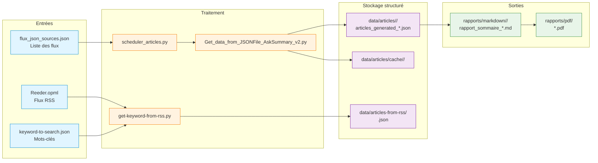

# Structure du projet — AnalyseActualités

> Organisation des fichiers et conventions de développement
> Version 3.0 · 22 février 2026

---

## Table des matières

1. [Arborescence](#1-arborescence)
2. [Description des dossiers](#2-description-des-dossiers)
3. [Flux de données](#3-flux-de-données)
4. [Conventions de développement](#4-conventions-de-développement)
5. [Formats de données](#5-formats-de-données)

---

## 1. Arborescence

```mermaid
flowchart TD
    ROOT["WUDD.ai/"]

    ROOT --> ENV[".env\nCrédentials API (non versionné)"]
    ROOT --> GITIGNORE[".gitignore"]
    ROOT --> README["README.md"]
    ROOT --> REQ["requirements.txt"]
    ROOT --> DOCKER["Dockerfile + docker-compose.yml"]

    ROOT --> SCRIPTS["scripts/"]
    ROOT --> CONFIG["config/"]
    ROOT --> DATA["data/"]
    ROOT --> RAPPORTS["rapports/"]
    ROOT --> DOCS["docs/"]
    ROOT --> UTILS["utils/"]
    ROOT --> TESTS["tests/"]
    ROOT --> ARCHIVES["archives/"]
    ROOT --> SAMPLES["samples/"]

    SCRIPTS --> S1["Get_data_from_JSONFile_AskSummary_v2.py\nScript ETL principal"]
    SCRIPTS --> S2["scheduler_articles.py\nOrchestration multi-flux"]
    SCRIPTS --> S3["get-keyword-from-rss.py\nExtraction par mot-clé"]
    SCRIPTS --> S4["articles_json_to_markdown.py\nConversion JSON → MD"]
    SCRIPTS --> S5["analyse_thematiques.py\nAnalyse sociétale"]
    SCRIPTS --> S6["check_cron_health.py\nMonitoring cron"]
    SCRIPTS --> S7["generate_keyword_reports.py\nRapports par mot-clé"]
    SCRIPTS --> USAGE["USAGE.md"]

    CONFIG --> C1["flux_json_sources.json\nFlux à traiter (nom + URL)"]
    CONFIG --> C2["sites_actualite.json\n133 sources RSS/JSON"]
    CONFIG --> C3["categories_actualite.json\n215 catégories"]
    CONFIG --> C4["keyword-to-search.json\nMots-clés surveillés"]
    CONFIG --> C5["thematiques_societales.json\n12 thématiques"]

    DATA --> DA["articles/\n  <flux>/articles_generated_*.json\n  cache/<flux>/"]
    DATA --> DR["articles-from-rss/\n  <mot-clé>.json"]
    DATA --> DRW["raw/\n  all_articles.txt"]

    RAPPORTS --> RM["markdown/\n  <flux>/rapport_sommaire_*.md"]
    RAPPORTS --> RP["pdf/\n  *.pdf"]

    UTILS --> U1["api_client.py"]
    UTILS --> U2["cache.py"]
    UTILS --> U3["config.py"]
    UTILS --> U4["date_utils.py"]

    classDef dir fill:#f5f5f5,stroke:#9e9e9e
    classDef script fill:#e8f5e9,stroke:#388e3c,stroke-width:1px
    classDef config fill:#e3f2fd,stroke:#1565c0,stroke-width:1px
    classDef data fill:#f3e5f5,stroke:#7b1fa2,stroke-width:1px
    class ROOT,SCRIPTS,CONFIG,DATA,RAPPORTS,DOCS,UTILS,TESTS,ARCHIVES,SAMPLES dir
    class S1,S2,S3,S4,S5,S6,S7 script
    class C1,C2,C3,C4,C5 config
    class DA,DR,DRW,RM,RP data
```



### Arborescence textuelle complète

```
WUDD.ai/
├── .env                                  # Credentials API (non versionné)
├── .env.example                          # Template configuration
├── .gitignore
├── README.md
├── requirements.txt
├── Dockerfile
├── docker-compose.yml
├── entrypoint.sh
├── CHANGELOG.md
│
├── scripts/
│   ├── Get_data_from_JSONFile_AskSummary_v2.py   # ETL principal
│   ├── scheduler_articles.py                      # Orchestrateur multi-flux
│   ├── get-keyword-from-rss.py                    # Extraction par mot-clé
│   ├── articles_json_to_markdown.py               # Conversion JSON → MD
│   ├── analyse_thematiques.py                     # Analyse sociétale
│   ├── check_cron_health.py                       # Monitoring cron
│   ├── generate_keyword_reports.py                # Rapports par mot-clé
│   └── USAGE.md
│
├── config/
│   ├── flux_json_sources.json            # Flux à traiter (nom + URL)
│   ├── sites_actualite.json              # 133 sources RSS/JSON
│   ├── categories_actualite.json         # 215 catégories
│   ├── keyword-to-search.json            # Mots-clés surveillés
│   ├── thematiques_societales.json       # 12 thématiques sociétales
│   └── logging.conf
│
├── data/                                 # ⚠️ ignoré par Git
│   ├── articles/
│   │   ├── <flux>/
│   │   │   └── articles_generated_YYYY-MM-DD_YYYY-MM-DD.json
│   │   └── cache/
│   │       └── <flux>/
│   ├── articles-from-rss/
│   │   └── <mot-clé>.json
│   └── raw/
│       └── all_articles.txt
│
├── rapports/                             # ⚠️ ignoré par Git
│   ├── markdown/
│   │   └── <flux>/
│   │       └── rapport_sommaire_*.md
│   └── pdf/
│       └── *.pdf
│
├── utils/
│   ├── __init__.py
│   ├── api_client.py
│   ├── cache.py
│   ├── config.py
│   └── date_utils.py
│
├── tests/
│   ├── test_date_utils.py
│   └── test_multi_flux.py
│
├── docs/                                 # Documentation technique
│   ├── ARCHITECTURE.md
│   ├── CRON_DOCKER_README.md
│   ├── DEPLOY.md
│   ├── DOCS_INDEX.md
│   ├── PROMPTS.md
│   ├── SCHEDULER_CRON.md
│   ├── SECURITY.md
│   ├── STRUCTURE.md              ← ce fichier
│   └── SYNTHESE_MULTI_FLUX.md
│
├── archives/                             # Sauvegardes horodatées
├── samples/                              # Exemples de sorties
└── .github/
    └── copilot-instructions.md
```

---

## 2. Description des dossiers

### `scripts/`
Scripts Python exécutables. Tous utilisent des chemins absolus (voir section 4).

| Script | Rôle | Mode |
|--------|------|------|
| `Get_data_from_JSONFile_AskSummary_v2.py` | ETL principal : collecte, résumés IA, stockage | CLI |
| `scheduler_articles.py` | Orchestre le traitement de tous les flux | CLI / cron |
| `get-keyword-from-rss.py` | Extrait les articles par mot-clé depuis Reeder.opml | CLI / cron |
| `articles_json_to_markdown.py` | Convertit JSON → Markdown formaté | GUI / CLI |
| `analyse_thematiques.py` | Analyse thématique sociétale des articles | CLI |
| `check_cron_health.py` | Vérifie la santé des tâches cron | cron |
| `generate_keyword_reports.py` | Génère rapports Markdown par mot-clé | CLI / cron |

### `config/`
Paramétrage de toute l'application. Modifiez ces fichiers pour ajouter des sources, flux, mots-clés ou thématiques sans toucher au code.

### `data/`
Données générées — **non versionnées** sur Git. Organisées par flux depuis février 2026 (multi-flux).

### `rapports/`
Rapports générés — **non versionnés** sur Git.  
Convention de nommage : `rapport_sommaire_articles_generated_<date_debut>_<date_fin>.md`

### `utils/`
Bibliothèque partagée entre les scripts : gestion API, cache, config, dates.

### `archives/`
Sauvegardes horodatées avant chaque modification de script.  
Convention : `<nom_script>_YYYYMMDD_HHMMSS.py`

---

## 3. Flux de données



---

## 4. Conventions de développement

### Chemins absolus (obligatoire depuis v2.0)

Tous les scripts détectent automatiquement la racine du projet :

```python
SCRIPT_DIR            = os.path.dirname(os.path.abspath(__file__))
PROJECT_ROOT          = os.path.dirname(SCRIPT_DIR)
DATA_ARTICLES_DIR     = os.path.join(PROJECT_ROOT, "data", "articles")
DATA_RAW_DIR          = os.path.join(PROJECT_ROOT, "data", "raw")
RAPPORTS_MARKDOWN_DIR = os.path.join(PROJECT_ROOT, "rapports", "markdown")
```

✅ Fonctionne depuis n'importe quel répertoire, compatible cron et Docker.

### Sauvegarde obligatoire avant modification

```bash
cp scripts/script.py archives/script_$(date +%Y%m%d_%H%M%S).py
```

### Nommage des fichiers

| Type | Convention |
|------|-----------|
| Articles JSON | `articles_generated_YYYY-MM-DD_YYYY-MM-DD.json` |
| Rapports | `rapport_sommaire_articles_generated_<debut>_<fin>.md` |
| Archives | `<nom_script>_YYYYMMDD_HHMMSS.py` |

### Logs

```python
def print_console(msg: str):
    print(f"{datetime.now().strftime('%Y-%m-%d %H:%M:%S')} {msg}")
```

Toujours utiliser `print_console()` — jamais `print()` seul.

---

## 5. Formats de données

### Entrée — Flux JSON

```json
{
  "items": [
    {
      "url": "https://source.com/article",
      "date_published": "2026-01-23T10:00:00Z",
      "authors": [{ "name": "Auteur" }]
    }
  ]
}
```

### Sortie — Article enrichi

```json
[
  {
    "Date de publication": "2026-01-23T10:00:00Z",
    "Sources": "Nom de la source",
    "URL": "https://...",
    "Résumé": "Résumé généré par l'IA en français (max 20 lignes)...",
    "Images": [
      { "url": "https://image.jpg", "width": 1200, "height": 800, "area": 960000 }
    ]
  }
]
```

> ⚠️ **Clés JSON françaises** : `Date de publication`, `Sources`, `URL`, `Résumé`, `Images`  
> Ne jamais renommer sans mettre à jour tous les scripts.

> ⚠️ **Format de date strict** : `YYYY-MM-DDTHH:MM:SSZ`

---

**Dernière mise à jour** : 22 février 2026 · Version 3.0
