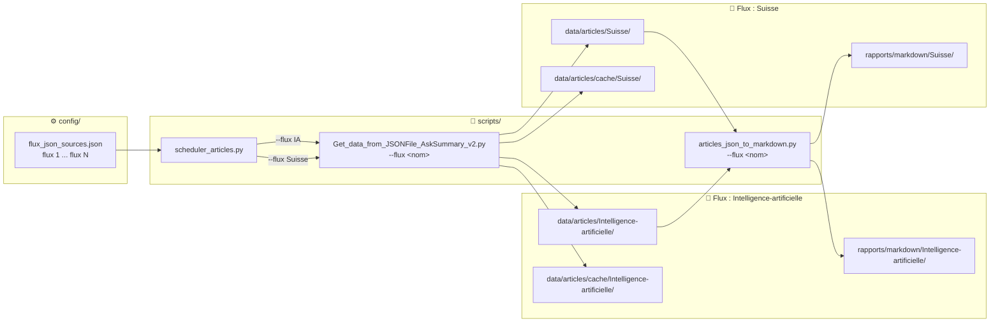

# Synthèse et documentation du fonctionnement multi-flux

> 📐 **Référence principale :** Section 2 de [ARCHITECTURE.md](ARCHITECTURE.md#2-architecture-multi-flux) pour les diagrammes complets (cloisonnement, pipeline ETL, ADRs).  
> Ce document est un **guide opérationnel** : ajout de flux, commandes et structure des outputs.

---

## Schéma de cloisonnement multi-flux



---

## 1. Objectif
Le système multi-flux permet de traiter plusieurs sources JSON d’actualités de façon totalement cloisonnée : chaque flux dispose de ses propres fichiers de données, cache, et rapports, garantissant l’indépendance et la traçabilité des traitements.

## 2. Architecture
- **Configuration des flux** : 
  - Le fichier `config/flux_json_sources.json` liste tous les flux à traiter, avec leur nom et URL.
- **Scripts principaux** :
  - `Get_data_from_JSONFile_AskSummary_v2.py` : traite un flux à la fois (paramètre `--flux`), génère les fichiers dans des sous-répertoires dédiés.
  - `scheduler_articles.py` : lance automatiquement le traitement pour chaque flux défini dans la config.
  - `articles_json_to_markdown.py` : convertit les articles JSON d’un flux en rapport Markdown, dans le répertoire du flux.
- **Organisation des outputs** :
  - Données : `data/articles/<flux>/articles_generated_YYYY-MM-DD_YYYY-MM-DD.json`
  - Cache : `data/articles/cache/<flux>/`
  - Rapports Markdown : `rapports/markdown/<flux>/rapport_sommaire_articles_generated_YYYY-MM-DD_YYYY-MM-DD.md`

## 3. Fonctionnement détaillé
1. **Définition des flux** : Ajoutez ou modifiez les flux dans `config/flux_json_sources.json`.
2. **Traitement d’un flux** : 
   - Lancer : `python3 scripts/Get_data_from_JSONFile_AskSummary_v2.py --flux <nom_flux> --date_debut AAAA-MM-JJ --date_fin AAAA-MM-JJ`
   - Le script charge la config, traite le flux, stocke les résultats et le cache dans les sous-dossiers du flux.
3. **Traitement de tous les flux** : 
   - Lancer : `python3 scripts/scheduler_articles.py` (traite tous les flux de la config sur la période définie).
4. **Génération de rapports** : 
   - Lancer : `python3 scripts/articles_json_to_markdown.py --flux <nom_flux> --date_debut ... --date_fin ...`
   - Produit un rapport Markdown dans le dossier du flux.

## 4. Bonnes pratiques
- **Cloisonnement** : chaque flux a ses propres dossiers, outputs et cache.
- **Ajout d’un flux** : il suffit de l’ajouter dans la config, aucun autre changement n’est nécessaire.
- **Tests** : les tests unitaires valident l’isolation des flux et la non-interférence des données.
- **Logs** : chaque traitement affiche le flux concerné et les chemins utilisés.

## 5. Exemple de structure générée
```
data/
  articles/
    Intelligence-artificielle/
      articles_generated_2026-02-01_2026-02-28.json
    Suisse/
      articles_generated_2026-02-01_2026-02-28.json
    cache/
      Intelligence-artificielle/
      Suisse/
rapports/
  markdown/
    Intelligence-artificielle/
      rapport_sommaire_articles_generated_2026-02-01_2026-02-28.md
    Suisse/
      rapport_sommaire_articles_generated_2026-02-01_2026-02-28.md
```

## 6. Pour aller plus loin
- Le système est prêt pour l’ajout de nouveaux flux, la parallélisation, et l’intégration CI/CD.
- Voir aussi : `docs/STRUCTURE.md`, `docs/ARCHITECTURE.md`, `scripts/USAGE.md`.

---
*Documentation mise à jour le 22/02/2026.*
