# Use Cases — WUDD.ai

> Quatorze scénarios typiques d'utilisation de la plateforme, du point de vue de l'utilisateur, dont deux optimisés pour une utilisation sur smartphone en situation de mobilité.
> Chaque use case est illustré par un diagramme Mermaid.

---

## Table des matières

1. [Veille quotidienne par mots-clés](#1-veille-quotidienne-par-mots-clés)
2. [Rapport de synthèse hebdomadaire multi-flux](#2-rapport-de-synthèse-hebdomadaire-multi-flux)
3. [Recherche transversale sur une entité nommée](#3-recherche-transversale-sur-une-entité-nommée)
4. [Cartographie géopolitique des sujets](#4-cartographie-géopolitique-des-sujets)
5. [Exploration du réseau sémantique](#5-exploration-du-réseau-sémantique)
6. [Rapport ad hoc avec Claude](#6-rapport-ad-hoc-avec-claude)
7. [Lecture des résumés en déplacement (mobile)](#7-lecture-des-résumés-en-déplacement-mobile)
8. [Briefing entités avant réunion (mobile)](#8-briefing-entités-avant-réunion-mobile)
9. [Rapport de veille quotidien Top 10 entités (48h)](#9-rapport-de-veille-quotidien-top-10-entités-48h)
10. [Sélection des articles les plus pertinents](#10-sélection-des-articles-les-plus-pertinents)
11. [Détection de tendances et alertes émergentes](#11-détection-de-tendances-et-alertes-émergentes)
12. [Analyse des biais éditoriaux par source](#12-analyse-des-biais-éditoriaux-par-source)
13. [Synthèse comparative RAG multi-sources](#13-synthèse-comparative-rag-multi-sources)
14. [Export et diffusion des résultats](#14-export-et-diffusion-des-résultats)

---

## 1. Veille quotidienne par mots-clés

**Contexte :** L'utilisateur suit un sujet précis (ex. « intelligence artificielle », « cybersécurité ») et veut être informé chaque matin des nouveaux articles correspondants, résumés en français par l'IA, sans lire les sources une par une.

**Acteurs :** Utilisateur · Docker/cron · API EurIA · Flux RSS (133+ sources)

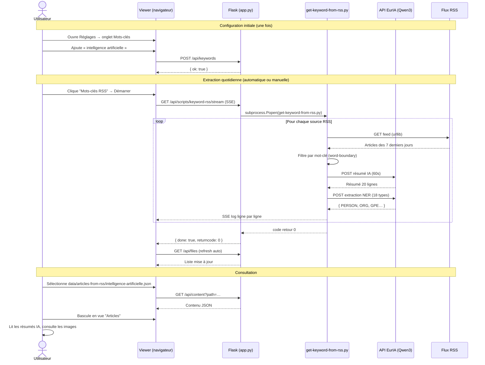

**Valeur produite :** Un fichier JSON enrichi par flux de mots-clés, avec résumés IA et entités NER, consultable directement dans le viewer sans quitter l'interface.

---

## 2. Rapport de synthèse hebdomadaire multi-flux

**Contexte :** Chaque lundi, l'utilisateur veut recevoir un rapport de synthèse structuré couvrant l'ensemble de ses flux d'actualités (IA généraliste, Tech, Géopolitique…), rédigé et organisé automatiquement par l'IA.

**Acteurs :** Utilisateur · Docker/cron · scheduler_articles.py · API EurIA

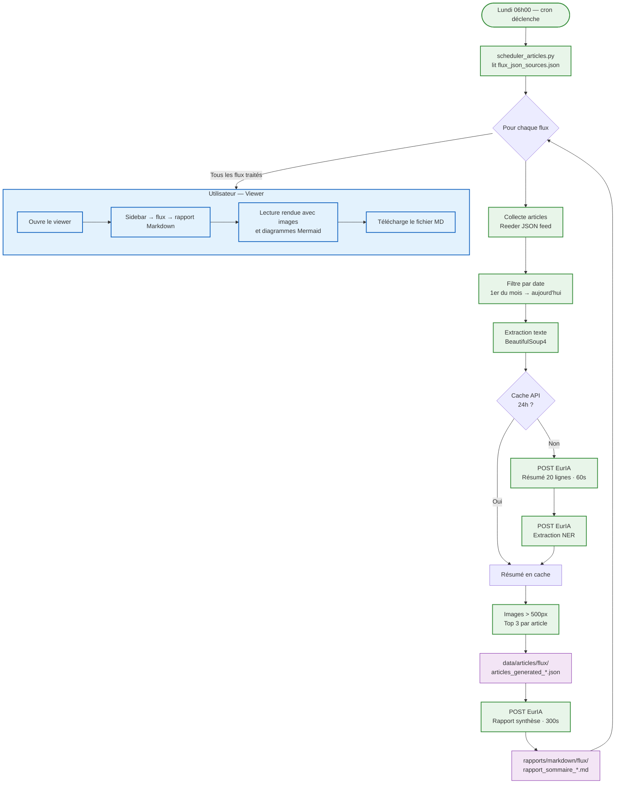

**Valeur produite :** Un rapport Markdown hebdomadaire prêt à lire, structuré par catégories thématiques identifiées par l'IA, avec images et tableau de références, sans aucune intervention manuelle.

---

## 3. Recherche transversale sur une entité nommée

**Contexte :** L'utilisateur veut savoir tout ce que le corpus d'articles dit sur un acteur précis — une entreprise, une personnalité, un pays — en agrégeant les mentions à travers tous les flux et toutes les dates.

**Acteurs :** Utilisateur · Viewer · Flask · Wikipedia/Wikidata · API EurIA

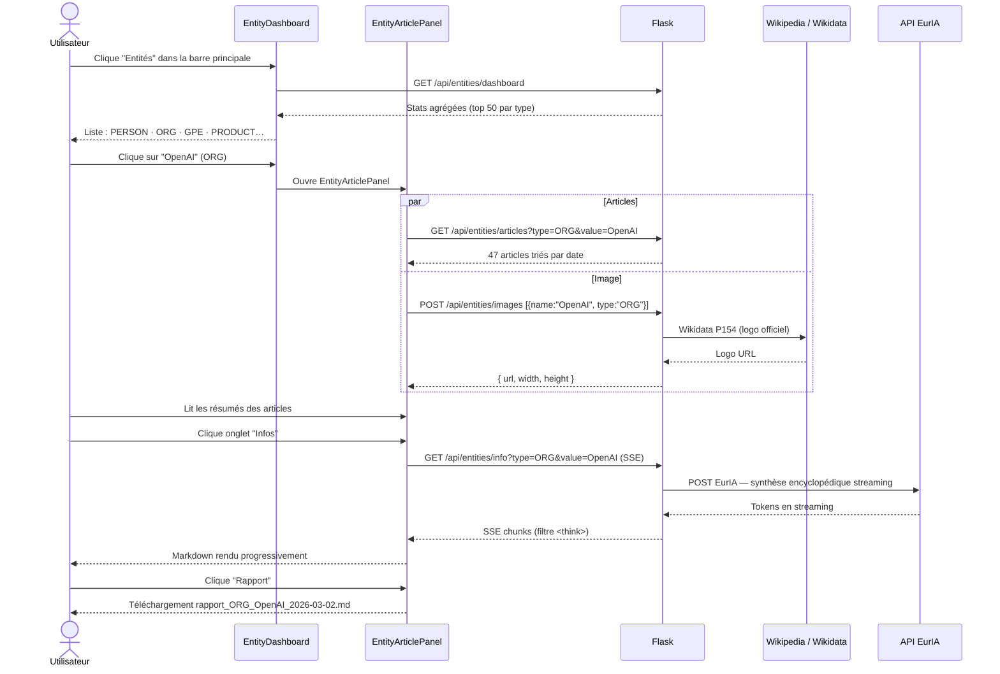

**Valeur produite :** En quelques clics, l'utilisateur obtient une vue 360° sur n'importe quelle entité : tous les articles qui la mentionnent, une synthèse encyclopédique à jour (web search), un logo, et un rapport Markdown exportable.

---

## 4. Cartographie géopolitique des sujets

**Contexte :** L'utilisateur veut identifier les zones géographiques les plus présentes dans ses sources d'actualités, détecter des hotspots émergents et explorer rapidement les articles associés à une région.

**Acteurs :** Utilisateur · Viewer · Flask · Wikipedia API (géocodage)

```mermaid
flowchart LR
    U([Utilisateur]) --> DASH[EntityDashboard\nonglet 🗺 Carte]
    DASH --> API1[GET /api/entities/dashboard\nEntités GPE + LOC]
    API1 --> GEO[POST /api/entities/geocode\nliste de noms]

    subgraph GEO_CACHE["Géocodage (Wikipedia API + cache JSON)"]
        CHECK{Dans le\ncache ?}
        WIKI[Wikipedia API\nfr puis en]
        STORE[data/geocode_cache.json\nmise à jour]
        CHECK -->|Non| WIKI --> STORE
        CHECK -->|Oui| HIT[Coordonnées\nen cache]
    end

    GEO --> CHECK
    STORE --> MAP
    HIT --> MAP

    MAP[Carte Leaflet\nCircleMarker par entité\nrayon ∝ nb mentions]
    MAP --> U2([Utilisateur voit\nles hotspots])

    U2 -->|Clique sur un marqueur| PANEL[EntityArticlePanel\narticles filtrés par GPE/LOC]
    PANEL --> ART[Articles mentionnant\ncette zone géographique]
    ART --> EXPORT[Exporte JSON\nou génère rapport MD]

    classDef ui fill:#e3f2fd,stroke:#1565c0,stroke-width:1px
    classDef api fill:#fff3e0,stroke:#f57c00,stroke-width:1px
    classDef cache fill:#f3e5f5,stroke:#7b1fa2,stroke-width:1px
    class DASH,MAP,PANEL,ART,EXPORT ui
    class API1,GEO,WIKI api
    class CHECK,STORE,HIT cache
```


**Valeur produite :** Une carte mondiale interactive où chaque cercle représente une entité géopolitique mentionnée dans le corpus — sa taille reflète la fréquence des mentions. Un clic ouvre instantanément les articles correspondants.

---

## 5. Exploration du réseau sémantique

**Contexte :** L'utilisateur part d'une entité connue et veut découvrir quelles autres entités lui sont le plus souvent associées dans les articles — pour identifier des acteurs, des tendances ou des connexions inattendues.

**Acteurs :** Utilisateur · EntityArticlePanel · EntityGraph · Flask

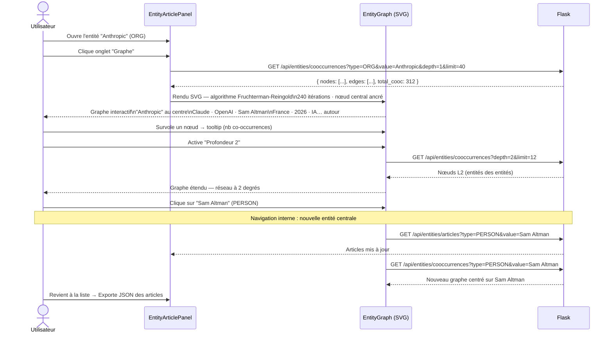


**Valeur produite :** L'utilisateur navigue dans le réseau sémantique de son corpus comme dans une carte mentale vivante — chaque clic recentre le graphe sur une nouvelle entité, révélant progressivement la structure relationnelle de l'information collectée.

---

## 6. Rapport ad hoc avec Claude

**Contexte :** L'utilisateur dispose d'un fichier JSON d'articles (généré par le pipeline ou l'extraction RSS) et veut obtenir rapidement un rapport de synthèse structuré, rédigé par Claude, sans passer par le pipeline automatique. Il utilise le [prompt dédié](instructions-for-claude-report.md) qui groupe les articles par thématiques, insère les images et produit un Markdown compatible iA Writer.

**Acteurs :** Utilisateur · Viewer · Claude (IA) · [instructions-for-claude-report.md](instructions-for-claude-report.md)

**Exemple de résultat :** [claude-generated-rapport-anthropic-20-28-fev-2026.pdf](../samples/claude-generated-rapport-anthropic-20-28-fev-2026.pdf)

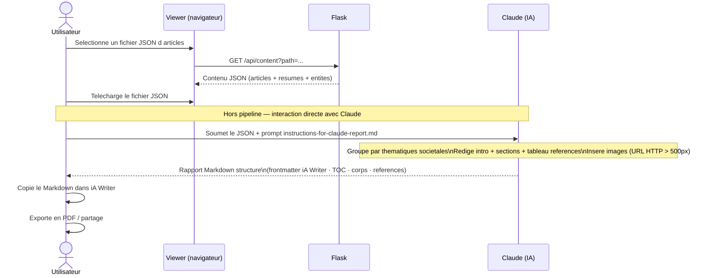

**Valeur produite :** Un rapport de synthèse thématique complet en quelques minutes, sans configuration ni attente de pipeline — idéal pour un corpus ponctuel (mot-clé, entité, période) ou une demande urgente. Le [prompt dédié](instructions-for-claude-report.md) garantit une structure et un style cohérents à chaque génération.

---

## 7. Lecture des résumés en déplacement (mobile)

**Contexte :** L'utilisateur consulte ses résumés pendant ses trajets quotidiens (métro, train, salle d'attente) depuis son iPhone. L'interface responsive du viewer — drawer hamburger, navigation en bas d'écran, vue cartes en pleine largeur — permet une lecture fluide sans souris ni clavier. En quelques secondes, il retrouve les derniers articles collectés, les parcourt en mode carte ou chronologique, et accède aux images associées.

**Acteurs :** Utilisateur (smartphone) · Viewer (Flask · React responsive) · Fichiers JSON locaux

**Caractéristiques iPhone :** sidebar en drawer (☰), barre de navigation fixée en bas (`safe-area-inset-bottom`), taille de police respectant les préférences système iOS, `theme-color` dynamique clair/sombre.

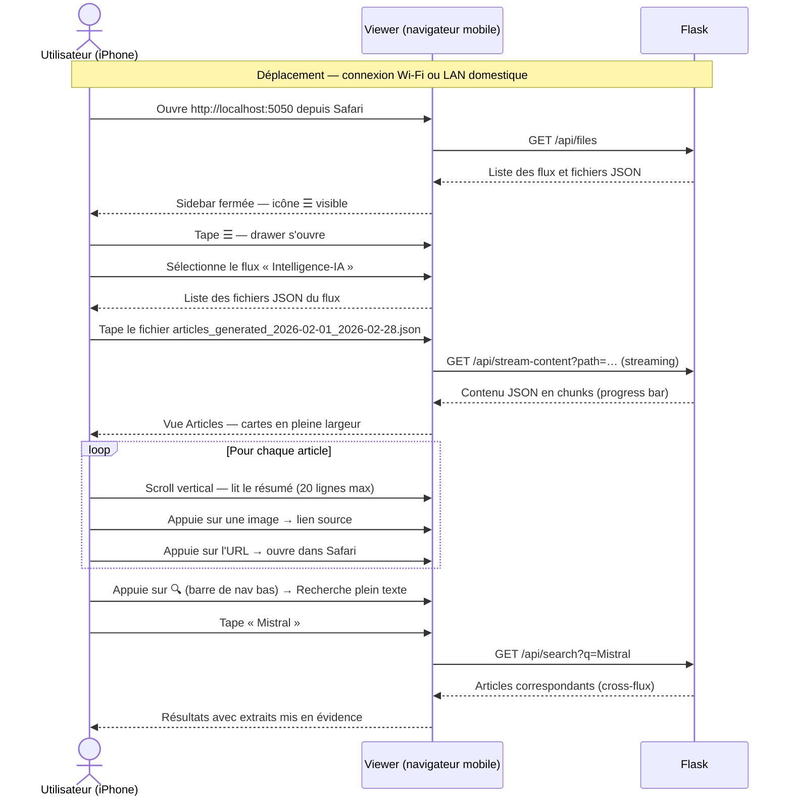


**Valeur produite :** Accès instantané à l'ensemble des résumés collectés depuis un iPhone, sans application native ni synchronisation cloud — la veille se consulte comme un journal personnalisé, sur ses propres données, en toute confidentialité.

---

## 8. Briefing entités avant réunion (mobile)

**Contexte :** Avant d'entrer en réunion ou en conférence, l'utilisateur veut en deux minutes identifier quels acteurs (personnes, organisations, pays) dominent l'actualité de ses flux, visualiser leur répartition géographique sur une carte, et parcourir la galerie des images associées pour ancrer visuellement les sujets du jour.

**Acteurs :** Utilisateur (smartphone) · EntityDashboard · Carte Leaflet (mobile) · Galerie NER · Wikipedia/Wikidata

**Usage type :** couloir, salle de réunion, 2–3 minutes avant le début d'un entretien ou d'une présentation.

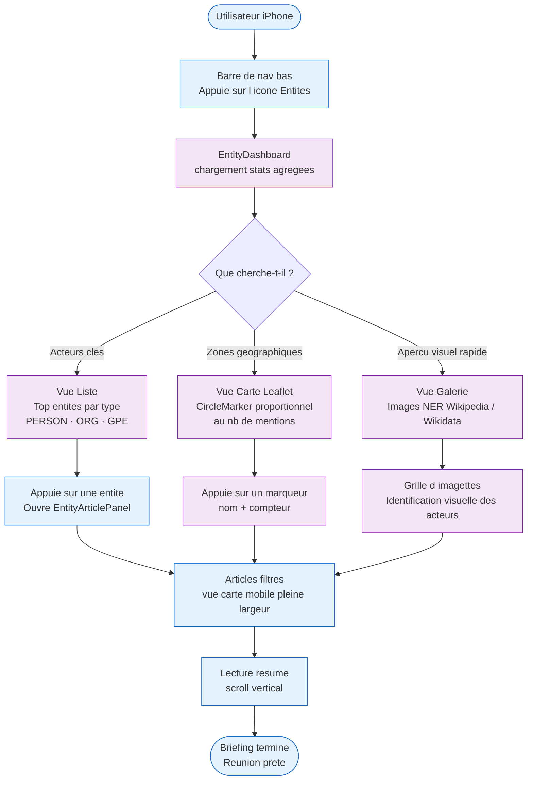


**Valeur produite :** En moins de trois minutes depuis un smartphone, l'utilisateur identifie les acteurs dominants de l'actualité récente, visualise leur ancrage géographique et les reconnaît visuellement — sans ordinateur, sans application dédiée, sur ses propres données.

## 9. Rapport de veille quotidien Top 10 entités (48h)

**Contexte :** Chaque soir à 23h00, un rapport de veille analytique est généré automatiquement à partir des articles collectés dans les 48 dernières heures. Le script identifie les 10 entités nommées les plus citées (personnes, organisations, pays, produits, événements), rédige une analyse structurée pour chacune — contexte encyclopédique, actualité des 48h avec sources, analyse stratégique — puis synthétise les corrélations et signaux faibles détectés.

**Acteurs :** Docker/cron · `generate_48h_report.py` · `get-keyword-from-rss.py` · API EurIA (Qwen3)

**Prérequis :** `data/articles-from-rss/_WUDD.AI_/48-heures.json` doit être à jour (généré par `get-keyword-from-rss.py` après chaque collecte RSS).

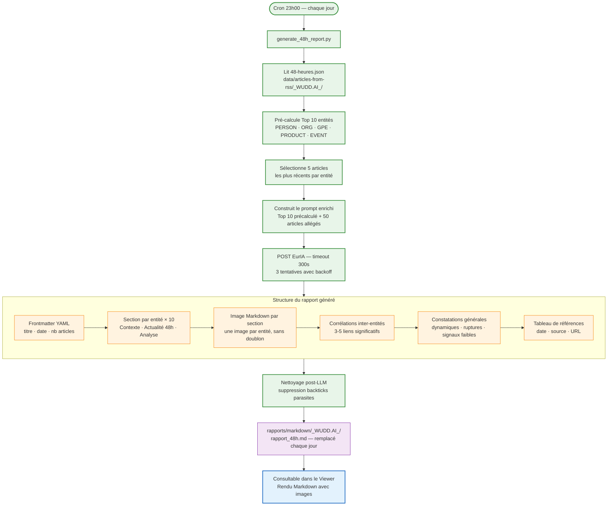

**Exemple de Top 10 généré (04/03/2026) :**

| Rang | Entité | Type | Articles |
|------|--------|------|----------|
| 1 | Apple | ORG | 202 |
| 2 | États-Unis | GPE | 83 |
| 3 | MacBook Neo | PRODUCT | 82 |
| 4 | Iran | GPE | 76 |
| 5 | iPhone 17e | PRODUCT | 54 |
| 6 | OpenAI | ORG | 47 |
| 7 | Suisse | GPE | 46 |
| 8 | MacBook Air M5 | PRODUCT | 46 |
| 9 | Studio Display XDR | PRODUCT | 45 |
| 10 | MacBook Air | PRODUCT | 40 |

**Test sans API :**
```bash
python3 scripts/generate_48h_report.py --dry-run
```

**Valeur produite :** Chaque matin, un rapport de veille analytique est disponible sans aucune intervention — 10 analyses d'entités avec contexte et sources, les corrélations entre acteurs, et une lecture des signaux faibles de la veille. Un seul fichier, toujours à jour : `rapports/markdown/_WUDD.AI_/rapport_48h.md`.

---

## 10. Sélection des articles les plus pertinents

**Contexte :** Après une collecte, des dizaines d'articles sont disponibles. L'utilisateur veut rapidement identifier les plus importants à lire, sans tout parcourir manuellement.

**Acteurs :** Analyste / Veilleur (viewer) · `utils/scoring.py` · route `/api/articles/top` · `TopArticlesPanel.jsx`

**Pré-condition :** Des fichiers JSON d'articles enrichis existent dans `data/articles/` ou `data/articles-from-rss/`.

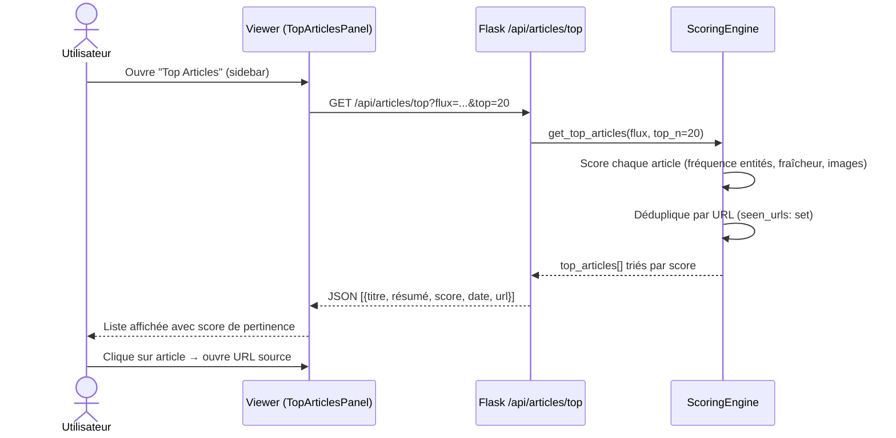

**Algorithme de scoring :**
- **Fréquence des entités NER** : bonus proportionnel au nombre d'entités reconnues
- **Fraîcheur** : articles < 7 jours favorisés
- **Images** : bonus si au moins une image largeur > 500 px
- **Déduplication** : une URL ne peut apparaître qu'une seule fois dans le résultat

**Valeur produite :** En moins d'une seconde, l'utilisateur obtient un classement objectif des articles à lire en priorité, sans biais de présentation. Gain de temps estimé : 70 % sur la revue de presse manuelle.

---

## 11. Détection de tendances et alertes émergentes

**Contexte :** L'utilisateur souhaite être alerté lorsqu'un sujet monte en fréquence, sans surveiller chaque flux individuellement.

**Acteurs :** Système (cron 07h00) · `scripts/trend_detector.py` · route `/api/alerts` · `AlertsPanel.jsx` · `data/alertes.json`

**Pré-condition :** Des articles enrichis NER existent sur au moins deux périodes consécutives.

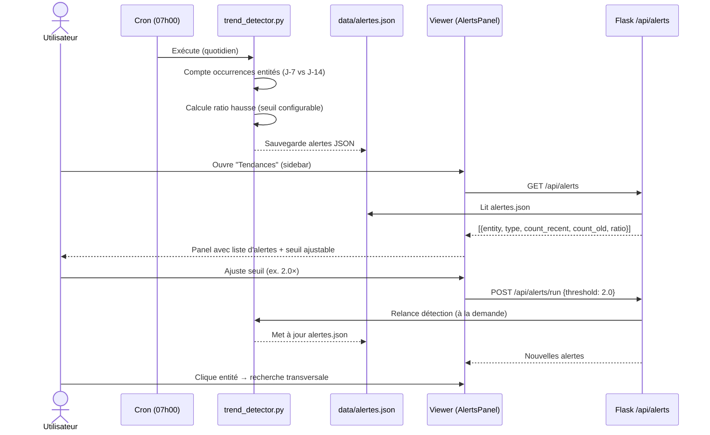

**Paramètres configurables (via UI) :**
- **Seuil de détection** : ratio minimum (défaut 2.0×) entre période récente et ancienne
- **Top N** : nombre maximum d'alertes affichées (défaut 20)

**Valeur produite :** Détection automatique des sujets émergents sans lecture exhaustive. Chaque matin, les tendances du jour sont pré-calculées. L'utilisateur peut affiner et naviguer directement vers les articles concernés.

---

## 12. Analyse des biais éditoriaux par source

**Contexte :** L'utilisateur veut comprendre si certaines sources présentent systématiquement un ton positif, négatif ou neutre sur les sujets couverts.

**Acteurs :** Analyste (viewer) · `scripts/enrich_sentiment.py` (Round-Robin) · route `/api/sources/bias` · `SourceBiasPanel.jsx`

**Pré-condition :** Les articles ont été enrichis avec le champ `"sentiment"` (via `enrich_sentiment.py`).

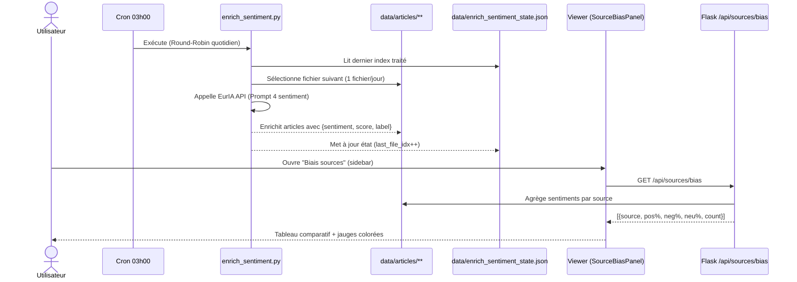

**Format du champ `sentiment` par article :**
```json
{
  "sentiment": {
    "label": "positif",
    "score": 0.72,
    "dominant_emotion": "confiance"
  }
}
```

**Mode Round-Robin :** 1 fichier JSON traité par jour, cycle complet toutes les N jours (N = nombre de fichiers). État persisté dans `data/enrich_sentiment_state.json`.

```bash
python3 scripts/enrich_sentiment.py --status   # Voir l'état du cycle
python3 scripts/enrich_sentiment.py            # Traiter le prochain fichier
python3 scripts/enrich_sentiment.py --all      # Traiter tous les fichiers
```

**Valeur produite :** Visualisation objective des tendances éditoriales par source. Permet d'identifier rapidement les sources militantes, les biais positifs/négatifs persistants, ou l'évolution du ton d'un média sur un sujet donné.

---

## 13. Synthèse comparative RAG multi-sources

**Contexte :** Sur un sujet complexe (ex. "IA et emploi"), l'utilisateur veut une analyse synthétique qui croise les points de vue de toutes les sources collectées, sans avoir à lire chaque article.

**Acteurs :** Analyste (viewer) · route `/api/synthesize-topic` · onglet RAG dans `EntityArticlePanel.jsx` · `utils/api_client.py`

**Pré-condition :** Des articles existent dans `data/` pour le flux ou le mot-clé sélectionné. L'entité ou le sujet est identifié.

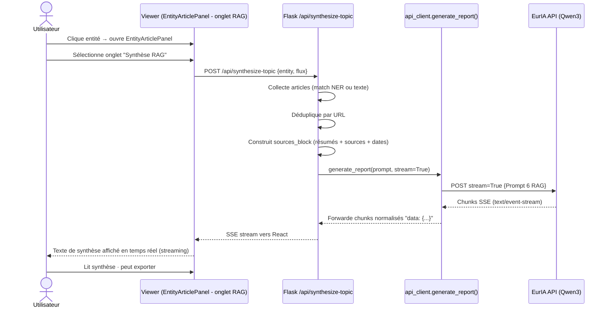

**Caractéristiques techniques :**
- **RAG pur** : `enable_web_search: False` — l'IA ne consulte que les articles collectés
- **Déduplication** : une URL ne peut contribuer qu'une fois à la synthèse
- **Streaming SSE** : le texte s'affiche mot par mot (expérience de lecture fluide)
- **Cache** : la synthèse est mise en cache (TTL 24h) pour éviter les appels répétés

**Valeur produite :** Analyse de fond croisant N sources en 30–60 secondes, sans biais de sélection manuelle. La réponse est ancrée sur les données réelles collectées — pas de d'hallucination sur des sources externes.

---

## 14. Export et diffusion des résultats

**Contexte :** L'utilisateur ou un système tiers veut consommer les articles et résumés dans un format standard (agrégateur RSS, newsletter, webhook Slack/Zapier).

**Acteurs :** Analyste (viewer) · routes `/api/export/atom`, `/api/export/newsletter`, `/api/export/webhook-test`

**Pré-condition :** Des articles JSON enrichis existent dans `data/articles/` ou `data/articles-from-rss/`.

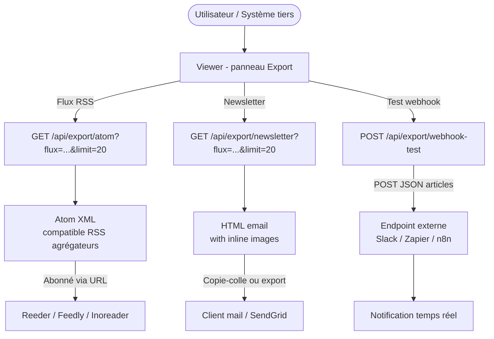

**Formats de sortie :**

| Export | Format | Usage typique | Paramètres |
|--------|--------|---------------|------------|
| Atom | XML (RFC 4287) | Agrégateurs RSS | `flux`, `limit` |
| Newsletter | HTML5 responsive | Email / Mailchimp | `flux`, `limit` |
| Webhook | JSON POST | Slack, Zapier, n8n | `url` cible, payload |

**Exemple d'URL d'abonnement Atom :**
```
http://localhost:5050/api/export/atom?flux=Intelligence-artificielle&limit=20
```

**Valeur produite :** Intégration de la veille WUDD.ai dans les outils existants de l'utilisateur (agrégateur personnel, newsletter d'équipe, alertes Slack automatiques) sans copier-coller manuel. La veille devient un service consommable par d'autres systèmes.

---

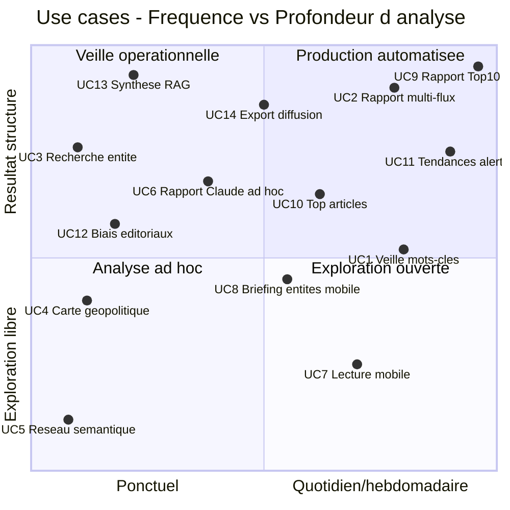

| # | Use Case | Déclencheur | Durée typique | Sortie |
|---|----------|-------------|-----------------|--------|
| 1 | Veille mots-clés | Manuel ou cron 01h00 | 5–15 min (script) | JSON enrichi NER |
| 2 | Rapport multi-flux | Cron lundi 06h00 | 30–90 min (pipeline) | Rapport Markdown |
| 3 | Recherche entité | Ad hoc (viewer) | 2–5 min | Rapport MD / export JSON |
| 4 | Carte géopolitique | Ad hoc (viewer) | 1–3 min | Lecture + export |
| 5 | Réseau sémantique | Ad hoc (viewer) | 5–20 min | Découverte / navigation |
| 6 | Rapport Claude ad hoc | Ad hoc (Claude) | 2–5 min | Rapport Markdown / PDF |
| 7 | Lecture mobile en déplacement | Quotidien (smartphone) | 5–10 min | Lecture · recherche plein texte |
| 8 | Briefing entités avant réunion | Ad hoc (smartphone) | 2–3 min | Orientation · sélection articles |
| 9 | Rapport Top 10 entités 48h | Cron 23h00 quotidien | ~5 min (script) | Rapport Markdown structuré |
| 10 | Top articles pertinents | Ad hoc (viewer) | < 1 min | Liste scorée des meilleurs articles |
| 11 | Tendances & alertes | Cron 07h00 / manuel | ~2 min (script) | Alertes JSON + panel interactif |
| 12 | Biais éditoriaux par source | Ad hoc (viewer) | 1–2 min | Tableau comparatif sources |
| 13 | Synthèse RAG multi-sources | Ad hoc (viewer) | 30–60s (streaming) | Analyse comparative Markdown |
| 14 | Export & diffusion | Ad hoc (viewer / cron) | < 1 min | Atom XML · Newsletter HTML · Webhook |

---

**Maintenu par** : Patrick Ostertag · patrick.ostertag@gmail.com
**Créé le** : 2 mars 2026 · **Mis à jour le** : 6 mars 2026 (UC10–UC14 — scoring, tendances, biais, RAG, exports)
