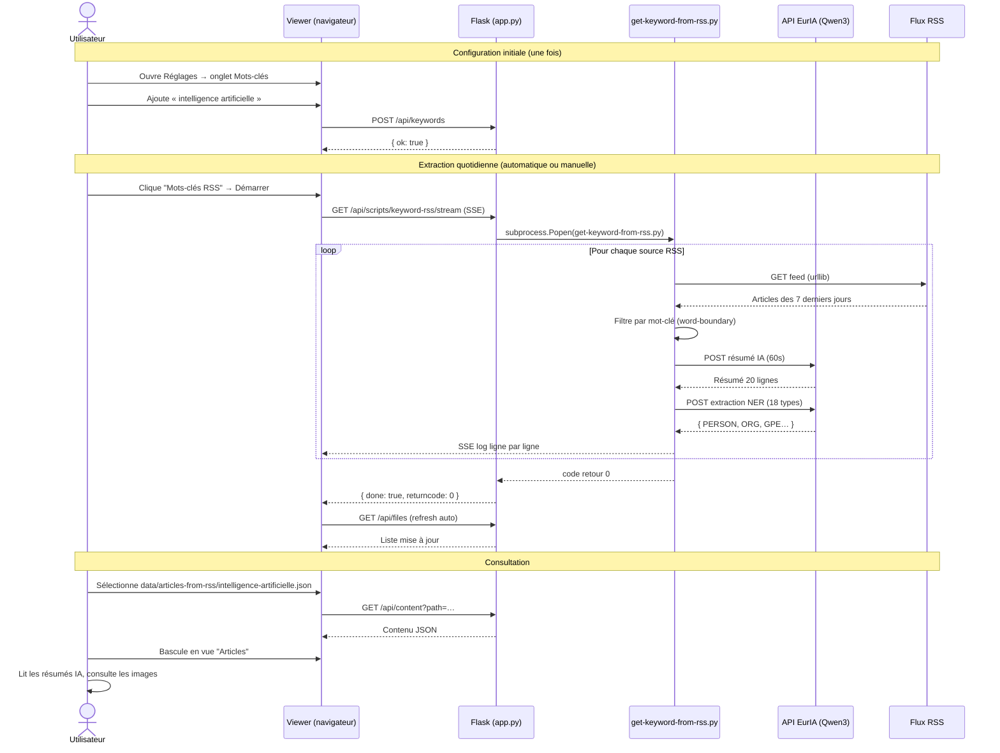
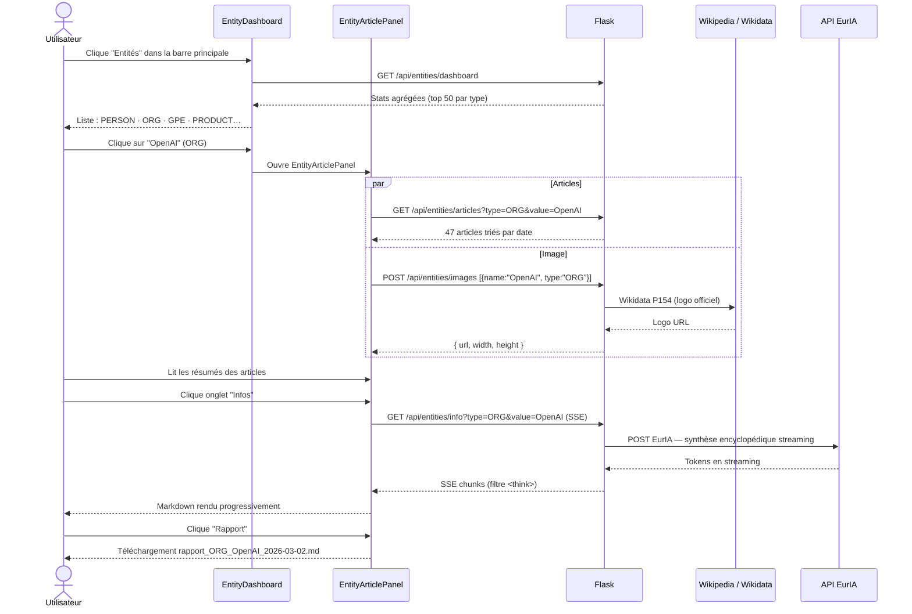
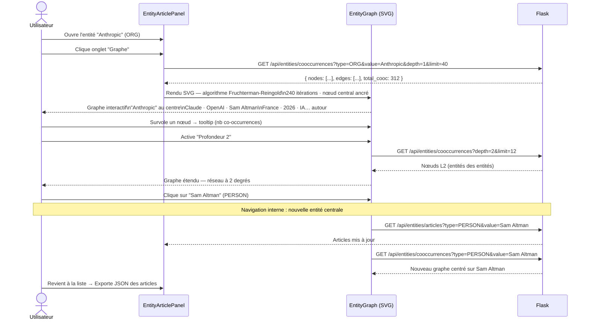
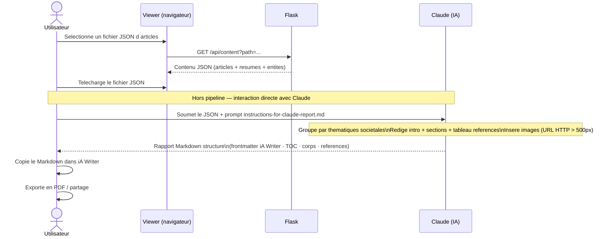
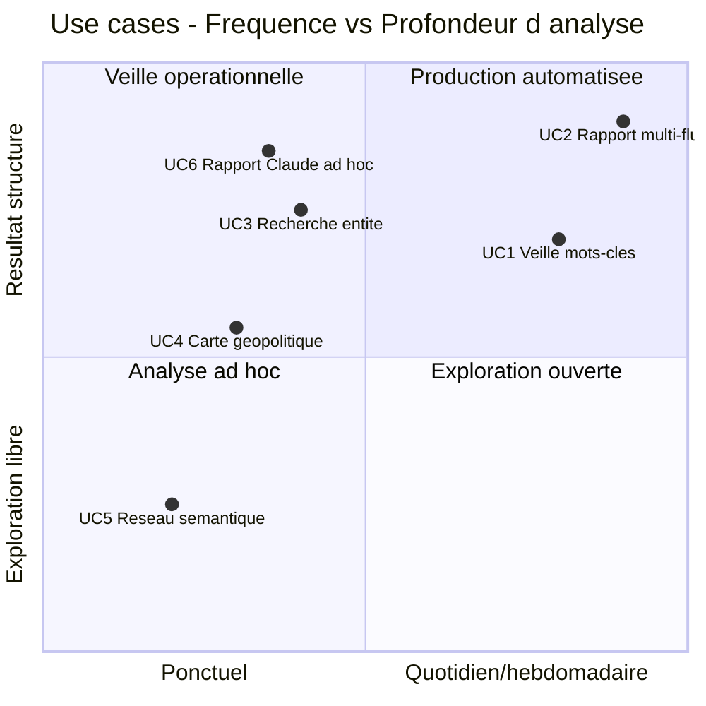

# Use Cases — WUDD.ai

> Cinq scénarios typiques d'utilisation de la plateforme, du point de vue de l'utilisateur.
> Chaque use case est illustré par un diagramme Mermaid.

---

## Table des matières

1. [Veille quotidienne par mots-clés](#1-veille-quotidienne-par-mots-clés)
2. [Rapport de synthèse hebdomadaire multi-flux](#2-rapport-de-synthèse-hebdomadaire-multi-flux)
3. [Recherche transversale sur une entité nommée](#3-recherche-transversale-sur-une-entité-nommée)
4. [Cartographie géopolitique des sujets](#4-cartographie-géopolitique-des-sujets)
5. [Exploration du réseau sémantique](#5-exploration-du-réseau-sémantique)

---

## 1. Veille quotidienne par mots-clés

**Contexte :** L'utilisateur suit un sujet précis (ex. « intelligence artificielle », « cybersécurité ») et veut être informé chaque matin des nouveaux articles correspondants, résumés en français par l'IA, sans lire les sources une par une.

**Acteurs :** Utilisateur · Docker/cron · API EurIA · Flux RSS (133+ sources)

**Valeur produite :** Un fichier JSON enrichi par flux de mots-clés, avec résumés IA et entités NER, consultable directement dans le viewer sans quitter l'interface.

---

## 2. Rapport de synthèse hebdomadaire multi-flux

**Contexte :** Chaque lundi, l'utilisateur veut recevoir un rapport de synthèse structuré couvrant l'ensemble de ses flux d'actualités (IA généraliste, Tech, Géopolitique…), rédigé et organisé automatiquement par l'IA.

**Acteurs :** Utilisateur · Docker/cron · scheduler_articles.py · API EurIA

**Valeur produite :** Un rapport Markdown hebdomadaire prêt à lire, structuré par catégories thématiques identifiées par l'IA, avec images et tableau de références, sans aucune intervention manuelle.

---

## 3. Recherche transversale sur une entité nommée

**Contexte :** L'utilisateur veut savoir tout ce que le corpus d'articles dit sur un acteur précis — une entreprise, une personnalité, un pays — en agrégeant les mentions à travers tous les flux et toutes les dates.

**Acteurs :** Utilisateur · Viewer · Flask · Wikipedia/Wikidata · API EurIA

**Valeur produite :** En quelques clics, l'utilisateur obtient une vue 360° sur n'importe quelle entité : tous les articles qui la mentionnent, une synthèse encyclopédique à jour (web search), un logo, et un rapport Markdown exportable.

---

## 4. Cartographie géopolitique des sujets

**Contexte :** L'utilisateur veut identifier les zones géographiques les plus présentes dans ses sources d'actualités, détecter des hotspots émergents et explorer rapidement les articles associés à une région.

**Acteurs :** Utilisateur · Viewer · Flask · Wikipedia API (géocodage)

```mermaid
flowchart LR
    U([Utilisateur]) --> DASH[EntityDashboard\nonglet 🗺 Carte]
    DASH --> API1[GET /api/entities/dashboard\nEntités GPE + LOC]
    API1 --> GEO[POST /api/entities/geocode\nliste de noms]

    subgraph GEO_CACHE["Géocodage (Wikipedia API + cache JSON)"]
        CHECK{Dans le\ncache ?}
        WIKI[Wikipedia API\nfr puis en]
        STORE[data/geocode_cache.json\nmise à jour]
        CHECK -->|Non| WIKI --> STORE
        CHECK -->|Oui| HIT[Coordonnées\nen cache]
    end

    GEO --> CHECK
    STORE --> MAP
    HIT --> MAP

    MAP[Carte Leaflet\nCircleMarker par entité\nrayon ∝ nb mentions]
    MAP --> U2([Utilisateur voit\nles hotspots])

    U2 -->|Clique sur un marqueur| PANEL[EntityArticlePanel\narticles filtrés par GPE/LOC]
    PANEL --> ART[Articles mentionnant\ncette zone géographique]
    ART --> EXPORT[Exporte JSON\nou génère rapport MD]

    classDef ui fill:#e3f2fd,stroke:#1565c0,stroke-width:1px
    classDef api fill:#fff3e0,stroke:#f57c00,stroke-width:1px
    classDef cache fill:#f3e5f5,stroke:#7b1fa2,stroke-width:1px
    class DASH,MAP,PANEL,ART,EXPORT ui
    class API1,GEO,WIKI api
    class CHECK,STORE,HIT cache
```

**Valeur produite :** Une carte mondiale interactive où chaque cercle représente une entité géopolitique mentionnée dans le corpus — sa taille reflète la fréquence des mentions. Un clic ouvre instantanément les articles correspondants.

---

## 5. Exploration du réseau sémantique

**Contexte :** L'utilisateur part d'une entité connue et veut découvrir quelles autres entités lui sont le plus souvent associées dans les articles — pour identifier des acteurs, des tendances ou des connexions inattendues.

**Acteurs :** Utilisateur · EntityArticlePanel · EntityGraph · Flask

**Valeur produite :** L'utilisateur navigue dans le réseau sémantique de son corpus comme dans une carte mentale vivante — chaque clic recentre le graphe sur une nouvelle entité, révélant progressivement la structure relationnelle de l'information collectée.

---

## 6. Rapport ad hoc avec Claude

**Contexte :** L'utilisateur dispose d'un fichier JSON d'articles (généré par le pipeline ou l'extraction RSS) et veut obtenir rapidement un rapport de synthèse structuré, rédigé par Claude, sans passer par le pipeline automatique. Il utilise le [prompt dédié](instructions-for-claude-report.md) qui groupe les articles par thématiques, insère les images et produit un Markdown compatible iA Writer.

**Acteurs :** Utilisateur · Viewer · Claude (IA) · [instructions-for-claude-report.md](instructions-for-claude-report.md)

**Exemple de résultat :** [claude-generated-rapport-anthropic-20-28-fev-2026.pdf](../samples/claude-generated-rapport-anthropic-20-28-fev-2026.pdf)

**Valeur produite :** Un rapport de synthèse thématique complet en quelques minutes, sans configuration ni attente de pipeline — idéal pour un corpus ponctuel (mot-clé, entité, période) ou une demande urgente. Le [prompt dédié](instructions-for-claude-report.md) garantit une structure et un style cohérents à chaque génération.

---

## Synthèse des use cases

| # | Use Case | Déclencheur | Durée typique | Sortie |
|---|----------|-------------|---------------|--------|
| 1 | Veille mots-clés | Manuel ou cron 01h00 | 5–15 min (script) | JSON enrichi NER |
| 2 | Rapport multi-flux | Cron lundi 06h00 | 30–90 min (pipeline) | Rapport Markdown |
| 3 | Recherche entité | Ad hoc (viewer) | 2–5 min | Rapport MD / export JSON |
| 4 | Carte géopolitique | Ad hoc (viewer) | 1–3 min | Lecture + export |
| 5 | Réseau sémantique | Ad hoc (viewer) | 5–20 min | Découverte / navigation |
| 6 | Rapport Claude ad hoc | Ad hoc (Claude) | 2–5 min | Rapport Markdown / PDF |

---

**Maintenu par** : Patrick Ostertag · patrick.ostertag@gmail.com
**Créé le** : 2 mars 2026
