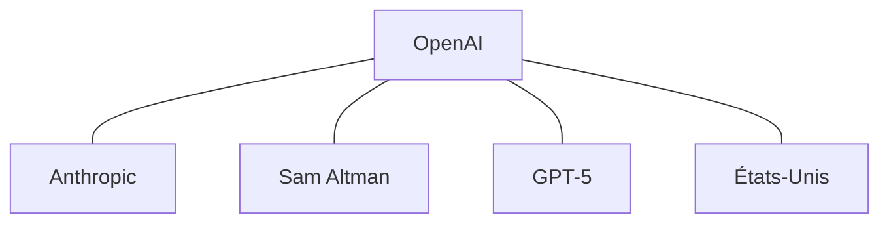
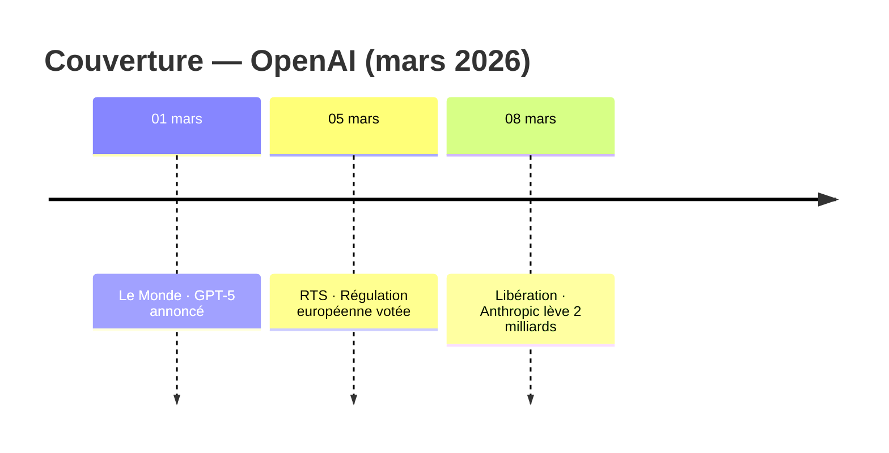
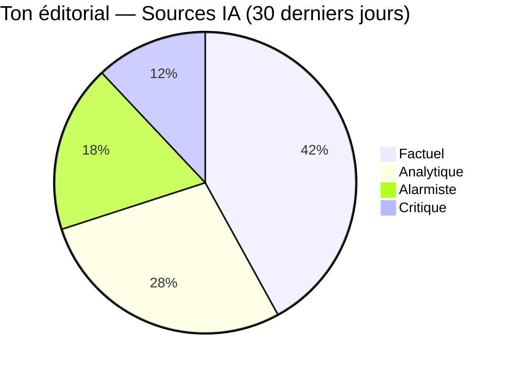

# WUDD.ai — Feuille de route complète
**Rapport de synthèse — 15 mars 2026 — v2.5.0**

---

## Légende des efforts

| Effort | Durée |
|---|---|
| **XS** | < 2h |
| **S** | ½ journée |
| **M** | 1 journée |
| **L** | 2–3 jours |
| **XL** | 1 semaine+ |

---

## AXE 1 — Améliorations techniques

### 1.1 Architecture backend — Critique

- [ ] **`[L]`** Découper `viewer/app.py` (4 822 lignes) en blueprints Flask
	- `routes/files.py` — `/api/files`, `/api/content`, `/api/search`, `/api/download`
	- `routes/entities.py` — `/api/entities/*`, `/api/search/entity`, `/api/entity-context`, `/api/watched-entities`, `/api/annotations`
	- `routes/analytics.py` — `/api/alerts`, `/api/articles/top`, `/api/sources/*`, `/api/cross-flux`, `/api/analytics/*`, `/api/briefing`
	- `routes/export.py` — `/api/export/*`, `/api/chat/*`
	- `routes/quota.py` — `/api/quota/*`
	- `routes/settings.py` — `/api/keywords`, `/api/rss-feeds`, `/api/web-sources`, `/api/flux-sources`, `/api/env`, `/api/ai-providers`
	- `routes/scheduler.py` — `/api/scheduler`, `/api/scripts/*`
	- `viewer/state.py` — état global partagé (`_rss_job`, `_bias_cache`)
	- `viewer/helpers.py` — fonctions partagées (`safe_path()`, `collect_files()`, `_call_ai_blocking()`)
- [ ] **`[S]`** Ajouter un **circuit breaker** dans `utils/api_client.py`
	- États OPEN / HALF-OPEN / CLOSED
	- Fenêtre de grâce 5 minutes après N échecs consécutifs
	- Log explicite à chaque transition d'état
- [ ] **`[XS]`** Corriger les **collisions de cache entre providers IA** (`utils/cache.py`)
	- Inclure le nom du provider (`AI_PROVIDER`) dans la clé MD5
- [ ] **`[XS]`** Remplacer le **reset paresseux des quotas** par un job cron explicite
	- Ajouter un job à 00:01 dans le crontab Docker
	- `utils/quota.py` : forcer `reset_day()` au démarrage si date ≠ date du dernier état

### 1.2 Qualité du code — Moyen terme

- [ ] **`[S]`** Créer `utils/file_io.py` — wrapper centralisé `json_read()` / `json_write()` avec `ensure_ascii=False, indent=2` systématiques (pattern répété 30+ fois)
- [ ] **`[S]`** Créer `utils/entity_utils.py` — abstraire la boucle `for etype, evals in entities.items()` (dupliquée dans 4+ scripts)
- [ ] **`[S]`** Valider les fichiers de configuration au démarrage via `jsonschema` dans `utils/config.py` (`quota.json`, `alert_rules.json`, `flux_json_sources.json`)
- [ ] **`[M]`** Ajouter des **React Error Boundaries** dans `App.jsx` — envelopper `EntityGraph`, `EntityDashboard`, `ChatbotPanel` avec fallback gracieux
- [ ] **`[M]`** Ajouter une **couche de cache frontend** (TTL 5 min) sur `EntityDashboard`, `TopArticlesPanel`, `SourceBiasPanel` — éviter les refetch à chaque ouverture
- [ ] **`[S]`** Ajouter la **validation des requêtes POST Flask** sur les endpoints sensibles

### 1.3 Tests — Long terme

- [ ] **`[L]`** Créer `tests/test_api_client.py` — fixtures mock, comportements d'erreur (429, 500, timeout)
- [ ] **`[M]`** Créer `tests/test_cache.py` — TTL, éviction, collision de clés, provider différent
- [ ] **`[M]`** Créer `tests/test_quota.py` — reset minuit, plafond par entité, adaptive sorting
- [ ] **`[M]`** Créer `tests/test_http_utils.py` — retry, backoff, BeautifulSoup extraction
- [ ] **`[XL]`** Créer `tests/test_viewer_app.py` — couverture des 62 endpoints Flask

### 1.4 Monitoring — Long terme

- [ ] **`[L]`** Ajouter des métriques Prometheus sur les jobs cron et appels API
- [ ] **`[M]`** Documenter l'API Flask (OpenAPI/Swagger via flask-restx)
- [ ] **`[M]`** Envisager SQLite au-delà de 50 000 articles pour les rebuilds d'index

---

## AXE 2 — Nouvelles fonctionnalités veille

### 2.1 Entités surveillées — Critique

> Actuellement : liste de favoris avec compteur statique, totalement déconnectée du reste du pipeline.

- [ ] **`[M]`** **Connecter `watched_entities.json` à `trend_detector.py`** — les entités surveillées déclenchent automatiquement une alerte si leur ratio dépasse le seuil configuré
- [ ] **`[M]`** **Prioriser les entités surveillées dans `generate_briefing.py`** — section "Veille prioritaire" systématique dans le briefing
- [ ] **`[S]`** **Notifications push** quand une entité surveillée franchit un seuil — brancher sur `utils/exporters/webhook.py` existant
- [ ] **`[S]`** **Mettre en cache le comptage des mentions** — remplacer le scan `rglob` à chaque ouverture par une lecture de `entity_index.json`
- [ ] **`[M]`** **Historique de mentions** — courbe temporelle depuis `entity_timeline.json` visible dans `EntityWatchPanel`
- [ ] **`[S]`** **Rapport hebdomadaire automatique** des entités surveillées — sauvegardé dans `rapports/markdown/_WUDD.AI_/`

### 2.2 Recherche et découverte

- [ ] **`[XL]`** **Recherche sémantique par embeddings vectoriels**
	- Générer des embeddings via l'API IA pour chaque résumé d'article
	- Stocker dans un index vectoriel embarqué (`lancedb` — sans serveur)
	- Bascule "recherche exacte / recherche sémantique" dans `SearchOverlay.jsx`
- [ ] **`[L]`** **Digest personnalisé par profil d'intérêt**
	- `config/user_profiles.json` : entités favorites, thématiques, sources préférées
	- Nouveau script `generate_personal_digest.py`
	- Onglet "Profil" dans `SettingsPanel.jsx`

### 2.3 Analyse éditoriale

- [ ] **`[L]`** **Comparaison de couverture par source**
	- Pour un même événement, afficher comment chaque source le traite (ton, angle, entités citées)
	- Nouveau composant `SourceCoverageCompare.jsx`
- [ ] **`[L]`** **Tableau de bord de veille concurrentielle**
	- Définir des "cibles" dans `SettingsPanel`
	- Rapport hebdomadaire : volume mentions, sentiment moyen, sources actives, articles notables
	- Extension de `EntityWatchPanel` + `generate_briefing.py`
- [ ] **`[M]`** **Alertes prédictives** dans `trend_detector.py`
	- Projection "seuil élevé dans ~2h" via régression linéaire sur 6 dernières valeurs horaires
	- Champ `prediction_seuil_dans_minutes` dans `alertes.json`

### 2.4 Productivité

- [ ] **`[M]`** **Annotations enrichies** — étendre à toutes les vues : `ArticleListViewer`, `EntityArticlePanel`, `MarkdownViewer`
	- Tags custom, notes libres, statut workflow (À traiter / En cours / Archivé / Important)
- [ ] **`[M]`** **Newsletter intelligente avec sélection automatique**
	- Mode "auto" dans `utils/exporters/newsletter.py`
	- `ScoringEngine` sélectionne les 5 meilleurs articles non encore envoyés
- [ ] **`[S]`** **Suivi de santé des sources** — script `check_source_health.py`
	- Sources sans nouvel article depuis 7 jours
	- Sources avec taux d'erreur > 30%
	- Résultat visible dans `SettingsPanel` onglet "Web sources"

### 2.5 Fonctionnalités avancées

- [ ] **`[XL]`** **Authentification multi-utilisateurs** (JWT)
- [ ] **`[XL]`** **Détection de propagation de narratifs** — quelle source a publié en premier, qui a repris
- [ ] **`[XL]`** **Analyse de réseaux d'influence** — clusters via algorithme Louvain, hubs et ponts

---

## AXE 3 — Export Obsidian

### 3.1 Infrastructure de base

- [ ] **`[S]`** Ajouter `OBSIDIAN_VAULT_PATH` dans `.env.example` et `utils/config.py` avec validation
- [ ] **`[S]`** Monter le vault comme volume dans `docker-compose.yml`
- [ ] **`[XS]`** Créer la structure de dossiers : `Veille/articles/`, `Veille/entités/`, `Veille/rapports/`, `Veille/synthèses/`
- [ ] **`[S]`** Créer `scripts/export_obsidian.py` — squelette avec argparse (`--flux`, `--keyword`, `--days`, `--dry-run`, `--force`)

### 3.2 Notes articles

- [ ] **`[M]`** Générateur de **frontmatter YAML complet** depuis le JSON article
	- `title`, `date`, `source`, `url`, `flux`
	- `sentiment`, `score_sentiment`, `ton_editorial`, `score_ton`
	- `score_source`, `temps_lecture`, `tags`, `entités`
- [ ] **`[S]`** Nommage des fichiers : `YYYY-MM-DD_source_slug-titre.md` (slug 40 caractères max)
- [ ] **`[S]`** Corps de la note : Résumé, Entités avec liens `[[internes]]` par type, section Source avec crédibilité
- [ ] **`[S]`** Insertion des images : `` depuis le champ `Images` existant
- [ ] **`[S]`** Déduplication à l'export — ne pas réécrire si MD5 résumé inchangé (réutilise `utils/deduplication.py`)

### 3.3 Notes d'entités avec diagrammes Mermaid

- [ ] **`[M]`** Note par entité significative (≥ 5 mentions) dans `Veille/entités/` avec frontmatter complet
- [ ] **`[M]`** **Diagramme de co-occurrences** `graph TD` depuis `entity_index.json` — Top 15 relations



- [ ] **`[M]`** **Timeline de couverture** `timeline` depuis `entity_timeline.json` — Top 10 articles par score



- [ ] **`[S]`** **Pie chart ton éditorial** `pie` depuis `/api/sources/bias` filtré sur l'entité



- [ ] **`[S]`** Liste des 10 articles les plus récents en liens `[[internes]]` en fin de note

### 3.4 Géolocalisation (Map View)

- [ ] **`[S]`** Identifier la GPE principale par article (première entité GPE par fréquence)
- [ ] **`[M]`** Résolution coordonnées GPS via `data/geocode_cache.json` puis Nominatim si absent
- [ ] **`[S]`** Injecter `location: [lat, lon]` dans le frontmatter (coordonnée de la GPE principale)
- [ ] **`[S]`** Injecter `entités_geo` — liste GPE/LOC avec coordonnées résolues

```yaml
entités_geo:
  - name: Bruxelles
    location: [50.8503, 4.3517]
  - name: France
    location: [46.2276, 2.2137]
```

- [ ] **`[S]`** Note géographique par entité GPE/LOC avec coordonnée GPS et backlinks articles

### 3.5 Notes de synthèse

- [ ] **`[S]`** Copier les rapports Markdown existants dans `Veille/rapports/` avec frontmatter ajouté
- [ ] **`[S]`** Note de synthèse par flux (`Veille/synthèses/<flux>.md`) : statistiques, top entités liées, liens vers derniers rapports
- [ ] **`[M]`** Note index globale (`Veille/synthèses/_INDEX.md`) : tableau de bord tous flux, top 20 entités cross-flux, alertes actives — "home page" de la veille dans Obsidian

### 3.6 Intégration dans le Viewer

- [ ] **`[S]`** Endpoint Flask `POST /api/export/obsidian` — paramètres : `flux`, `keyword`, `days`, `force`, `include_geo`, `include_mermaid`
- [ ] **`[M]`** Onglet **Obsidian** dans `ExportPanel.jsx`
	- Statut vault (chemin + accessible/inaccessible)
	- Sélecteur source, slider période, checkboxes options (géo, Mermaid, rapports)
	- Bouton "Exporter" avec streaming SSE du nombre de notes créées
- [ ] **`[S]`** Bouton "Ouvrir dans Obsidian" via protocole `obsidian://open?vault=...`
- [ ] **`[XS]`** Badge d'avertissement si `OBSIDIAN_VAULT_PATH` non configuré

### 3.7 Automatisation

- [ ] **`[S]`** Ajouter `export_obsidian.py` au crontab Docker — quotidien à 08:30 après les enrichissements
- [ ] **`[XS]`** Exposer le statut du dernier export dans `/api/scheduler`

### 3.8 Documentation

- [ ] **`[M]`** Créer `docs/OBSIDIAN.md` : prérequis, configuration, structure vault, format frontmatter, configuration Map View, requêtes Dataview exemples
- [ ] **`[XS]`** Template de vault vide pré-configuré dans `samples/obsidian-vault-template/`

---

## AXE 4 — Copies d'écran

> Remplacer intégralement les 19 captures existantes dans `docs/Screen-captures/`

- [ ] **`[XS]`** Supprimer les 19 anciennes captures dans `docs/Screen-captures/`
- [ ] **`[XS]`** **Capture 1** — Interface principale : sidebar + liste articles JSON avec badges sentiment
- [ ] **`[XS]`** **Capture 2** — Recherche full-text ⌘K : overlay avec résultats multi-flux surlignés
- [ ] **`[XS]`** **Capture 3** — Rapport Markdown : rapport rendu avec image, sections et tableau sources
- [ ] **`[XS]`** **Capture 4** — Dashboard entités vue Liste : compteurs + sections colorées par type NER
- [ ] **`[XS]`** **Capture 5** — Graphe de co-occurrences : réseau force-layout d'une entité clé
- [ ] **`[XS]`** **Capture 6** — Top Articles podium : 3 cartes avec 🥇🥈🥉, badges sentiment/ton/lecture
- [ ] **`[XS]`** **Capture 7** — Tendances & Alertes : liste rouge/orange/jaune avec ratios
- [ ] **`[XS]`** **Capture 8** — Terminal IA : conversation en cours avec réponse Markdown streamée
- [ ] **`[XS]`** **Capture 9** — Biais éditoriaux : tableau avec barres tricolores et badges ton
- [ ] **`[XS]`** **Capture 10** — Réglages Planification : tableau cron jobs avec statuts actifs
- [ ] **`[XS]`** Mettre à jour les références aux captures dans `README.md` et `docs/ARCHITECTURE.md`

---

## Tableau de bord des priorités

### Immédiat — cette semaine

| Tâche | Axe | Effort |
|---|---|---|
| Fix cache provider IA | Tech | XS |
| Reset quota cron 00:01 | Tech | XS |
| Brancher entités surveillées sur alertes | Fonc. | M |
| Cache mentions dans EntityWatchPanel | Fonc. | S |
| Refaire les 10 copies d'écran | Comm. | ~1j |

### Court terme — 2 à 4 semaines

| Tâche | Axe | Effort |
|---|---|---|
| Split Flask blueprints | Tech | L |
| Circuit breaker API | Tech | S |
| Validation config JSON + file_io.py | Tech | S+S |
| React Error Boundaries + cache frontend | Tech | M+M |
| Export Obsidian — livrable minimal (phases 3.1 à 3.2) | Obsidian | L |
| Annotations enrichies toutes vues | Fonc. | M |
| Newsletter auto | Fonc. | M |
| Suivi santé sources | Fonc. | S |

### Moyen terme — 1 à 2 mois

| Tâche | Axe | Effort |
|---|---|---|
| Export Obsidian complet sans géo (phases 3.3 à 3.5) | Obsidian | L |
| Géolocalisation Map View (phase 3.4) | Obsidian | L |
| Tests api_client, cache, quota, Flask | Tech | XL |
| Alertes prédictives | Fonc. | M |
| Digest personnalisé | Fonc. | L |
| Comparaison couverture sources | Fonc. | L |

### Long terme — 3 à 6 mois

| Tâche | Axe | Effort |
|---|---|---|
| Recherche sémantique embeddings | Fonc. | XL |
| Veille concurrentielle | Fonc. | L |
| Authentification multi-utilisateurs | Tech | XL |
| Détection propagation narratifs | Fonc. | XL |
| Métriques Prometheus + OpenAPI | Tech | L |

---

## Estimation globale

| Axe | Effort total estimé |
|---|---|
| Améliorations techniques | ~15 jours |
| Nouvelles fonctionnalités veille | ~25 jours |
| Export Obsidian complet | ~7 jours |
| Copies d'écran | ~1 jour |
| **Total** | **~48 jours** |
